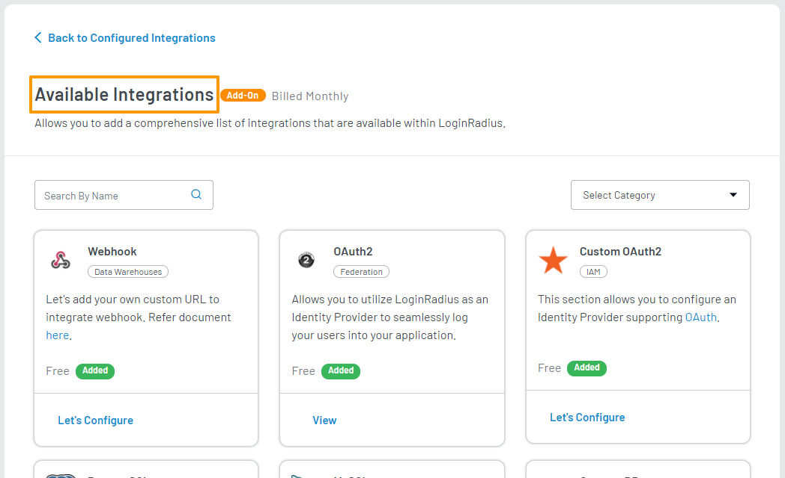
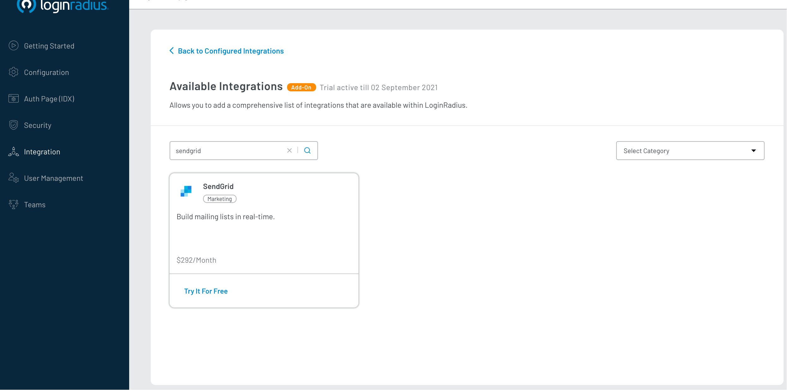
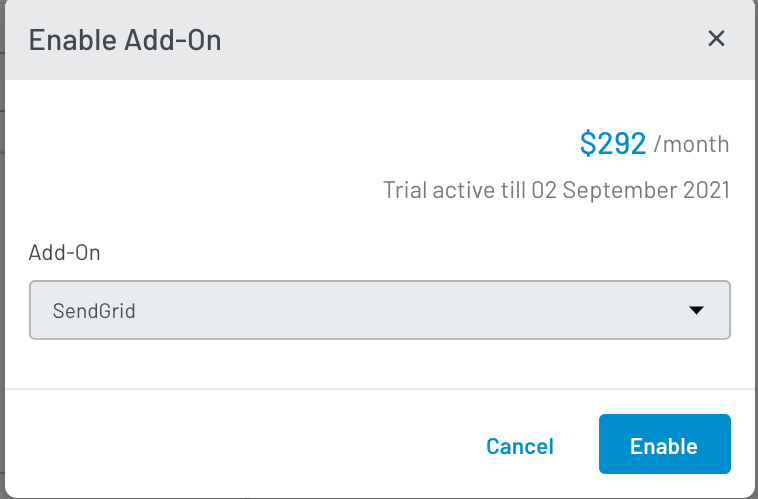
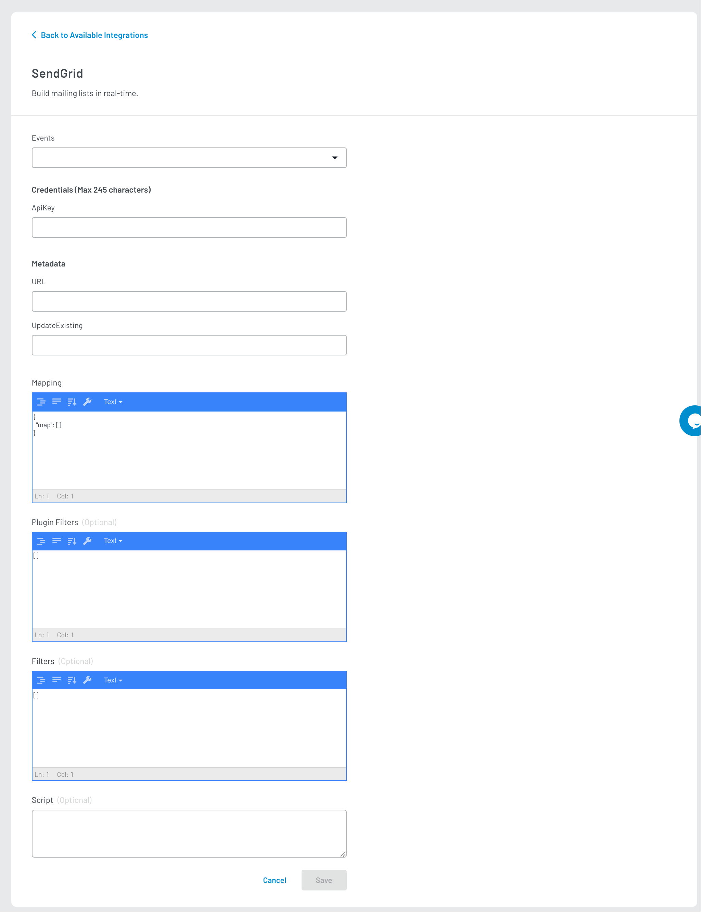

# SendGrid

SendGrid helps build mailing lists in real-time.

Let's integrate SendGrid into your Loginradius Application.

## Step 1: Visit Integration Section

Log in to your <a href="https://dashboard.loginradius.com/dashboard" target="_blank">LoginRadius Dashboard</a> account, select your app, then from the left navigation panel, click the **Integration** and the Configured Integrations screen will appear:

   

## Step 2: Add Integration

Click the **Add** button from the above screen, and you will find the list of all available integrations as displayed in the below screen:

   

## Step 3: Enable SendGrid

Search for SendGrid in the search bar, locate **SendGrid** and click the **Try It For Free** option. 

   

The following pop-up will appear, click the **Enable** button.

   

## Step 4: Configure SendGrid

From the **Available Integrations** screen, click the **Let’s Configure** under the SendGrid box. The following screen will appear:

   

Enter or select the following details to configure SendGrid:

a. Select the **Event** from the dropdown

b. Enter the **Credentials** namely 
   
   * **ApiKey**

> **Note:** Credentials can contain maximum of 245 characters.

c. Enter the **Metadata** details namely

   * **URL**

   * **UpdateExisting**
   
   * **Mapping**

   * **Plugin Filters**

   * **Filters**

   * **Script**

> **Note:** Metadata details of Plugin Filters, Filters and Script are optional

Click the **Save** button to save the configuration.