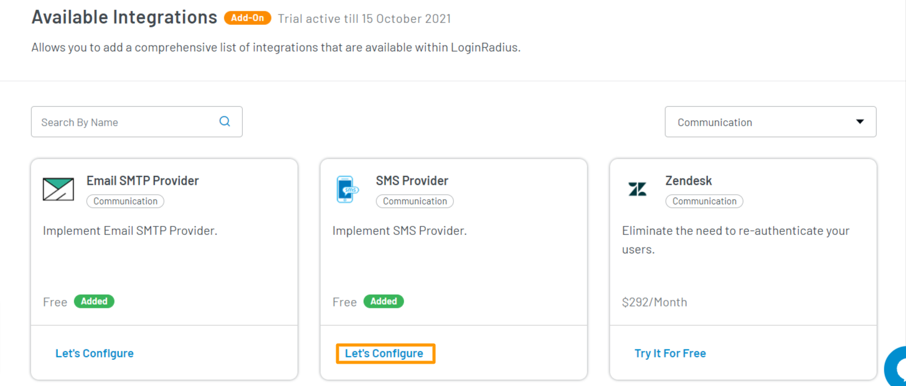
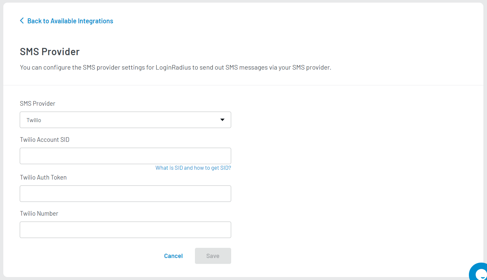

Premium

# Setup SMS Provider

Setting up an SMS provider allows you to send and receive text messages to and from an SMS capable device over the network. LoginRadius Identity Platform establishes SMS communication by sending the SMS from your SMS provider to your consumers. To send out SMS from your SMS provider, you should follow the below steps.

## Step 1: Access SMS Provider

1. Log in to your <a href="https://dashboard.loginradius.com/dashboard" target="_blank">LoginRadius Dashboard</a> account.
2. Select your app and navigate to **Integration** from the left navigation panel. The following screen will appear:

   
   
3. Click the **Add** button, the available integrations screen will appear.
4. Either search for **SMS** in the search bar or go to the **Select Category** dropdown and select **Communication** category. Locate **SMS Provider**. 

   

   > **Note**: SMS Provider option will appear in the **Integration** section only when **Phone Login** feature is enabled for your app.

5. Click the **Let's Configure** option, the following screen will appear:

   

## Step 2: Configure SMS Provider Settings

Provide the following default supported Twilio SMS provider details:

1.  **SMS Provider**: Select Twilio SMS Provider
2.  **Twilio Account SID**: Enter the Twilio Account SID. Check <a href="https://support.twilio.com/hc/en-us/articles/223136607-What-is-an-Application-SID-" target="_blank">Twilio help center</a> for Account SID.
3.  **Twilio Auth Token**: Enter the Twilio Auth Token.
4.  **Twilio Number**: Enter the Twilio registered number.

> To obtain the **Twilio Account SID**, **Auth Token** and **Number**, sign up for <a href="https://www.twilio.com/try-twilio" target="_blank">Twilio</a> account.

Save the settings by clicking the **Save** button.

[Go Back to Home Page](/)
