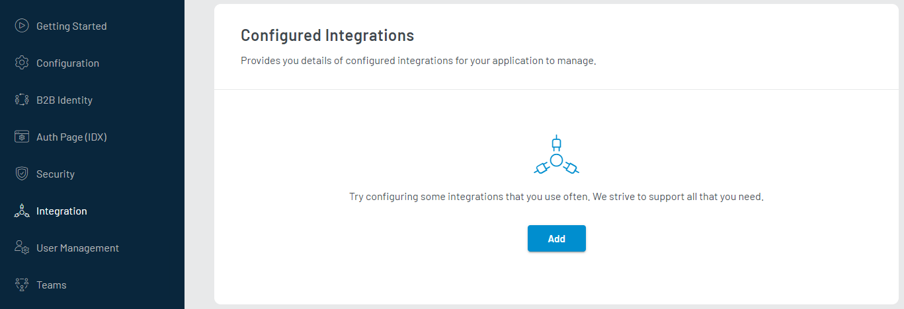
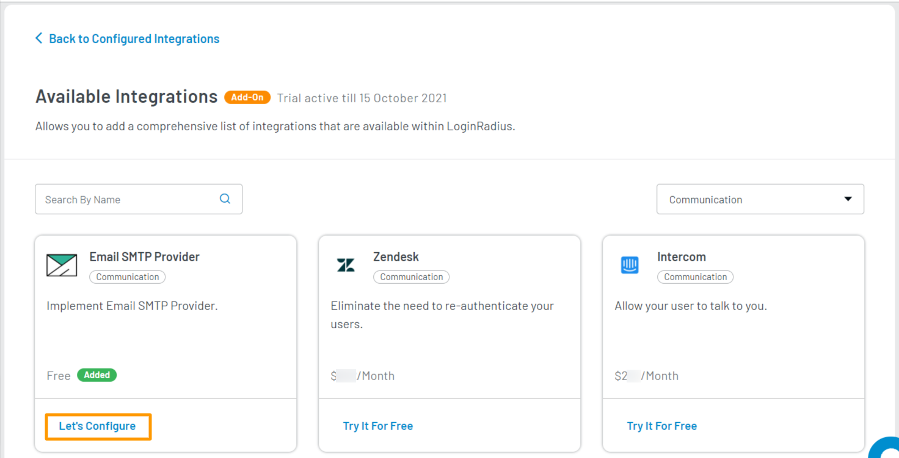
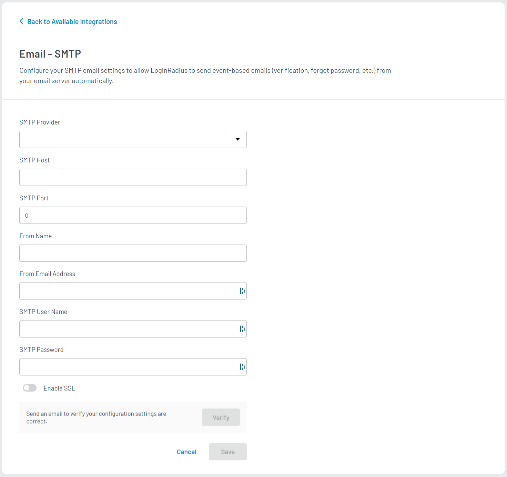
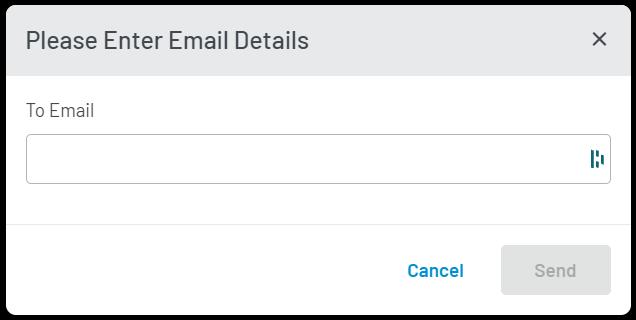

# Setup Your SMTP Provider

Setting up the SMTP server in LoginRadius allows the system to send out all email correspondences directly through your SMTP provider. It enables you to get deliverability stats and analytics and also optimize your email messaging. 

Setup your SMTP provider by following the below steps.

## Step 1: Access SMTP Provider Settings
1. Log in to your <a href="https://dashboard.loginradius.com/dashboard" target="_blank">LoginRadius Dashboard</a> account. 
2. Select your app and navigate to **Integration** from the left navigation panel. The following screen will appear:

   
   
3. Click the **Add** button, the available integrations screen will appear.
4. Either search for **SMTP** in the search bar or go to the **Select Category** dropdown and select **Communication** category. Locate **Email SMTP Provider**. Click the down arrow, the **SMTP Provider Settings** screen will appear.

   
   
5. Click the **Let's Configure** option, the following screen will appear:

   

## Step 2: Configure SMTP Provider Settings

Enter or select the following SMTP details:

1. **SMTP Providers:** Select a pre-configured provider or other for a custom provider.
2. **SMTP Host:** If you have selected the SMTP provider from the default list (rather than Others), enter the SMTP host details.
3. **SMTP Port:** If you have selected the SMTP provider from the default list (rather than Others), enter the SMTP port details.
4. **From Name:** Enter the name of the sender.
5. **From Email Address:** Enter the email of the sender.
6. **SMTP User Name:** Enter the SMTP username.
7. **SMTP Password:** Enter the password for the SMTP username.
8. **Enable SSL:** Select this option to make email communication more secure.

> **Note**: The following are the default SMTP providers list:
> 
> * Amazon SES (US East)
> * Amazon SES (US West)
> * Amazon SES (EU)
> * Gmail
> * Mandrill
> * Rackspace-mailgun
> * SendGrid
> * Yahoo
## Step 3: Verify and Save SMTP Provider Settings

1. Click the **Verify** button, the following pop-up will appear:

   

2. Enter the email id in the **To Email** textbox and click the **Send** button. If the email is sent successfully, a success message will be displayed on the screen.

3. Save the configured SMTP settings by clicking the **Save** button.

[Go Back to Home Page](/)

