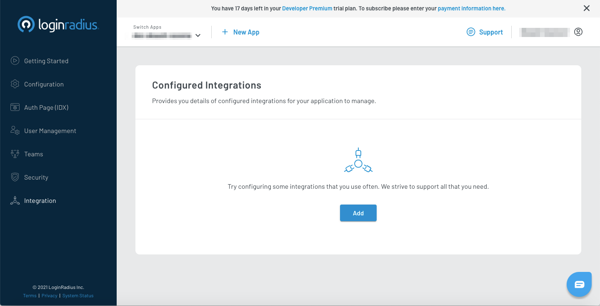
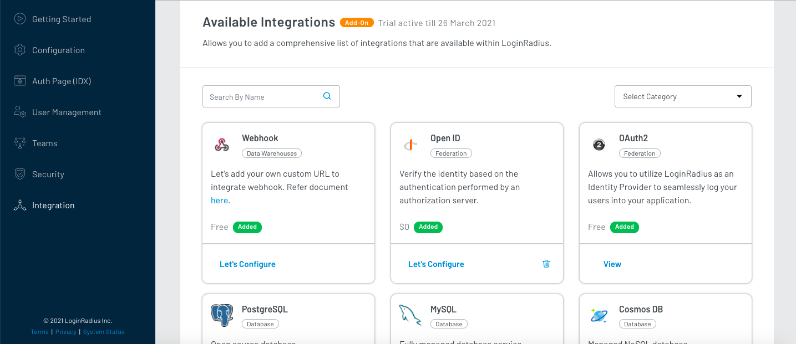
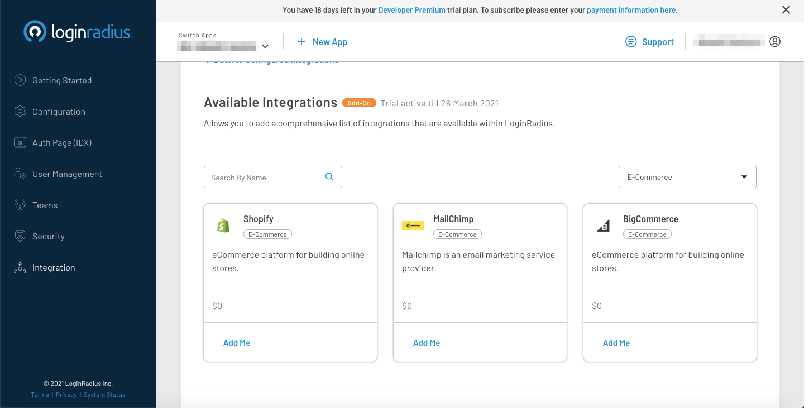
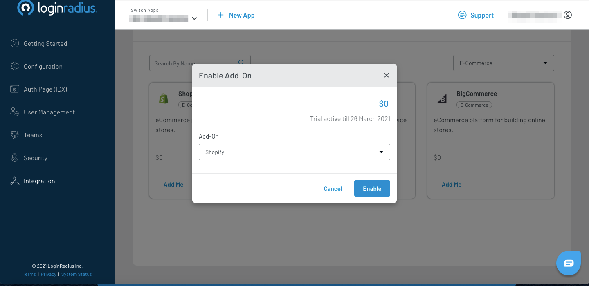
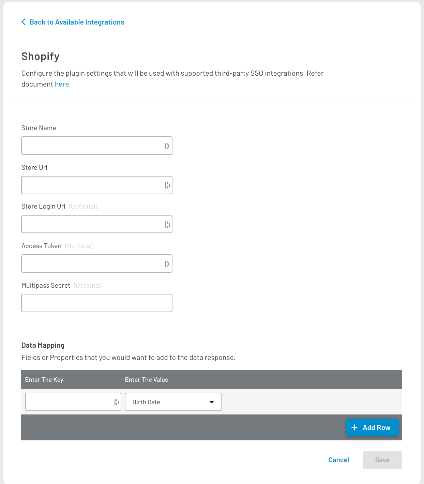

# Shopify

LoginRadius provides you with a Shopify Multipass Hosted Plugin to integrate LoginRadius features and functionalities into your Shopify site. 

This integration makes use of the LoginRadius JavaScript Interfaces along with the LoginRadius Hosted Plugin feature, refer below for instructions on setting up this integration.

## Multipass Configuration

This section covers the required configurations that you need to perform to enable Multipass in Shopify. 

> Note: (This feature is only available to Shopify Plus customers)

1. Log in to your Shopify account to configure Multipass under:

   **Settings > Checkout** > (scroll to **Customer accounts**) 

2. Set the configuration to **Accounts are required.**

3. Under Enable Multipass login, click the **Enable Multipass** and note down the generated secret as it will be required in the [LoginRadius Dashboard Configurations](#loginradius-dashboard-configurations).

4. As you have your Shopify configured for Multipass connections, you will need to configure Multipass in your LoginRadius Admin Console as well. Refer to the below section for the same.

## LoginRadius Dashboard Configurations

1. Log in to your [LoginRadius Dashboard](https://dashboard.loginradius.com/) account, and navigate to [Integration](https://dashboard.loginradius.com/integration). The following screen will appear:

   

2. Click **Add** button for adding a new Shopify app. The following configuration options will appear: 

   


3. Either search for **Shopify** in the search bar or go to the **Select Category** dropdown and select **E-Commerce**category. Locate **Shopify** and click the **Add Me** option.

   

4. The following pop-up will appear, click the **Enable** button.

   

5. The Shopify app is now available in the **Available Integrations**. There, click the **Let's Configure** under the Shopify box. The following screen will appear:

   

6. Enter or select the following details to configure your shopify app:

   * In the **Store Name** field, enter the name of your store.
   * In the **Store Url** field, enter the URL: https://.myshopify.com.
   * In the **Store Login Url** field, enter the URL: https://.myshopify.com/account/login/.
   * In the **Access Token** (optional) field, enter the Shopify Access Token.
   * In the **Multipass Secret** (Optional) field, enter the **Multipass Secret** obtained from the above Shopify configurations. You can find that under the Shopify Admin Panel: **Settings> Checkout > (Enable Multipass login).**
   * In the **Mapping** field, map the Shopify fields under **Key** with the LoginRadius fields under **Value**. Refer to the below table for the simple mapping examples. You can map the multiple fields by clicking the **Add Row** button.


| Key | Value |
| :-------------: |-------------|
| first_name | FirstName |
| |
| last_name | LastName |
| | |
| email | Email[0].Value |
| | |

Now, click the **Add** button to save your configurations.


> Crucial Information: This integration requires editing `.liquid files`, which can be done through the Shopify theme editor. Simply follow the instructions below:
> 
> 1. Login to your Shopify Admin Panel.
> 2. Click the **Online Store** from the left navigation.
> 3. Click the **Theme** in the left navigation.
> 4. Select the desired theme, click the **Actions** and select the **Edit Code** option.
> 5. After opening the theme editor, refer to the [below section](#upload-assets) to implement LoginRadius in Shopify.

## Upload Assets 

This section covers the LoginRadius Shopify Plugin integration under the Shopify Admin Console. To integrate it, you need to extract the Shopify plugin zip file, which you can get from [LoginRadius Github](https://github.com/LoginRadius/shopify-identity-plugin).

1. After extracting the above file, upload the Javascript and CSS files into your theme, refer to the following JavaScript and CSS files. 

**Content:**

- **raas-settings.js** - The javascript file that handles the LoginRadius initializations and functionality. More details on how the various calls in this file work can be found here. 

- **lr-raas-style.css** - The default Styles applied to the LoginRadius Interfaces. 

- **register.liquid** - A sample Register .liquid file. 

- **login.liquid** - A sample Login .liquid file.

2. Extract **Shopify.Assets**, inside the folder, there are several files you are going to use for your LoginRadius Shopify Implementation.

3. Expand **Assets** option in your Shopify theme editor and click the **Add a new assets** in the Shopify theme editor.

4. Select both files and upload them.

5. If you are going to use the default social icon theme, you will need to upload two image files inside the same folder iconsprite.svg and iconsprite32.png.

## Edit 'theme.liquid' file

In the left side theme editor menu, there is a theme file explorer, this expands the **Layouts** option, click the **theme.liquid** file.

### Add LoginRadius Core JS File and Theme CSS
Add the following tags just before the (closing head tag) tag:

```
{{ 'lr-raas-style.css' | asset_url | stylesheet_tag }}
{{ '//auth.lrcontent.com/v2/js/LoginRadiusV2.js' | script_tag }}
{{ '//code.jquery.com/jquery-latest.min.js' | script_tag }}
```
### Initialize LoginRadius User Registration Options

The LoginRadius User Registration interfaces require the following options: `apiKey`, `appName` and also a SOTT token (unless you prefer to use Google ReCaptcha), add the following script just before the (closing body tag) and make sure to replace and with the LoginRadius API KEY and Site Name. Also, add the SOTT token if you want to use SOTT for registration.

```
<script type="text/javascript">
var raasoption = {};
raasoption.apiKey = <API KEY>;
raasoption.appName = <APP NAME>
raasoption.hashTemplate= true;
raasoption.sott = <SOTT>;
raasoption.verificationUrl = window.location;
raasoption.resetPasswordUrl = window.location;
var LRObject= new LoginRadiusV2(raasoption);
var lrshopifystore = <Name Of Your Shopify Store>
</script>
```

### Add LoginRadius User Registration Shopify Extension library

Add the following tag just after the 'Options initialization script':
```
 {{ 'raas-settings.js' | asset_url | script_tag }}
 ```

### Add SSO Code

For best practice with LoginRadius Single-Sign-On (SSO), simply add the following two code blocks to each page where Single Sign-On is required. You need to add this to your theme.liquid file. The first code block is for the scenario when your consumer is not logged into Shopify but your consumer is logged in from other SSO family sites. The second one is used after your consumer is logged into Shopify, but has been logged out from other SSO family sites. Put it just after the 'raassettings. js' script tag from the above steps.
```

 <script type = "text/javascript">
 $(document).ready(function() {
 var check_options= {};
 check_options.onError = function(response) {
 // On Error
 // If the consumer is not log in then this function will execute. 
 window.location = 'https://{{ shop.domain }}/account/logout'; 
 }; 
 LRObject.util.ready(function() {
 LRObject.init("ssoNotLoginThenLogout", check_options);
 }); 
 $("a:contains('Log out')").on('click', function() {
 lrLogout('/account/logout');
 return false;
 });
 });
 </script>

 <script type = "text/javascript">
 $(document).ready(function() {
 var ssologin_options= {};
 ssologin_options.onSuccess = function(data) {
 // On Success
 //Write your custom code here
 if (data.isauthenticated && document.referrer != "https://checkout.shopify.com/"){
 lrLogout('/account/logout');
 }else if (data.isauthenticated) {
 exchangeMultipassToken(data.token); 
 }
 };

 LRObject.util.ready(function() {
 LRObject.init("ssoLogin", ssologin_options);
 });
 });
 </script>


```
## Login

Expand the templates option under directory **Template**, select **customers/login.liquid** option, select all and then delete everything on this page.

> **Crucial Information:** On this page, you need to make sure jQuery is properly imported as it varies on different themes. If jQuery loads perfectly then it’s good, else you can import the latest version manually by adding the following line at the top of your page.

{{ '//code.jquery.com/jquery-latest.min.js' | script_tag }}

Then copy and paste the code from the file 'login.liquid' from the zip folder. This file contains the interface and control for all the LoginRadius User Registration modules, it contains side-by-side social and email/password login interfaces, a message span to show the message, a link for 'forget the password, and handles for 'forget password' and 'email verification'.

## Registration

Expand the templates option and click the **customers/register.liquid**. To implement the registration form on the Shopify Register page, select everything in the file and replace it with the file 'registration.liquid' in the zip folder.

It will generate the user registration form for you with validation logic. All the fields are customizable when the form is being submitted, a verification email will be sent out to the email address that has been just filled in. The consumer will be officially registered after the verification link has been clicked.

## Customizations

This implementation requires the LoginRadius JavaScript Interface, if you want to customize the look and feel or make some functionality changes, refer to our LoginRadius JavaScript Interface documentation.


[Go Back to Home Page](https://lr-developer-docs.netlify.app)
