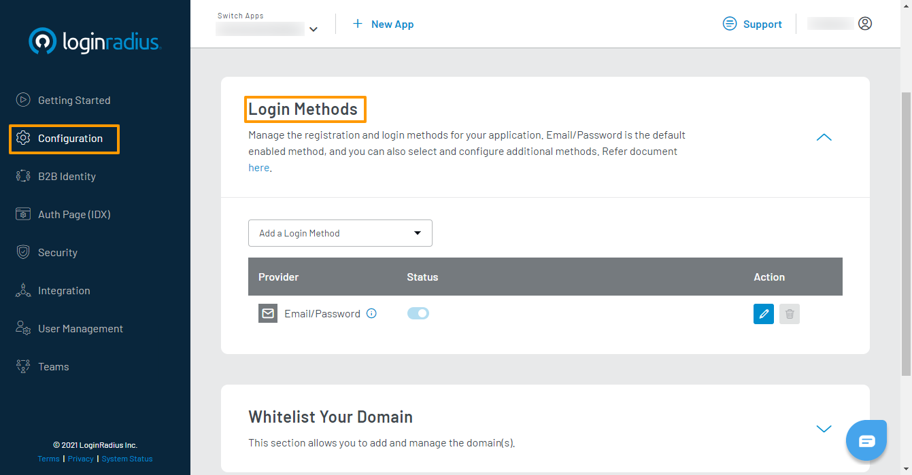

### Step 1: Choose Login Method 

1. Login to your LoginRadius Dashboard account, from the left navigation panel, click **Configuration** and then navigate to the **Login Methods** section.

   


2. Click the down arrow, and the **Login Methods** section will expand.

3. #### Using Cli
   With **<a href="https://github.com/LoginRadius/lr-cli/" target="_blank">LoginRadius CLI</a>**, You can add social provider using the simple command below

   ```sh
   $ lr add social
   ? Select the provider from the list: ###Provider###
   ? Client ID: ###Client ID###
   ? Client Secret: ###Client Secret###
   ###Provider### is added as your login Method
   ```
   #### Using Dashboard
   Click the **Add Method** drop-down and select your desired social provider from the available providers’ list as displayed in the following screen:

   


   It will open the steps section to set up the respective social provider app. 

   > The list of [supported social providers](#supported-social-providers) varies based on your plan. 

### Step 2: Configure Social Login 
#### Using Cli
With **<a href="https://github.com/LoginRadius/lr-cli/" target="_blank">LoginRadius CLI</a>**, You can update social provider using the simple command below

   ```sh
   $ lr set social -p ###Provider###
   ? API Key: ###key###
   ? API Secret: ###secret###
   ###Provider### updated successfully.
   ```
#### Using Dashboard 
1. Follow the step by step guide displayed on the LoginRadius Dashboard screen for configuration. For example, the following screen displays the configuration steps for configuring Google as social login option:

   

2. Perform each step and click the **Next** button to go to the next step.
The steps for configuring each social provider will be different and displayed after selecting the respective social provider.


3. Upon completing the selected Social ID Provider’s configuration steps, you will get the credentials, you will get the credentails. Save these credentials and then click the **Take Me To Setup** from the guide’s right corner.

   


4. Enter the obtained credentials in the **Configure App** section and click the **Save** button.

   

### Step 3: Whitelist Domain
#### Using CLI
With the help of **<a href="https://github.com/LoginRadius/lr-cli/" target="_blank">LoginRadius CLI</a>** you can whitelist your domain using your terminal.

For security reasons, LoginRadius processes the API calls that are received from the whitelisted domains. Local domains (http://localhost and http://127.0.0.1) are whitelisted by default.

```sh
$ lr add domain -d htts://google.com
htts://google.com is now added as your whitelisted domain.
```
#### Using Dashboard
Whitelist your application domain to allow the LoginRadius API access.

In your LoginRadius Dashboard, navigate to **<a href="https://dashboard.loginradius.com/configuration" target="_blank">Configuration > Whitelist Your Domain</a>** and add your domain name:


### Step 4: Check Auth Page (IDX)
#### Using CLI
With **<a href="https://github.com/LoginRadius/lr-cli/" target="_blank">LoginRadius CLI</a>**, You can go to Auth page from CLI using the simple command below

   ```sh
   $ lr demo
   ```
#### Using Dashboard
Open your **Auth Page (IDX)** (https://</your-app-name/>.hub.loginradius.com/auth.aspx ) and it will display the social icon for the configured social provider:


> The Social Login is now configured and functioning on your Auth Page (IDX). If you are not using Auth Page (IDX) for authentication, use LoginRadius SDK or APIs to utilize the configured Social Login in your application.