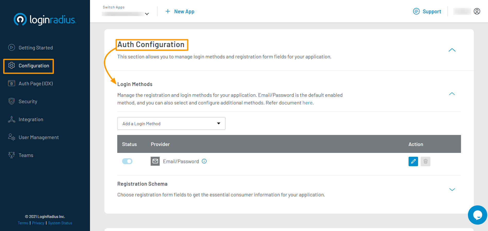

### Step 1: Choose Login Method 

1. Login to your <a href="https://dashboard.loginradius.com/dashboard" target="_blank">LoginRadius Dashboard</a>account, navigate to **<a href="https://dashboard.loginradius.com/configuration" target="_blank">Configuration > Auth Configuration</a>**.

2. Click the down arrow and select the **Login Methods** option. The following screen will appear:

   

3. Click the **Add a Login Method** drop-down and select your desired social provider from the available providers’ list as displayed in the following screen:

   

   It will open the steps section to set up the respective social provider app. 

   > Here is the list of [supported social providers](#supported-social-providers). 

### Step 2: Configure Social Login 

1. Follow the step by step guide displayed on the LoginRadius Dashboard screen for configuration. For example, the following screen displays the configuration steps for configuring Google as social login option:

   

2. Perform each step and click the **Next** button to go to the next step.
The steps for configuring each social provider will be different and displayed after selecting the respective social provider.

3. Upon completing the selected Social ID Provider’s configuration steps, you will get the credentials, you will get the credentails. Save these credentials and then click the **Take Me To Setup** from the guide’s right corner.

   

4. Enter the obtained credentials in the **Configure App** section and click the **Save** button.

   

### Step 3: Whitelist Domain

Whitelist your application domain to allow the LoginRadius API access.

In your LoginRadius Dashboard, navigate to **<a href="https://dashboard.loginradius.com/configuration" target="_blank">Configuration > Whitelist Your Domain</a>** and add your domain name:

### Step 4: Check Auth Page (IDX)

Open your **Auth Page (IDX)** (https://</your-app-name/>.hub.loginradius.com/auth.aspx ) and it will display the social icon for the configured social provider:

> The Social Login is now configured and functioning on your Auth Page (IDX). If you are not using Auth Page (IDX) for authentication, use LoginRadius SDK or APIs to utilize the configured Social Login in your application.
