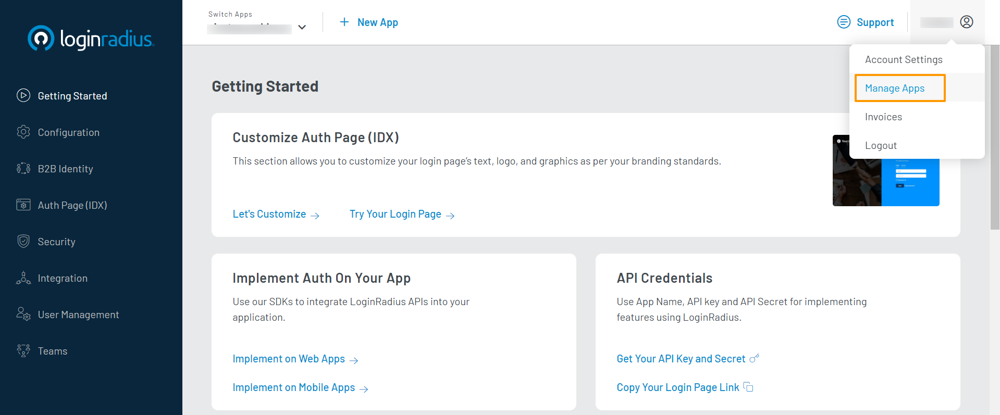
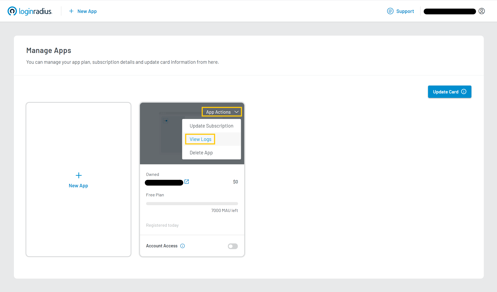

# View Subscription Logs

This guide explains how to view your application's subscription logs using the LoginRadius Dashboard.

## Access Manage Apps Section

Log in to your <a href="https://dashboard.loginradius.com/dashboard" target="_blank">LoginRadius Dashboard</a> account. From the top right corner dropdown menu, click **Manage Apps**.

  

## View Logs

When the **Manage Apps** screen appears, look for the app you want to see information of, and hover on it. On the top right corner of the hover card, there should be a dropdown menu labeled **App Actions**. Click on this menu and select **View Logs**:

  

  In the log, you will find the following details for each log entry:

  * **Expiry Date**: Shows current expiry date (if applicable), or a change in expiry date compared to the previous log entry.

  * **Activities**: Detailing what has changed to the app status compared to the previous log entry (eg. if app plan has been upgraded, changes to Billing Cycle,...)

  * **Created By**: The one who made the change (Owner, Support Team,...)

  * **Created Time (UTC)**: The date and time of the change.

  [Go Back to Home Page](/)
