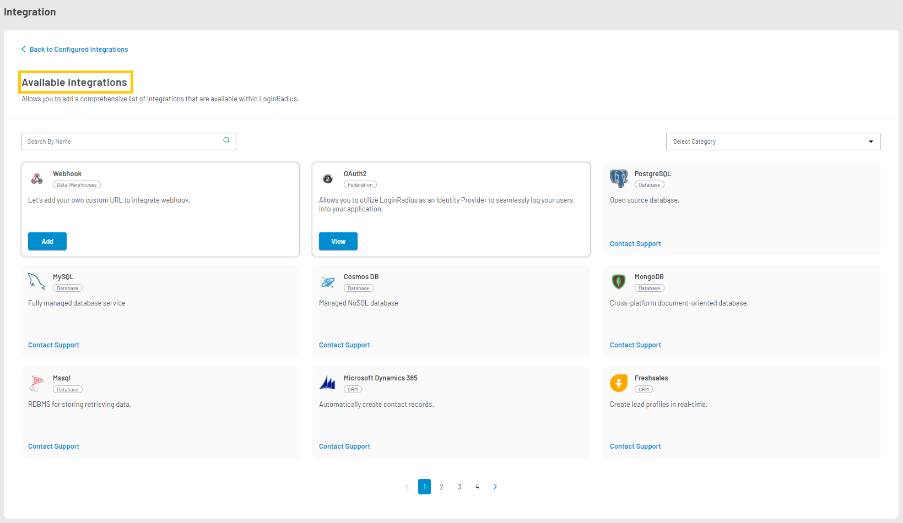
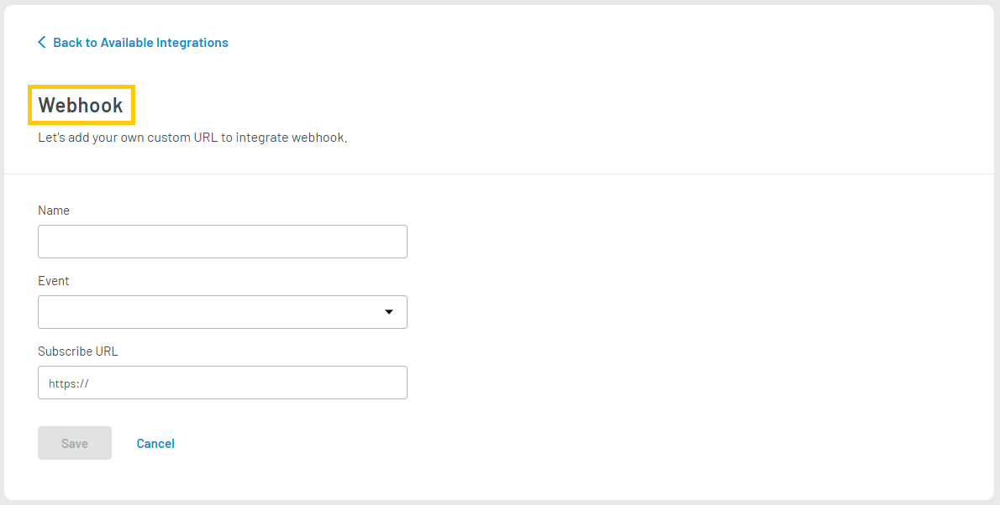
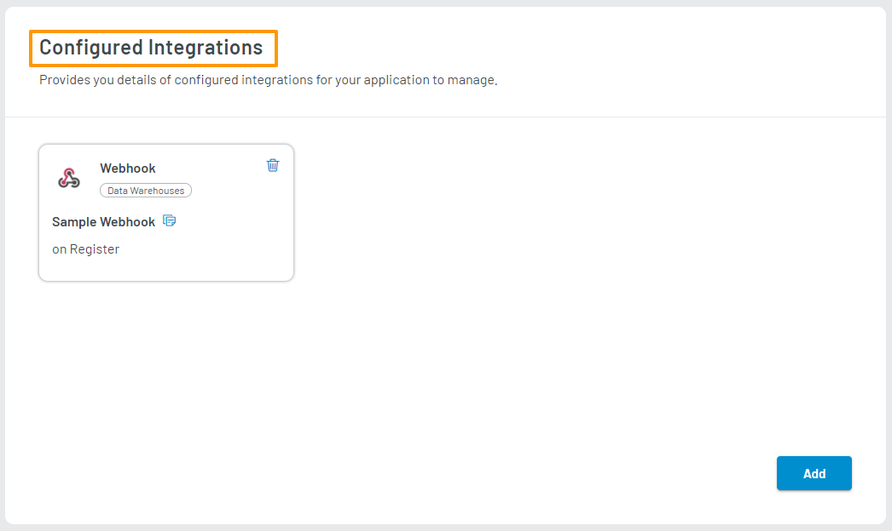

### Step 1: Visit Integration Section

Log in to your <a href="https://dashboard.loginradius.com/dashboard" target="_blank">LoginRadius Dashboard</a> account, select your app, then from the left navigation panel, click the **Integration** and the Configured Integrations screen will appear:

### Step 2: Add Webhook

Click the **Add** button from the above screen, and you will find the list of all available integrations as displayed in the below screen:

Click the **Let's Configure** button in the Webhook tile as on the above screen and follow step 3.

### Step 3: Configure Webhook

Enter or select the following details on the Webhook screen:

- **Name**: Enter the name of the Webhook
- **Event**: Choose the type of event from the dropdown.

  | PLAN              | ALLOWED EVENTS                                                                                                                                                                                                                                                                                       |
  | ----------------- | ---------------------------------------------------------------------------------------------------------------------------------------------------------------------------------------------------------------------------------------------------------------------------------------------------- |
  | **Developer**     | Login, Register, UpdateProfile, ResetPassword, ChangePassword, emailVerification, LinkAccount, UnlinkAccount, InvalidateEmailVerification                                                                                                                                                            |
  | **Developer Pro** | Login, Register, UpdateProfile, ResetPassword, ChangePassword, emailVerification, BlockAccount, DeleteAccount, AssignRoles, UnassignRoles, LinkAccount, UnlinkAccount, VerifyPhoneNumber, UpdateCustomobject, DeleteCustomObject, CreateCustomObject, InvalidateEmailVerification, RemoveRoleContext |

- **Subscribe URL**: Enter the URL where payload data will be sent when the webhook event is triggered.

The following displays the Webhook screen:

Click the **Save** button after providing the required details.

You will find the successfully configured webhook in the **Configured Integrations** section as displayed in the below screen:

