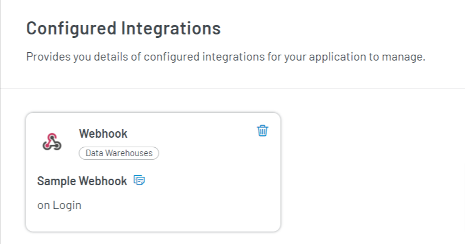

### Step 1: Visit Integration Section

1. Log in to your <a href="https://dashboard.loginradius.com/dashboard" target="_blank">LoginRadius Dashboard</a> account, select your app, then from the left navigation panel, click the **Integration** and the Configured Integrations screen will appear:

   

2. Click the **Add** button from the above screen, and you will find the list of all available integrations as displayed in the below screen:

   
   
3. Click the **Try It For Free** option and the following pop-up will appear:
   

4. Click the **Enable** button from above pop-up and then rom the **Available Integrations** screen, click the **Let’s Configure** option under the Webhook box. The following screen will appear:

   

5. Enter or select the following details on the Webhook screen:

   - **Name**: Enter the name of the Webhook
   - **Event**: Choose the type of event.

     | ALLOWED EVENTS                                                                                                                                                                                                                                                                                       |
     | ---------------------------------------------------------------------------------------------------------------------------------------------------------------------------------------------------------------------------------------------------------------------------------------------------- |
     | Login, Register, UpdateProfile, ResetPassword, ChangePassword, emailVerification, BlockAccount, DeleteAccount, AssignRoles, UnassignRoles, LinkAccount, UnlinkAccount, VerifyPhoneNumber, UpdateCustomobject, DeleteCustomObject, CreateCustomObject, InvalidateEmailVerification, RemoveRoleContext |

   - **Subscribe URL**: Enter the URL where payload data will be sent when the webhook event is triggered.

   > **Note**: You can change the list of subscribed events through the API at any time. By default, Webhooks are only subscribed to the push event.

6. Click the **Save** button after providing the required details.

You will find the successfully configured webhook in the **Configured Integrations** section as displayed in the below screen:

