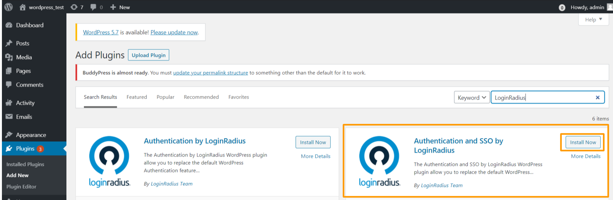
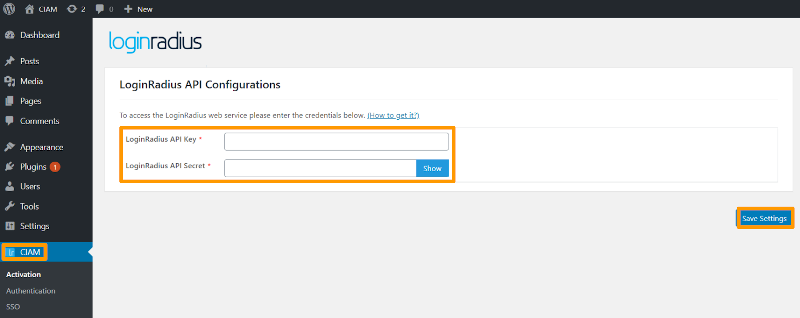
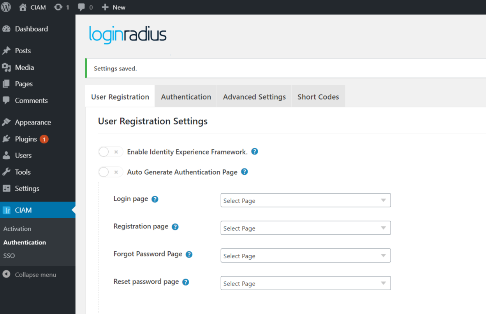
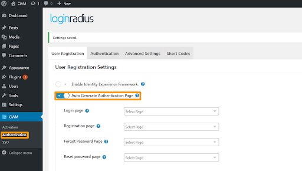
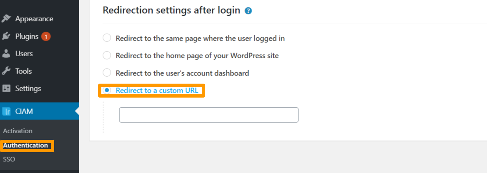
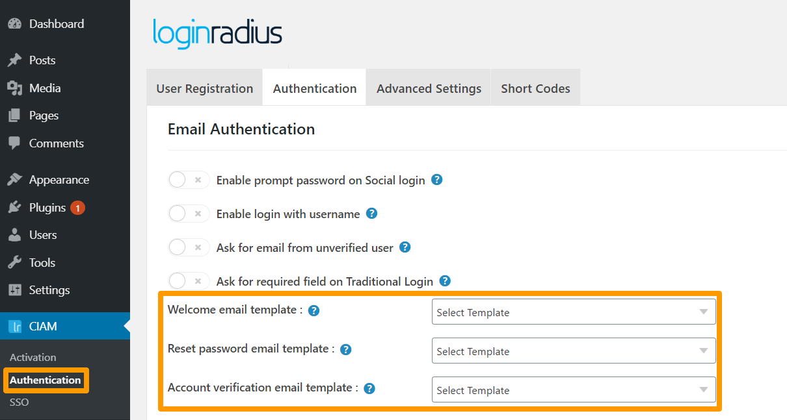
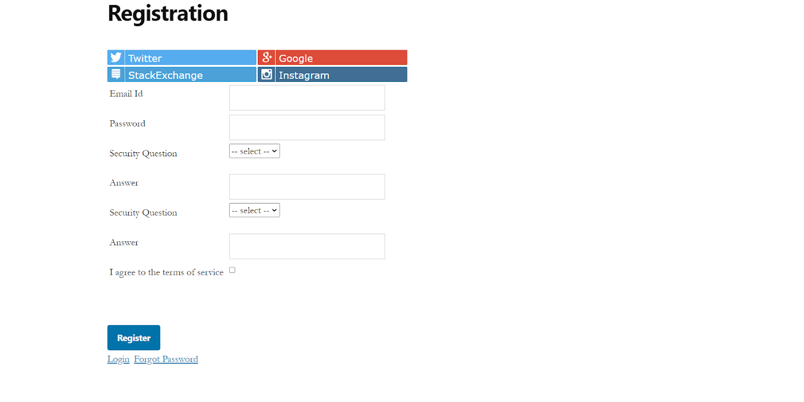
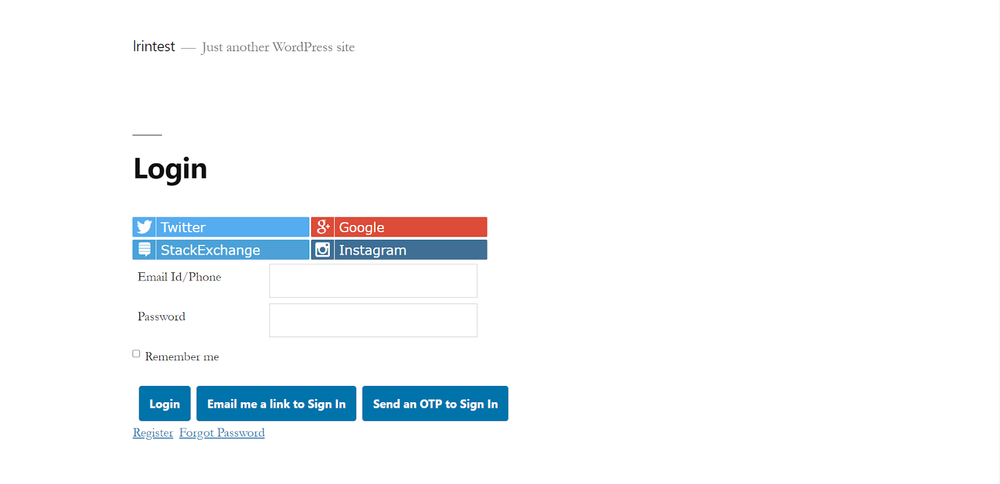

# Get Started - WordPress
The tutorial lets you implement LoginRadius user registration, login, profile, and log out in your WordPress application.

> **Note:** <a href="https://accounts.loginradius.com/auth.aspx?return_url=https://dashboard.loginradius.com/login&action=register" target="_blank">Create an account</a> to get started if you don't have one yet!

You can access the WordPress LoginRadius CIAM Plugin <a href="https://wordpress.org/plugins/loginradius-customer-identity-and-access-management/" target="_blank">here</a>.

Watch this video to get started, or refer to the section below for the text-based guide.

<figure class="video_container">
<iframe width="560" height="315" src="https://www.youtube.com/embed/Njxtvu7KBMg" frameborder="0" allow="accelerometer; autoplay; clipboard-write; encrypted-media; gyroscope; picture-in-picture" allowfullscreen></iframe></figure>

---

## Get Credentials

Before using LoginRadius WordPress Plugin, you need to get your App Name, API Key, and API Secret.

In your LoginRadius Dashboard, navigate to **<a href="https://dashboard.loginradius.com/configuration" target="_blank">Configuration > API Credentials</a>** and click the **API Key And Secret** subsection to retrieve your API Credentials.

> **Note:** Whitelist your application domain as explained in the [Whitelist Domain](#whitelist-domain) section.

## Setup WordPress Plugin

1. Log in to an existing WordPress site as an administrator.

2. Go to **Plugins > Add New** in the admin menu on the left.

3. Search for **"LoginRadius"** and click the **Install Now** button given next to the **Authentication and SSO by LoginRadius** plugin highlighted in the following screen.

   

4. To activate the plugin, navigate to **WordPress Admin Panel > CIAM > Activation** and enter your **API Key**, and **API Secret** obtained from the [Get Credentials](#get-credentials) step.

   

5. Click the **Save Settings** button.

## Implement Registration and Login

To enable authentication settings, navigate to **Wordpress Admin Panel > CIAM > Authentication**, the following screen will appear:

 
### User Registration Tab

**Auto Generate Authentication Page**

To allow the plugin to auto-generate the pages for login, registration, forgot password, and reset password enable 'Auto Generate Authentication Page'.

> **Note:** You can also generate email/social login and registration interface on the desired page using the shortcodes provided in the ShortCodes tab, If you don’t wish to enable **Auto Generate Authentication Page**.
 

**Redirection After Login**

You can set the redirection of the consumer after login to one of the following options displayed on the screen:

Below is the example of passing the Redirect To URL with the login URL
http://www.example.com/login/?redirect_to=http:%2F%2Fwww.example1.com

> **Note:** redirect_to parameter will have a URL in the encoded format.

### Authentication Tab

Email templates can be added/modified in **LoginRadius Dashboard** which will be displayed in the WP-Admin authentication page.

 
> **Note:** Refer to [this document](/guide/emailpassword-login) for managing email templates for Email/Password Login.

### Short Codes Tab

You can select shortcodes that can be used on the page or post to display the respective interface. 

## Run and See Result

**Registration Page**: Open the registration page created from the plugin authentication tab from the admin panel, it will appear as given below. 

**Login Page**: Login interfaces can be used from the login page created from the plugin authentication tab from the admin panel.

## Whitelist Domain

For security reasons, LoginRadius processes the API calls that are received from the whitelisted domains. Local domains (http://localhost and http://127.0.0.1) are whitelisted by default.
 
To whitelist your domain, in your LoginRadius Dashboard, navigate to **<a href="https://dashboard.loginradius.com/configuration" target="_blank">Configuration > Whitelist Your Domain</a>** and add your domain name:
 

## API Reference

[APIs](/#api)

[Go Back to Home Page](/)
