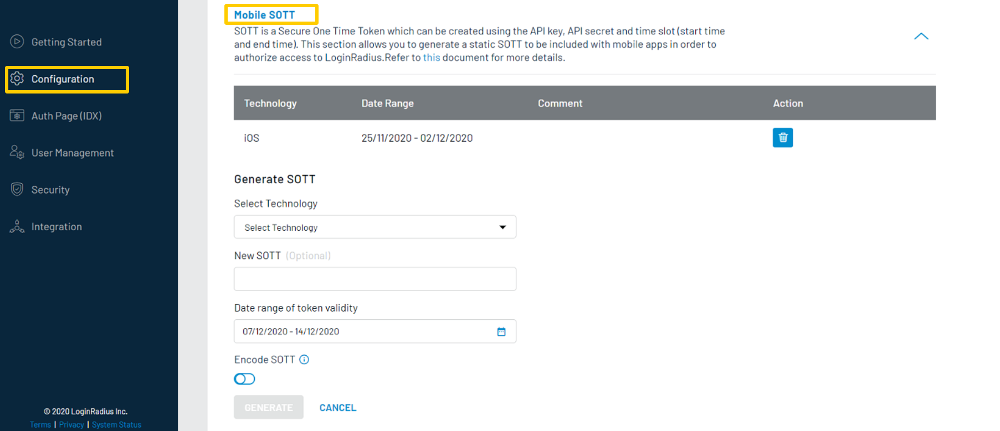

This guide will show you how to implement the user authentication in a android application application. For this tutorial, we will use the Android demo from GitHub and show you step by step how to run it.

## Prerequisites

* Android SDK Version >= 15
* Build Tools Version = 28.0.0 (changeable in build.gradle)
* Android Studio >= 3.5.2

import {
  ExpansionPanel,
  ExpansionPanelList,
  ExpansionPanelListItem
} from 'gatsby-theme-apollo-docs';

import Setup from "../howto/dashboard-setup"

## Setup Your Dashboard

Get your credentials and whitelist your application domain as explained in this section. This is a mandatory step to successfully implement and run the demo.

<ExpansionPanel title="Click here to view details">
<Setup />
</ExpansionPanel>


Generate SOTT You need to pass the SOTT value at the time of registration in Android SDK V2 and you can generate this by [dashboard](https://dashboard.loginradius.com/dashboard).

Open dashboard, click on "Configure Your Application" and open *Mobile SOTT* . now set the time according to the requirement and generate SOTT.

<div style="text-align:center">
  
</div>
<br></br>


## Start with demo

1.You can clone the [demo repository](https://github.com/LoginRadius/android-sdk) on your system using below commands:

  #### With SSH
  ```
    git clone git@github.com:LoginRadius/android-sdk.git
  ```
  #### With https
  ```
  git clone https://github.com/LoginRadius/android-sdk.git
  ```
2. Now import demo in your Android Studio.

3. After importing the demo project in Android Studio, there is a need to configure API Key, Site Name and SOTT. These values are initialized in MainActivity.java.

```java
LoginRadiusSDK.Initialize init = new Initialize();
init.setApiKey(getString(R.string.api_key));
init.setSiteName(getString(R.string.site_name));
init.setSott(sott);
```
(a) You can configure API Key and Site Name values in the strings.xml of the demo project.
```xml
<resources>
    ....
    <string name="api_key">your loginradius api key</string>
    <string name="site_name">your loginradius sitename</string>
    ....
</resources>
```
(b) To configure SOTT, replace the value in the following code in MainActivity.java:

```java
  String sott = "put your sott here";
```
4. Run this application on your android studio 

<div style="text-align:center">
  
</div>

## Features implemented in demo
- Login 
- Registration 
- Email Verification
- Forgot Password
- Reset Password

## Discover More 

import { MenuWrapper } from "../../src/components/menu.js";
import WorkoutMenuItem from "../../src/components/menu-item.js";
import { IconSupport } from "@apollo/space-kit/icons/IconSupport";
import { IconInfo } from "@apollo/space-kit/icons/IconInfo";

<MenuWrapper>

<WorkoutMenuItem
  icon={IconInfo}
  keyWord={"Discover More"}
  otherWords={"on"}
>

* Add/Update [Email Templates](/howto/email-templates/)
* Customize Your [Login Page](/howto/authentication-theme/)
* Work with [SOTT](/howto/work-with-sott/)

</WorkoutMenuItem>

<WorkoutMenuItem
  icon={IconSupport}
  keyWord={"How To"}
  otherWords={"Guides"}
>

* Implement [SMTP Configuration](/howto/email-smtp-config/)
* Implement [Social Login](/howto/social-login/)

</WorkoutMenuItem>

</MenuWrapper>