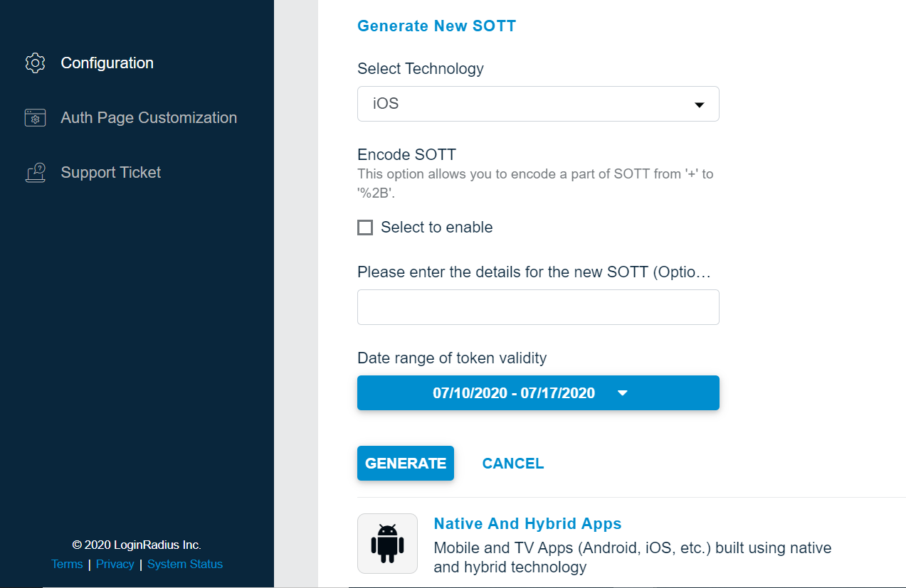
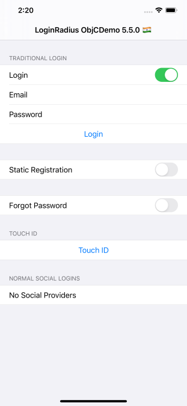

This guide will show you how to implement the user authentication in a iOS application . For this tutorial, we will use the iOS demo from GitHub and show you step by step how to run it.

## Prerequisite

This tutorial assumes you have:

- [OS X](https://www.apple.com/macos/catalina/), [Xcode](https://developer.apple.com/xcode/) and iOS 9 or higher.

import {
  ExpansionPanel,
  ExpansionPanelList,
  ExpansionPanelListItem
} from 'gatsby-theme-apollo-docs';

import Setup from "../howto/dashboard-setup"

## Setup Your Dashboard

Get your credentials and whitelist your application domain as explained in this section. This is a mandatory step to successfully implement and run the demo.

<ExpansionPanel title="Click here to view details">
  <Setup />
</ExpansionPanel>

Generate SOTT You need to pass the SOTT value at the time of registration and you can generate this by [dashboard](https://dashboard.loginradius.com/dashboard). 

Open dashboard, click on "Configure Your Application" and open **Mobile SOTT** . Now set the time according to the requirement and generate SOTT.

<div style="text-align:center">
  
</div>
<br></br>


## Start with demo

1. You can clone the [demo repository](https://github.com/LoginRadius/ios-sdk) on your system using below commands:

  #### With SSH
  ```
  git clone git@github.com:LoginRadius/ios-sdk.git
  ```
  #### With https
  ```
  git clone https://github.com/LoginRadius/ios-sdk.git
  ```
2. Now install demo in your Xcode Studio.
3. Install the SDK via CocoaPods 

To create Pod file run the following command in terminal
  ```
  $ pod init
  ``` 
To integrate LoginRadiusSDK into your Xcode project using CocoaPods, specify it in your `Podfile`:

  ```
    source 'https://github.com/CocoaPods/Specs.git'
    platform :ios, '9.0'

    target 'TargetName' do
    pod 'LoginRadiusSDK', '~> 5.4.1'
    end
  ```

Then, run the following command:

```
  pod install
```
4. Create a plist file named **LoginRadius.plist** and add the following code.
```xml
  <key>apiKey</key>
  <string>Enter your loginradius api key</string>
  <key>siteName</key>
  <string>Enter your loginradius site name</string>
```
5. In Xcode, right-click on your project's .plist file and select Open As -> Source Code.**Default plist is usually your Info.plist file**
6. Insert the value for url scheme with this.
```
<Your site name>.<Your Bundle Identifier>
```

7. Run your project
<div style="text-align:center">
  
  
</div>

## Features implemented in demo
- Login 
- Registration 
- Email Verification
- Forgot Password
- Reset Password

## Discover More 

import { MenuWrapper } from "../../src/components/menu.js";
import WorkoutMenuItem from "../../src/components/menu-item.js";
import { IconSupport } from "@apollo/space-kit/icons/IconSupport";
import { IconInfo } from "@apollo/space-kit/icons/IconInfo";

<MenuWrapper>

<WorkoutMenuItem
  icon={IconInfo}
  keyWord={"Discover More"}
  otherWords={"on"}
>

* Add/Update [Email Templates](/howto/email-templates/)
* Customize Your [Login Page](/howto/authentication-theme/)
* Work with [SOTT](/howto/work-with-sott/)

</WorkoutMenuItem>

<WorkoutMenuItem
  icon={IconSupport}
  keyWord={"How To"}
  otherWords={"Guides"}
>

* Implement [SMTP Configuration](/howto/email-smtp-config/)
* Implement [Captcha](/howto/implement-captcha/)
* Implement [Social Login](/howto/social-login/)

</WorkoutMenuItem>

</MenuWrapper>
