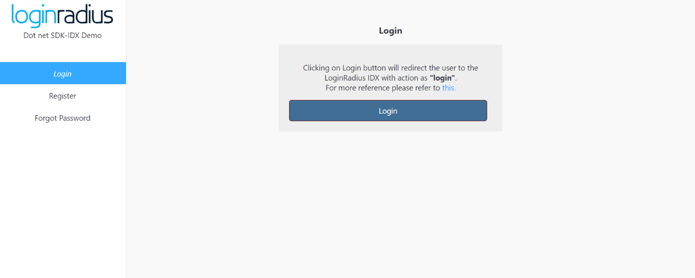

import {
  ExpansionPanel,
  ExpansionPanelList,
  ExpansionPanelListItem
} from 'gatsby-theme-apollo-docs';

import Setup from "../howto/dashboard-setup"

This guide will show you how to implement the user authentication in a ASP.NET application. For this tutorial, we will use the ASP.NET demo from GitHub and show you step by step how to run it.


## Prerequisites

This tutorial assumes you have:

- Basic knowledge of HTML/CSS
- ASP.NET installed on your system

## Setup Your Dashboard

Get your credentials and whitelist your application domain as explained in this section. This is a mandatory step to successfully implement and run the demo.

<ExpansionPanel title="Click here to view details">
<Setup />
</ExpansionPanel>


## Start with IDX demo

1. You can clone the [IDX demo repository](https://github.com/LoginRadius/login-page-demos) on your system using below commands:

  #### With SSH
  ```
  git clone git@github.com:LoginRadius/login-page-demos.git
  ```
  #### With https
  ```
  git clone https://github.com/LoginRadius/login-page-demos.git
  ```
2. Now Open dot-net-idx-demo in your ASP.NET IDE(Visual Studio).

```
cd login-page-demo/dot-net-idx-demo/
```


This is the file structure you will get in the ASP.NET demo, let me explain what each file does

 - Samples - Contains all the code related to a sample demo created in MVC format using ASP.NET.

 - Source folder - contains the LoginRadius ASP.NET SDK functionality needed to run the authentication demo

```
.
Samples
-- dot-net-demo/
  |-- Controllers/
  |--  Models/
  |--  Views/
  |--  wwwroot/
Source/
```


3. You need to add your LoginRadius credentials in the demo app to communicate with [LoginRadius SDK](https://github.com/LoginRadius/dot-net-sdk)

- Server side: `dot-net-idx-demo\Samples\dot-net-demo\dot-net-demo\appsettings.json`

```js
"loginradius": {
    "apiKey": "",
    "apiSecret": "",
    "appName": "",
    "ApiRequestSigning": "false",
    "proxyAddress": "__HTTP_PROXY_ADDRESS__",
    "proxyCredentials": "__HTTP_PROXY_CREDENTIAL__",
    "connectionTimeout": "__HTTP_CONNECTION_TIMEOUT__",
    "requestRetries": "__HTTP_CONNECTION_RETRY__",
    "domainName": "https://api.loginradius.com/"
  }
``` 

- Client side: `dot-net-idx-demo\Samples\dot-net-demo\dot-net-demo\wwwroot\js\options.js`

```Js
commonOptions.apiKey = "<LoginRadius API Key>"; 
commonOptions.appName = "<App Name>"; 
```
4. Run this application on your ASP.NET IDE and after successful build

Now you can see application running in the [http://localhost:4000/](http://localhost:4000/). Once you click on login button it will redirect you to auth page.

<div style="text-align:center">
  
</div>


## Features implemented in demo
- Login with IDX
- Registration with IDX
- Email Verification
- Forgot Password
- Reset Password

## Discover More 

import { MenuWrapper } from "../../src/components/menu.js";
import WorkoutMenuItem from "../../src/components/menu-item.js";
import { IconSupport } from "@apollo/space-kit/icons/IconSupport";
import { IconInfo } from "@apollo/space-kit/icons/IconInfo";

<MenuWrapper>

<WorkoutMenuItem
  icon={IconInfo}
  keyWord={"Discover More"}
  otherWords={"on"}
>

* Add/Update [Email Templates](/howto/email-templates/)
* Customize Your [Login Page](/howto/authentication-theme/)
* Work with [SOTT](/howto/work-with-sott/)

</WorkoutMenuItem>

<WorkoutMenuItem
  icon={IconSupport}
  keyWord={"How To"}
  otherWords={"Guides"}
>

* Implement [SMTP Configuration](/howto/email-smtp-config/)
* Implement [Captcha](/howto/implement-captcha/)
* Implement [Social Login](/howto/social-login/)

</WorkoutMenuItem>

</MenuWrapper>