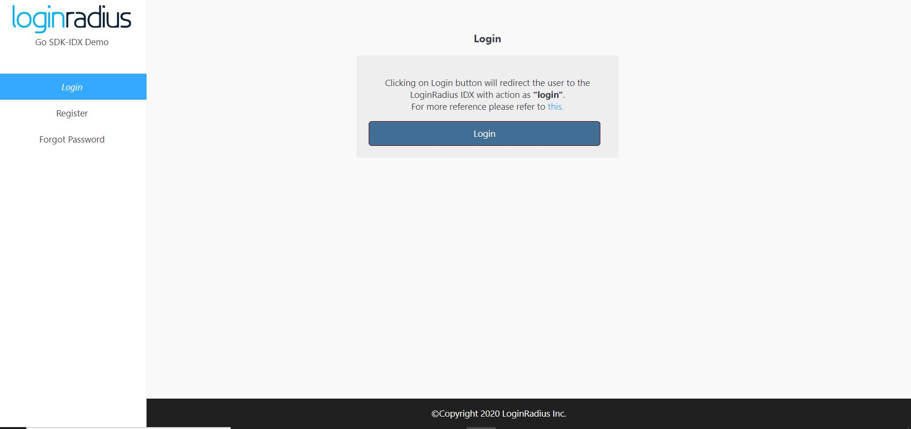

import {
  ExpansionPanel,
  ExpansionPanelList,
  ExpansionPanelListItem
} from 'gatsby-theme-apollo-docs';

import Setup from "../howto/dashboard-setup"

This guide will show you how to implement the user authentication in a Go application. For this tutorial, we will use the Go demo from GitHub and show you step by step how to run it.


## Prerequisites

This tutorial assumes you have:

- Basic knowledge of HTML/CSS
- Latest Go version installed on your system

## Setup Your Dashboard

Get your credentials and whitelist your application domain as explained in this section. This is a mandatory step to successfully implement and run the demo.

<ExpansionPanel title="Click here to view details">
  <Setup/>
</ExpansionPanel>

## Start with IDX demo

1. You can clone the [IDX demo repository](https://github.com/LoginRadius/login-page-demos) on your system using below commands:

  #### With SSH

  ```
  git clone git@github.com:LoginRadius/login-page-demos.git
  ```

  #### With https

  ```
  git clone https://github.com/LoginRadius/login-page-demos.git
  ```
2. Now move to the directory Go demo by running the following command using the terminal

```
cd login-page-demo/go-idx-demo/
```

This is the file structure you will get in the GoLang demo, let me explain what each file does

 - config folder - Contains the public and secret environment files.

- pkg folder - Contains all code for routes and APIs

- ui folder - Contains all the HTML, CSS and JS file to create UI for the test application

 - go.mod - contains all the go lang dependencies

- main.go -  Contains all the code to run a server and render the html files.
```
.
+-- config
|   --- public.env
|   --- secret.env
+-- pkg
+-- ui
|   +-- assets
|   |   +-- css
|   |   +-- img
|   |   +-- js
|   |   --- index.html
|   |   --- profile.html
|   |   --- resetpassword.html
--- go.mod
--- main.go
```

3. Set your LoginRadius credentials on the client and server-side in the following files

- Server side: `public.env`

```
BASEURL=http://localhost:3000/
DOMAIN=https://api.loginradius.com
```
- Server side: `secret.env`

```
APIKEY=<LoginRadius API key>
APISECRET=<LoginRadius API secret>
```

- Client side: `ui/assets/js/options.js`

``` JS
commonOptions.apiKey = "<LoginRadius API key>";
commonOptions.appName = "<LoginRadius App Name>";
```

4. Running application 

Run the below commands in the terminal from the root folder of the application, Once all the dependencies have been installed run the application

```GO
go run main.go
```
Then visit [http://localhost:3000](http://localhost:3000) from your local browser and you will see the application running. Once you click on login button it will redirect you to auth page.

<div style="text-align:center">
  
</div>

## Features implemented in demo
- Login with IDX
- Registration with IDX
- Email Verification
- Forgot Password
- Reset Password

## Discover More 

import { MenuWrapper } from "../../src/components/menu.js";
import WorkoutMenuItem from "../../src/components/menu-item.js";
import { IconSupport } from "@apollo/space-kit/icons/IconSupport";
import { IconInfo } from "@apollo/space-kit/icons/IconInfo";

<MenuWrapper>

<WorkoutMenuItem
  icon={IconInfo}
  keyWord={"Discover More"}
  otherWords={"on"}
>

* Add/Update [Email Templates](/howto/email-templates/)
* Customize Your [Login Page](/howto/authentication-theme/)
* Work with [SOTT](/howto/work-with-sott/)

</WorkoutMenuItem>

<WorkoutMenuItem
  icon={IconSupport}
  keyWord={"How To"}
  otherWords={"Guides"}
>

* Implement [SMTP Configuration](/howto/email-smtp-config/)
* Implement [Social Login](/howto/social-login/)

</WorkoutMenuItem>

</MenuWrapper>