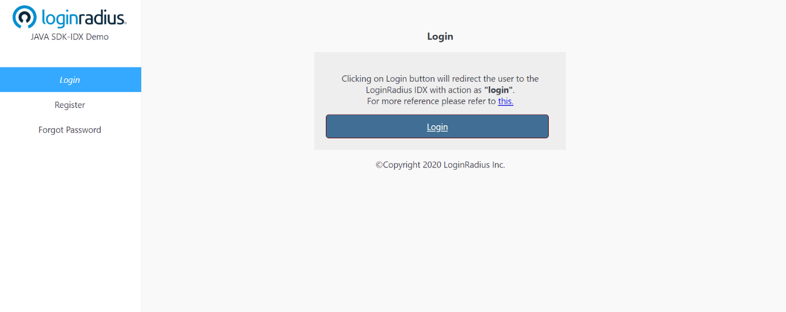

import {
  ExpansionPanel,
  ExpansionPanelList,
  ExpansionPanelListItem
} from 'gatsby-theme-apollo-docs';

import Setup from "../howto/dashboard-setup"

This guide will show you how to implement the user authentication in a Java application. For this tutorial, we will use the Java demo from GitHub and show you step by step how to run it.

## Prerequisites

This tutorial assumes you have:

- Basic knowledge of HTML/CSS
- java installed on your system

## Setup Your Dashboard

Get your credentials and whitelist your application domain as explained in this section. This is a mandatory step to successfully implement and run the demo.

<ExpansionPanel title="Click here to view details">
<Setup />
</ExpansionPanel>

## Start with Auth Page (IDX) demo

1. You can clone the [Auth Page demo repository](https://github.com/LoginRadius/login-page-demos) on your system using below commands:

  #### With SSH
  ```
  git clone git@github.com:LoginRadius/login-page-demos.git
  ```
  #### With https
  ```
  git clone https://github.com/LoginRadius/login-page-demos.git
  ```
2. Now move to the directory Java demo by running the following command using the terminal

```
cd login-page-demo/java-idx-demo/
```

and Open/import java-idx-demo in your java IDE (Eclipse).

This is the file structure you will get in the Java demo, let's see  what each file does

 - demo folder - Contains all the HTML, CSS and JS file to create UI for the test application.

 - static folder - Contains all the CSS and JS file to create UI for the test application.

 - java folder - Contains server side code and routing API to be used in demo

 - templates folder - contains the HTML template for Login and profile page

```
.
.project
pom.xml
README.md
src
| -- main
| -- |--- |java/
| -- |--- |resources/
| -- |--- |-- application.properties
| -- |--- |-- static
| -- |--- |-- templates
| -- |--- |-- --- index.html
| -- |--- |-- --- profile.html
```


3. You need to add your LoginRadius credentials in the demo app to communicate with [LoginRadius SDK](https://github.com/LoginRadius/java-sdk)

- Server side: `java-idx-demo/src/main/resources/application.properties`

```JAVA
server.port= 8080
app.apikey=xxxxxxxxxx //Add api key
app.apisecret=xxxxxxxxx //Add api secret
``` 

- Client side: `java-idx-demo/src/main/resources/static/js/options.js`

```Java
commonOptions.apiKey = "<LoginRadius API Key>"; //Add api key
commonOptions.appName = "<App Name>"; //Add app name
```
4. Running application 

Run this application on your java IDE and after successful build

Then visit [http://localhost:3000/demo](http://localhost:3000/demo) from your local browser and you will see the application running. Once you click on login button it will redirect you to auth page.


<div style="text-align:center">
  
</div>


## Features implemented in demo
- Login with Auth Page (IDX)
- Registration with Auth Page (IDX)
- Email Verification
- Forgot Password
- Reset Password
 

## Discover More 

import { MenuWrapper } from "../../src/components/menu.js";
import WorkoutMenuItem from "../../src/components/menu-item.js";
import { IconSupport } from "@apollo/space-kit/icons/IconSupport";
import { IconInfo } from "@apollo/space-kit/icons/IconInfo";

<MenuWrapper>

<WorkoutMenuItem
  icon={IconInfo}
  keyWord={"Discover More"}
  otherWords={"on"}
>

* Add/Update [Email Templates](/howto/manage-email-password-login/)
* Customize Your [Login Page](/howto/authentication-theme/)
* Work with [SOTT](/howto/work-with-sott/)

</WorkoutMenuItem>

<WorkoutMenuItem
  icon={IconSupport}
  keyWord={"How To"}
  otherWords={"Guides"}
>

* Manage [Communication Settings](/howto/manage-communication-settings/)
* Implement [Social Login](/howto/social-login/)

</WorkoutMenuItem>

</MenuWrapper>