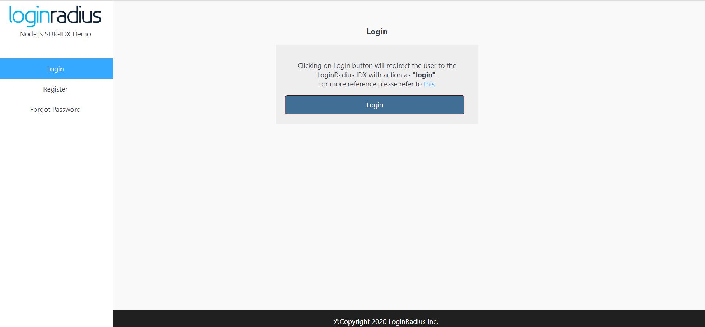

import {
  ExpansionPanel,
  ExpansionPanelList,
  ExpansionPanelListItem
} from 'gatsby-theme-apollo-docs';

import Setup from "../howto/dashboard-setup"

This guide will show you how to implement the user authentication in a Node.js Express application. For this tutorial, we will use the Node.js demo from GitHub and show you step by step how to run it.


## Prerequisites

This tutorial assumes you have:

- Basic knowledge of HTML/CSS
- Latest Node.js version installed on your system

## Setup Your Dashboard

Get your credentials and whitelist your application domain as explained in this section. This is a mandatory step to successfully implement and run the demo.


<ExpansionPanel title="Click here to view details">
<Setup />
</ExpansionPanel>

## Start with Auth Page (IDX) demo

1. You can clone the [Auth Page demo repository](https://github.com/LoginRadius/login-page-demos) on your system using below commands:

  #### With SSH

  ```
  git clone git@github.com:LoginRadius/login-page-demos.git
  ```

  #### With https

  ```
  git clone https://github.com/LoginRadius/login-page-demos.git
  ```
2. Now move to the directory Node.js demo by running the following command using the terminal

  ```
  cd login-page-demo/node-idx-demo/
  ```

   This is the file structure you will get in the Node.js demo, let's see what each file does

    - demo folder - Contains all the HTML, CSS and JS file to create UI for the test application.

    - package.json - Contains all the bare minimum Node.js dependencies needed.

    - server.js -  Contains all the server-side code to render Html pages and send requests to LoginRadius server.

  ```
    +-- demo
    |   +-- assets
    |   --- index.html
    |   --- profile.html
    |   --- resetpassword.html
    --- package.json
    --- server.js
   ```

3. Set your LoginRadius credentials on the client and server-side in the following files

   - Server side: `server.js`

  ```JS
  /*  Config variable  */
  var config = {
    apiDomain: 'https://api.loginradius.com',
    apiKey: '<LoginRadius API key>',
    apiSecret: '<LoginRadius API secret>',
    siteName: '<LoginRadius App name>',
  };
  ```

   - Client side: `demo/assets/js/options.js`

  ``` JS
  commonOptions.apiKey = "<LoginRadius API key>";
  commonOptions.appName = "<LoginRadius App Name>";
  ```

4. Running application 

  Run the below commands in the terminal from the root folder of the application

  ``` JS
  npm install
  ```

  Once all the dependencies have been installed run the application

  ``` JS
  node server.js
  ```
  Then visit [http://localhost:3000/demo](http://localhost:3000/demo) from your local browser and you will see the application running. Once you click on login button it will redirect you to auth page.

  <div style="text-align:center">
    
  </div>

## Features implemented in demo
- Login with Auth Page (IDX)
- Registration with Auth Page (IDX)
- Email Verification
- Forgot Password
- Reset Password

## Discover More 

import { MenuWrapper } from "../../src/components/menu.js";
import WorkoutMenuItem from "../../src/components/menu-item.js";
import { IconSupport } from "@apollo/space-kit/icons/IconSupport";
import { IconInfo } from "@apollo/space-kit/icons/IconInfo";

<MenuWrapper>

<WorkoutMenuItem
  icon={IconInfo}
  keyWord={"Discover More"}
  otherWords={"on"}
>

* Add/Update [Email Templates](/howto/email-templates/)
* Customize Your [Login Page](/howto/authentication-theme/)
* Work with [SOTT](/howto/work-with-sott/)

</WorkoutMenuItem>

<WorkoutMenuItem
  icon={IconSupport}
  keyWord={"How To"}
  otherWords={"Guides"}
>

* Implement [SMTP Configuration](/howto/email-smtp-config/)
* Implement [Social Login](/howto/social-login/)

</WorkoutMenuItem>

</MenuWrapper>

