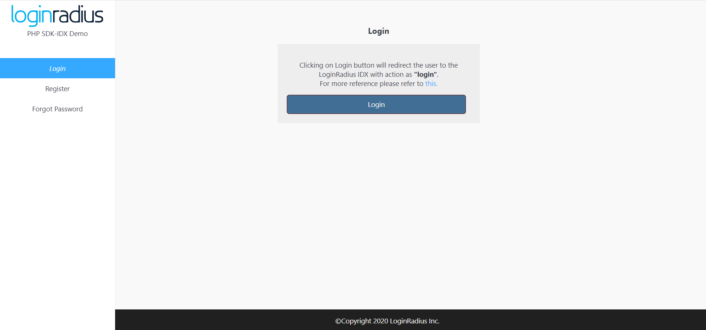

import {
  ExpansionPanel,
  ExpansionPanelList,
  ExpansionPanelListItem
} from 'gatsby-theme-apollo-docs';

import Setup from "../howto/dashboard-setup"


This guide will show you how to implement the user authentication in a PHP application. For this tutorial, we will use the PHP  demo from GitHub and show you step by step how to run it.

## Prerequisites

This tutorial assumes you have:

- Basic knowledge of HTML/CSS
- PHP 6 or later
- Composer

## Setup Your Dashboard

Get your credentials and whitelist your application domain as explained in this section. This is a mandatory step to successfully implement and run the demo.

<ExpansionPanel title="Click here to view details">
<Setup />
</ExpansionPanel>


## Start with Auth Page (IDX) demo

1. You can clone the [Auth Page demo repository](https://github.com/LoginRadius/login-page-demos) on your system using below commands:

  #### With SSH

  ```
  git clone git@github.com:LoginRadius/login-page-demos.git
  ```

  #### With https

  ```
  git clone https://github.com/LoginRadius/login-page-demos.git
  ```
2. Now move to the directory PHP demo using terminal

```
cd login-page-demo/php-idx-demo/
```

This is the file structure you will get in the PHP Demo, let's see  what each file does
 - demo folder - Contains all the HTML, CSS and JS file to create UI for the test application.

 - ajax_handler - Contains server side code and routing API to be used in demo

 - src folder - contains the required LoginRadius SDK functions to work with demo

```
.
+-- demo
|   +-- ajax_handler/
|   +-- assets/
|   --- index.html
|   --- profile.html
|   --- resetpassword.html
--  src/LoginRadiusSDK/
--- composer.json
```

3. Set your LoginRadius credentials on the client and server side in the following files

- Server side: `demo/ajax_handler/config.php`

  ```PHP
  <?php
  define('LR_API_KEY', 'LoginRadius API Key');
  define('LR_API_SECRET', 'LoginRadius API Secret');  // Pass API Secret Key
  ```

- Client side: `demo/js/options.js`

``` JS
commonOptions.apiKey = "<LoginRadius API Key>";
commonOptions.appName = "<App Name>";
```
4. Upload the complete folder in your server wrapped in directory

5. Now run your application in your web browser [http://localhost:3000/demo](http://localhost:3000/demo)

Once you click on login button it will redirect you to auth page.
<div style="text-align:center">
  
</div>

## Features implemented in demo
- Login with Auth Page (IDX)
- Registration with Auth Page (IDX)
- Email Verification
- Forgot Password
- Reset Password

## Discover More 

import { MenuWrapper } from "../../src/components/menu.js";
import WorkoutMenuItem from "../../src/components/menu-item.js";
import { IconSupport } from "@apollo/space-kit/icons/IconSupport";
import { IconInfo } from "@apollo/space-kit/icons/IconInfo";

<MenuWrapper>

<WorkoutMenuItem
  icon={IconInfo}
  keyWord={"Discover More"}
  otherWords={"on"}
>

* Add/Update [Email Templates](/howto/email-templates/)
* Customize Your [Login Page](/howto/authentication-theme/)
* Work with [SOTT](/howto/work-with-sott/)

</WorkoutMenuItem>

<WorkoutMenuItem
  icon={IconSupport}
  keyWord={"How To"}
  otherWords={"Guides"}
>

* Implement [SMTP Configuration](/howto/email-smtp-config/)
* Implement [Social Login](/howto/social-login/)

</WorkoutMenuItem>

</MenuWrapper>


