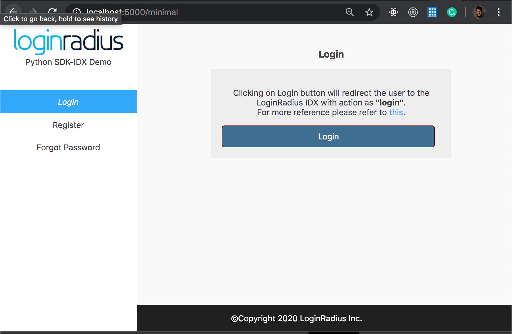

import {
  ExpansionPanel,
  ExpansionPanelList,
  ExpansionPanelListItem
} from 'gatsby-theme-apollo-docs';

import Setup from "../howto/dashboard-setup"


This guide will show you how to implement the user authentication in a Python application. For this tutorial, we will use the Python demo from GitHub and show you step by step how to run it. 


## Prerequisites

This tutorial assumes you have:

- python 2.7 and up
- pip

## Setup Your Dashboard

Get your credentials and whitelist your application domain as explained in this section. This is a mandatory step to successfully implement and run the demo.

<ExpansionPanel title="Click here to view details">
  <Setup />
</ExpansionPanel>

## Start with IDX demo

1. You can clone the [IDX demo repository](https://github.com/LoginRadius/login-page-demos) on your system using below commands:

  #### With SSH

  ```
  git clone git@github.com:LoginRadius/login-page-demos.git
  ```

  #### With https

  ```
  git clone https://github.com/LoginRadius/login-page-demos.git`
  ```
2. Now move to the directory Python demo by running the following command using the terminal

```
cd login-page-demo/python-idx-demo/Demo/
```
This is the file structure you will get in the Python demo, let me explain what each file does

 - static folder - Contains all the CSS and JS  and images to create UI for the test application.

 - template folder - Contains the HTML code for profile and Login page.

 - LoginRadius folder - contains the LoginRadius Python SDK codes needed to run the authentication demo


```
+demo/
|-- app.py
|-- auth.py
|-- lr.py
|-- +static/
|-- |--css/
|-- |--images/
|-- |--js/
|-- +templates
|-- |--index.html
|-- |--profile.html
|-- |--resetpassword.html
|-- +LoginRadius/
```
3. You need to add your LoginRadius credentials in the demo app to communicate with [LoginRadius SDK](https://www.loginradius.com/docs/libraries/sdk-libraries/python-library/)

Server Side: `python-idx-demo/Demo/lr.py`

```python
API_KEY = "<Enter LoginRadius API Key>"
API_SECRET = "<Enter LoginRadius API secret"
```

Client Side: `python-idx-demo/Demo/static/js/options.js`

```js
commonOptions.apiKey = "<LoginRadius API Key";
commonOptions.appName = "<App Name>";
```

4. Running application 

Run the below commands in the terminal from the root folder of the application

```
pip install flast requests pbkdf2 cryptography && cd python-idx-demo/Demo
```
This command will install all the required dependency to run the python demo and change the directory to Demo folder from where your application will be served.

Once all the dependencies have been installed run the application

```
python app.py
```
Now you can see application running in the http://localhost:5000, Once you click on login button it will redirect you to auth page.

<div style="text-align:center">
  
</div>

## Features implemented in demo
- Login with IDX
- Registration with IDX
- Email Verification
- Forgot Password
- Reset Password

## Discover More 

import { MenuWrapper } from "../../src/components/menu.js";
import WorkoutMenuItem from "../../src/components/menu-item.js";
import { IconSupport } from "@apollo/space-kit/icons/IconSupport";
import { IconInfo } from "@apollo/space-kit/icons/IconInfo";

<MenuWrapper>

<WorkoutMenuItem
  icon={IconInfo}
  keyWord={"Discover More"}
  otherWords={"on"}
>

* Add/Update [Email Templates](/howto/email-templates/)
* Customize Your [Login Page](/howto/authentication-theme/)
* Work with [SOTT](/howto/work-with-sott/)

</WorkoutMenuItem>

<WorkoutMenuItem
  icon={IconSupport}
  keyWord={"How To"}
  otherWords={"Guides"}
>

* Implement [SMTP Configuration](/howto/email-smtp-config/)
* Implement [Captcha](/howto/implement-captcha/)
* Implement [Social Login](/howto/social-login/)

</WorkoutMenuItem>

</MenuWrapper>


