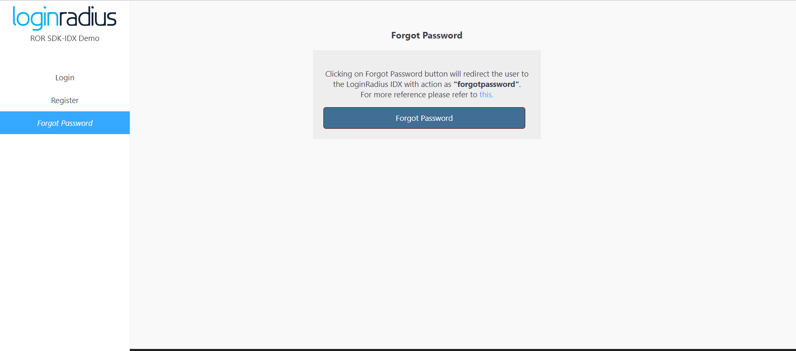

import {
  ExpansionPanel,
  ExpansionPanelList,
  ExpansionPanelListItem
} from 'gatsby-theme-apollo-docs';

import Setup from "../howto/dashboard-setup"

This guide will show you how to implement the user authentication in a ROR application. For this tutorial, we will use the ROR demo from GitHub and show you step by step how to run it.

## Prerequisites

This tutorial assumes you have:

- Basic knowledge of HTML/CSS
-  Ruby and Rails set up installed on your system

> Follow [this](https://www.ruby-lang.org/en/documentation/installation/) guide to install Ruby, and [this](https://guides.rubyonrails.org/) guide to install Rails. 


## Setup Your Dashboard

Get your credentials and whitelist your application domain as explained in this section. This is a mandatory step to successfully implement and run the demo.

<ExpansionPanel title="Click here to view details">
<Setup />
</ExpansionPanel>

## Start with Auth Page (IDX) demo

1. You can clone the [Auth Page demo repository](https://github.com/LoginRadius/login-page-demos) on your system using below commands:

  #### With SSH

  ```
  git clone git@github.com:LoginRadius/login-page-demos.git
  ```

  #### With https

  ```
  git clone https://github.com/LoginRadius/login-page-demos.git
  ```
2. Now move to the diretory ROR demo using terminal

```
cd login-page-demo/ruby-on-rails-idx-demo/
```

This is the file structure you will get in the ROR demo, let's see  what each file does

 - public folder - Contains all the HTML, CSS and JS file to create UI for the test application.

 - Gemfile - Contains all the bare minimum ROR dependencies needed.


```
.

-|bin/
-|app/
-|config/
-|lib/
-|public/
-|-- |-css/
-|-- |-icons/
-|-- |-js/
-|-- index.html 
-|-- profile.html 
-|Gemfile
-|Rakefile

```


3. Set your LoginRadius credentials on the client and server side in the following files

### Server side:
 Set the generated `/config/application.yml` with your credentials; an example is provided in  `config/application.yml.example`

```yml
  SITE_NAME: <your-site-name>
  API_KEY: <your-api-key>
  API_SECRET: <your-api-secret>
  CUSTOM_API_DOMAIN: "false"
```

### Client side:
 To configure the login screen implementation, create `options.js` in `/public/js` based on the example provided example in `/public/options.js.sample` 


``` JS
commonOptions.apiKey = "<LoginRadius API Key>";
commonOptions.appName = "<App Name>";
```
4. Running Application 

Now Run the following commands in the root of the directory, where `gemfile` is located  

```
  bundle install
```
```
 bundle exec figaro install
```

Run the server using `rails server`

Then visit [http://localhost:3000/demo](http://localhost:3000/demo) from your local browser and you will see the application running. Once you click on login button it will redirect you to auth page.


<div style="text-align:center">
  
</div>


## Discover More 

import { MenuWrapper } from "../../src/components/menu.js";
import WorkoutMenuItem from "../../src/components/menu-item.js";
import { IconSupport } from "@apollo/space-kit/icons/IconSupport";
import { IconInfo } from "@apollo/space-kit/icons/IconInfo";

<MenuWrapper>

<WorkoutMenuItem
  icon={IconInfo}
  keyWord={"Discover More"}
  otherWords={"on"}
>

* Add/Update [Email Templates](/howto/email-templates/)
* Customize Your [Login Page](/howto/authentication-theme/)
* Work with [SOTT](/howto/work-with-sott/)

</WorkoutMenuItem>

<WorkoutMenuItem
  icon={IconSupport}
  keyWord={"How To"}
  otherWords={"Guides"}
>

* Implement [SMTP Configuration](/howto/email-smtp-config/)
* Implement [Social Login](/howto/social-login/)

</WorkoutMenuItem>

</MenuWrapper>