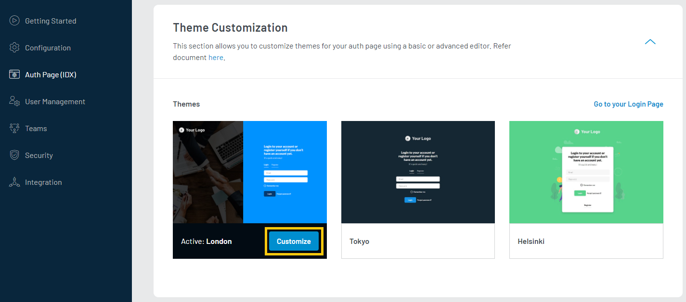

import {
  ExpansionPanel,
  ExpansionPanelList,
  ExpansionPanelListItem
} from 'gatsby-theme-apollo-docs';

import Customize from "../howto/authentication-theme"

This feature allows you to choose a design template for your authentication pages (register, login, forgot password, and reset password). You can then customize Favicon, Logo, and Labels for the selected template. The default design theme remains applicable even if you do not choose a template option.

## Access the advanced editor

Login to your [LoginRadius Dashboard](https://dashboard.loginradius.com/dashboard) account,from the left navigation panel, click the **Auth Page (IDX)** and then navigate to the **Auth Page (IDX)** section. Click the **CUSTOMIZE** button given on the selected theme as highlighted in the screen below:

  

 

By clicking on **SWITCH TO ADVANCED EDITOR**, You can see an advanced editor section showing several files and their source codes, as shown in the screen below:

  

 

## Customization

The IDX consists of two main pages-Authentication and Profile. 

The **Authentication** page has the following interfaces:

- Registration
- Login
- Forgot Password

The **Profile** page has the following interfaces:

- Profile Editor
- Reset Password

Both pages allow you to add your custom CSS and JS by adding the properties or direct from the URL along with the below categories.

1. Markup
2. Styling
3. Script

### Markup

The HTML layout of both **Authentication** and **Profile** page is customizable. Go into the `HTML` tab in the *Authentication* section, and you can see the complete HTML code over here.  You have to include some JavaScript handlers to populate the containers and help make the associations between LoginRadius scripts and the Identity Experience Framework Registration page.
The HTML interfaces are set to some default containers to handle different authentication functionalities. Below is the list of default interfaces and their corresponding containers. 

| Interface       | Default Container ID| Related Section  |
| ------------- |-------------| -----|
| Login Form  | login-container | Authentication |
| Registration    | registration-container      | Authentication |
| Forgot Password  | forgotpassword-container      | Authentication |
| Social Linking Interface  | lr-linked-social and lr-not-linked-social | Profile |
| Profile Editor    | profile-editor-container      | Profile |
| Change Password | change-password      | Profile |

> Note: While changing the markup, you need to change the corresponding IDs for the interfaces.

For example, if you want to change the ID of the default login-container then while changing the ID of the element in the markup file, you need to update the same ID reference in its corresponding JavaScript file `default-auth-before-script.js` using this variable `lr_raas_settings.login.containerid`.

### Styling

You can customize the CSS styling applied to the page by making changes to the provided `hosted-auth-default.css` according to your design/branding requirements.

### Script

You can control some additional functionality from `default-auth-before-script.js` and  `default-profile-before-script.js`. JavaScript files include additional JS, if you would like to further customize the interfaces based on your requirement.

The following customizations are included in the provided JS files:

**To change the messages**: Find the object `successMessages` in *JavaScript files* and change the message according to your requirements.

**To change the loading image**: Find function `visibleLoadingSpinner` in *JavaScript files* and customize it to your requirements.

**To change form settings**: 
 - Find functions `showLogin, showRegister, showForgotPassword` in **default-auth-before-script.js** and customize it for your requirements. You can add the custom code just below the default code.
- Find functions `LoginRadiusRaaS.\$hooks.setRenderProfileEditor` in **default-profile-before-script.js** and customize it for your requirements. You can add the custom code just below the default code.
