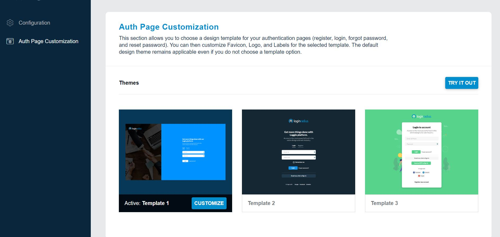
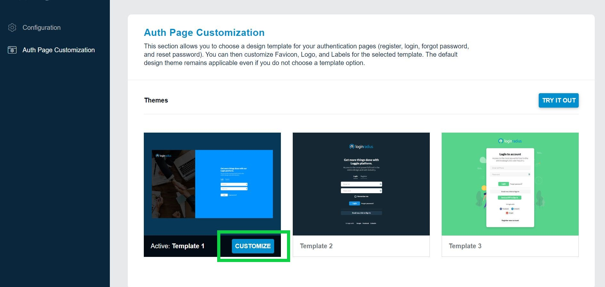
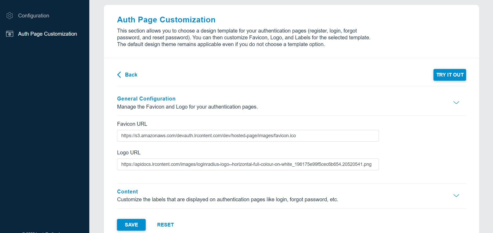
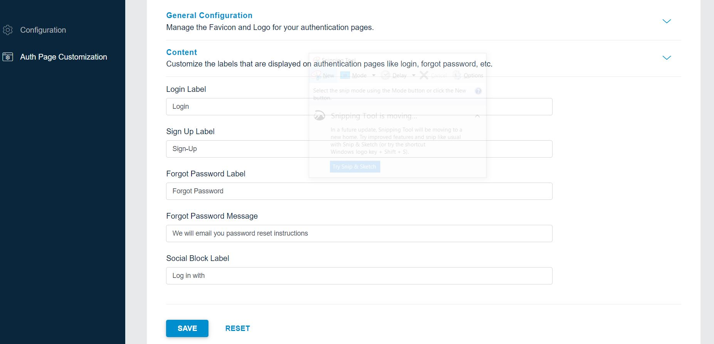
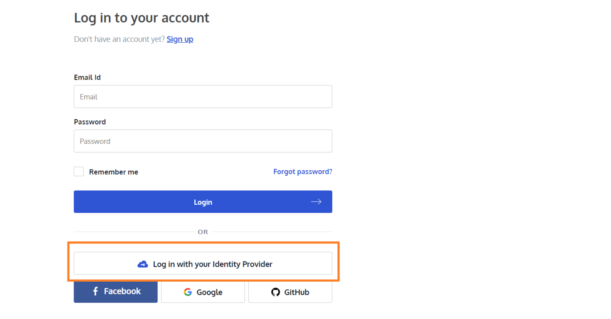

The Secotion explains the available IDX customization options:

## Theme Selection

These themes do not require JavaScript to work, and it offers a simpler and faster experience for end-users. You can activate any of the themes shown below and then customize it if you want.

  

## Customization

You can customize the activated theme as per the requirements like logo, favicon, login page labels, etc. To proceed click the **Customize** button highlighted in the following screen:

  

The following screen will appear:

  

**General Configuration**: You can manage the **Favicon** and **Logo** for your authentication pages as explained below: 
 - **Favicon**: Enter the favicon URL 
 - **Logo**: Enter the logo URL

Click the **Save** button to save the changes. To view the changes reflect, click the **Try It Out** button from the top-right corner of the screen.

**Content Configuration** You can change the default tab name of the Log In, Sign Up and Forgot Password interfaces with any custom name using the respective “Tab Name” field. You can also change/customize the title text displayed on the login screen for the social login options using the **Social Block Label field**. The default text is **Log in with your Identity Provider**

To start managing the content, click the **Content** tab from the screen and the configuration option will appear on the screen as displayed below:

  

 - **Login Label**: You can change the Login Label as per your requirement example: Log In or Sign In

- **Sign Up Label**: You can change the Sign Up Label as per your requirement example: Sign Up or Registration

- **Forget Password Label**: You can change the Forget Password Label as per your requirement example: Forget Password

- **Forgot Password Message**: You can change the message that will be displayed to the user on submitting the forgot password request. The default message is ‘We will email you password reset instructions’.

- **Social Block Label**: You can change the Social Block Label as per your requirement. Social Block Label is title displayed on the login screen as highlighted in the screen below:

  

After making the desired changes, click the **Save** button. To view the changes reflect, click the **Try It Out** button from the top-right corner of the screen.

**Note:**
**Try It Out button** will navigate you to your IDX page where you can see all the changes. The URL of the IDX page is unique for your app. Your customers will be registering and logging on this page.