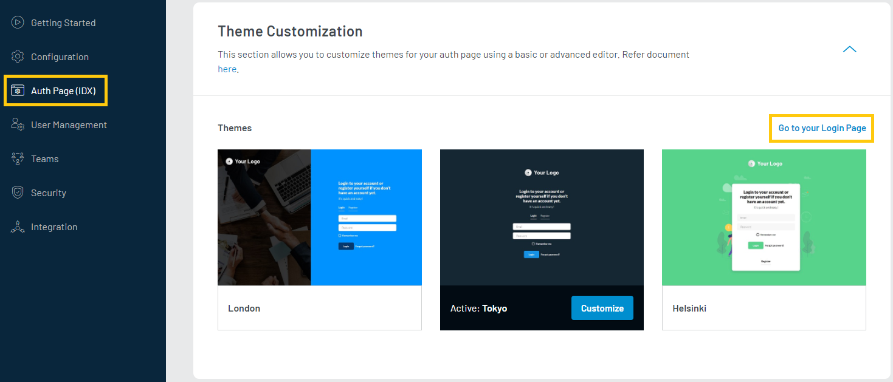
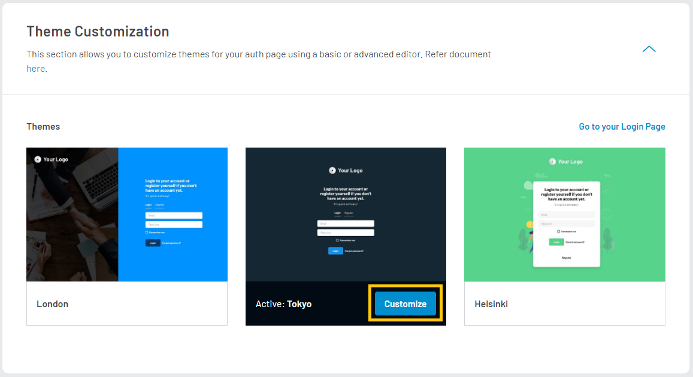

import Developer from "../../src/components/developer.js"

The section explains the available Auth Page (IDX) customization options.

## Theme Selection

These themes do not require JavaScript to work, and it offers a simpler and faster experience for end-users. You can activate any of the themes and then customize as per your requirement. The customizations will reflect in the registration, login reset password, and profile page.

To access **Auth Page (IDX)** customization, login to your [LoginRadius Dashboard](https://dashboard.loginradius.com/dashboard) account, from the left navigation panel, click the **Auth Page (IDX)** and the following screen will appear:

  

 

You can activate a theme by hovering on any inactive theme and then clicking on the **ACTIVATE** button.

> Activating a new theme would replace your existing theme and your customizations with default.

## Customization

You can customize the activated theme as per the requirements. To proceed click the **CUSTOMIZE** button highlighted in the following screen:

   

 

> **Note**: Activating the new theme will replace the existing theme and reset the customization to the default state.

You can customize your IDX page with your logo, favicon, login page labels, etc as displayed in the following screen:

  

 

### General Configuration
You can manage the **Favicon** and **Logo** for your authentication pages as explained below: 
- **Favicon**: Enter the URL for your favicon or upload. Favicon’s minimum and maximum dimensions recommendations are 16x16 and 48x48 pixels, respectively. For uploads, only *ico files are supported, and file size should not exceed 2 MB.
- **Logo**: Enter the URL for your logo or upload. Logo image size should have a maximum width of 200 pixels. For uploads, only *png files are supported, and file size should not exceed 2 MB.
 
Click the **Save** button to save the changes. 

> You can view the changes on your IDX Page immediately after saving your configurations by clicking the **Go to your Login Page** button from the top-right corner of the section. This will navigate you to your Auth Page (IDX), where you can see all the changes. The URL of the Auth Page (IDX) is unique for your app. Your customers will register and login using this page.

### Body
You can manage your IDX page body attributes like Background Image URL, Background Color, Text Color, and Font Family.

To start managing the body attributes, click the **Body** tab from the screen and the configuration option will appear on the screen as displayed below:

  

 

- **Background Image URL**: You can change your IDX page’s background by adding your background image URL here. Recommended background image dimensions for each theme are as following:
   - 550x768 for the London theme
   - 1366x768 for the Tokyo theme
   - 580x548 for the Helsinki theme. 

For uploads, *jpg, *png, and *svg files are supported, and file size should not exceed 2 MB.

- **Background Color**: You can change the background color of your IDX pages.
- **Font Family**: You can change your IDX pages’ font style by selecting the required font family available in the drop-down menu.

### <Developer>Content</Developer>

You can change the default tab name of the Login, Sign Up, and Forgot Password interfaces with any custom name using the respective “Tab Name” field. You can also change the title text displayed on the login screen for the social login options using the **Social Block Label field**. The default text is **Log in with**.

To start managing the content, click the **Content** tab from the screen and the configuration option will appear on the screen as displayed below:

  

 

 - **Login Label**: You can change the login label as per your requirement, example: Login or Sign In.

- **Sign Up Label**: You can change the sign-up label as per your requirement, example: Sign Up or Registration.

- **Forget Password Label**: You can change the forget password label as per your requirement, example: Forget Password.

- **Forgot Password Message**: You can change the message that will be displayed to the user on submitting the forgot password request. The default message is ‘We will email you password reset instructions’.

- **Social Block Label**: You can change the social block label as per your requirement. Social block label is title displayed on the login screen as highlighted in the screen below:

  

 

> You can switch to our Advanced Editor by clicking the **SWITCH TO ADVANCED EDITOR**. This will replace the basic editor with the advanced code editor interface. Check out [Advanced Editor documentation](/howto/advanced-editor/) document for more details.