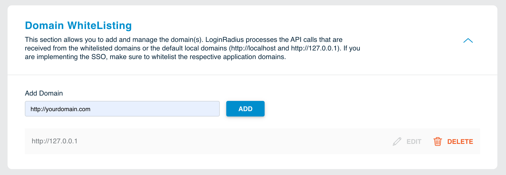

## Getting Credentials

To communicate with LoginRadius you will need some details about the application. You can find those details in the **Api Credentials** section of the [LoginRadius Dashboard](https://dashboard.loginradius.com/dashboard).

The **API Key** and **API Secret** is used to interact with LoginRadius APIs.

The **App Name** is the unique name for each application in LoginRadius. The **Auth Page** URL will be created using your app name only.

> **For eg:** If App Name is **mynewapp** then your Auth Page URL will be `https://mynewapp.hub.loginradius.com/auth.aspx`.

  

## Domain Whitelisting

This section allows you to add and manage the domain(s). LoginRadius processes the API calls that are received from the whitelisted domains. Local domains **(http://localhost and http://127.0.0.1)** are whitelisted by default.

> If you are implementing the SSO, make sure to whitelist the respective application domains.

  

