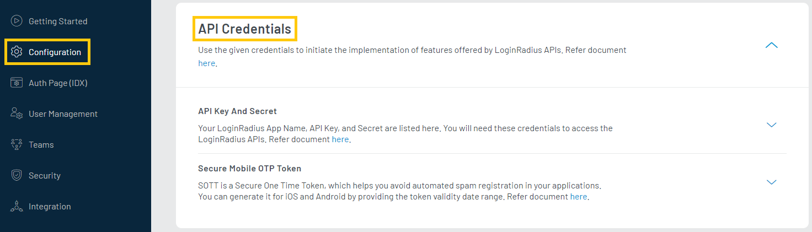

To communicate with LoginRadius you will need some details about the application. These details are required for setup and initiate the implementation of LoginRadius.

## Getting Credentials

### API Credentials

The API key and API Secret are used to interact with LoginRadius' APIs. To access API credentials, login to your [LoginRadius Dashboard](https://dashboard.loginradius.com/dashboard) account, from the left navigation panel, click the **Configuration** and then navigate to the **API Credentials** section. 

Click the down arrow or anywhere within the section and the **API Credentials** screen will appear:

  

 

Click on the **API Key And Secret** to get your unique credentials as displayed in the following screen:

  

 

The **APP Name** is unique for each application in LoginRadius. The **Auth Page** URL is  created using your app name.

> **For eg:** If App Name is **myapp** then your Auth Page URL will be `https://myapp.hub.loginradius.com/auth.aspx`.

### Mobile SOTT
To avoid spam automated registrations, in the request header, LoginRadius supports an additional token - SOTT (Secure One Time Token) along with API key. Check out [Work with SOTT](/howto/work-with-sott/) document for more details.

## Domain Whitelisting

This section allows you to add and manage the domain(s). LoginRadius processes the API calls that are received from the whitelisted domains. Local domains `(http://localhost and http://127.0.0.1)` are whitelisted by default.

To add the application domain, login to your [LoginRadius Dashboard](https://dashboard.loginradius.com/dashboard) account, from the left navigation panel, click the **Configuration** and then navigate to the **Domain Whitelisting** section. 

Click the down arrow or anywhere within the section and the **Domain Whitelisting** screen will appear:

> If you are implementing the SSO, make sure to whitelist the respective application domains. Check out [enable web sso](/howto/web-sso/) document for more details.

  

 