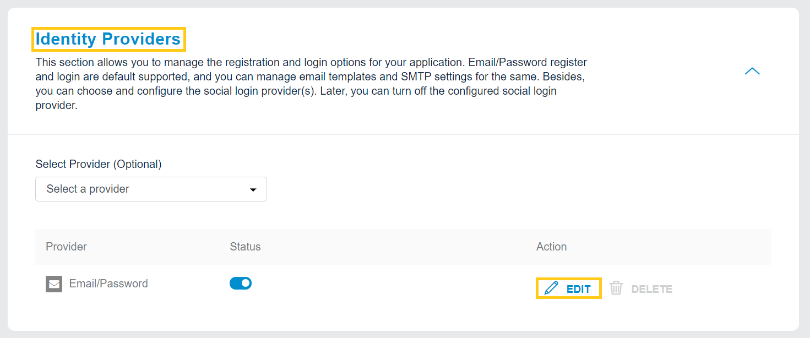
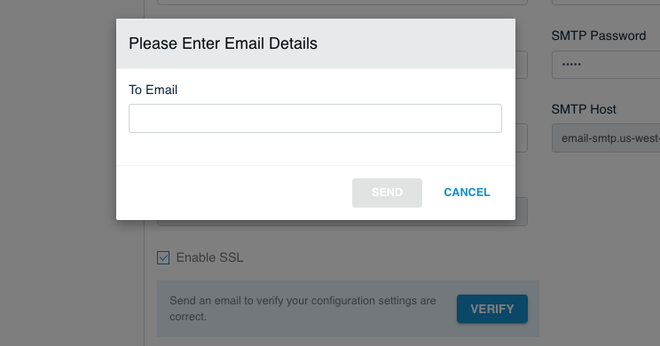
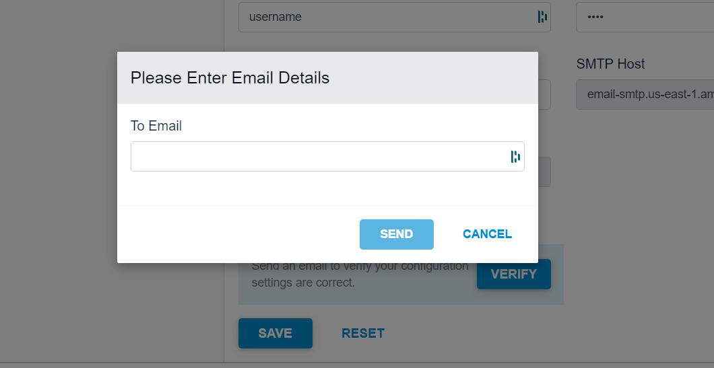

You can either configure your SMTP server or use the fully managed SMTP services offered by the LoginRadius Identity Platform to send emails.

Follow these steps for configuration of the SMTP provider in your LoginRadius Dashboard.

## Navigate to Communication Settings

Login to your <a href="https://dashboard.loginradius.com/dashboard" target="_blank">LoginRadius Dashboard</a>  account, navigate to the **Communication Settings** section and click on the **SMTP Provider Settings** section, as highlighted in the screen below:

  

The SMTP Settings section will appear as displayed in the screen below:

  

## Configure SMTP Form

Fill the following details in the SMTP Settings form:

- **From Name**: Enter the first name of the sender.
- **From Email Address**: Enter the email of the sender.
- **SMTP User Name**: Enter the SMTP username.
- **SMTP Password**: Enter the password for the SMTP username.
- **SMTP Provider**: Select the SMTP provider from the  drop-down list.
- **SMTP Host**: If you have selected the SMTP provider from the default list (rather than Others), enter the SMTP host details.
- **SMTP Port**: If you have selected the SMTP provider from the default list (rather than Others), enter the SMTP port details.
- **Enable SSL**: Select this option to make email communication more secure.

## Verify SMTP Settings

Click the Verify button from the **SMTP Settings** screen, the following pop-up will appear:

  

Enter the email id in the To Email textbox and click the Send button. If the email is sent successfully, a success message will be displayed on the screen.

## Save Settings

Save the configured SMTP settings by clicking the **Save** button from the **SMTP Settings screen**.

> Note: The following are the default SMTP providers list:
 - Amazon SES (US East)
 - Amazon SES (US East)
 - Amazon SES (US East)
 - Gmail
 - Mandrill
 - Rackspace-mailgun
 - SendGrid
 - Yahoo