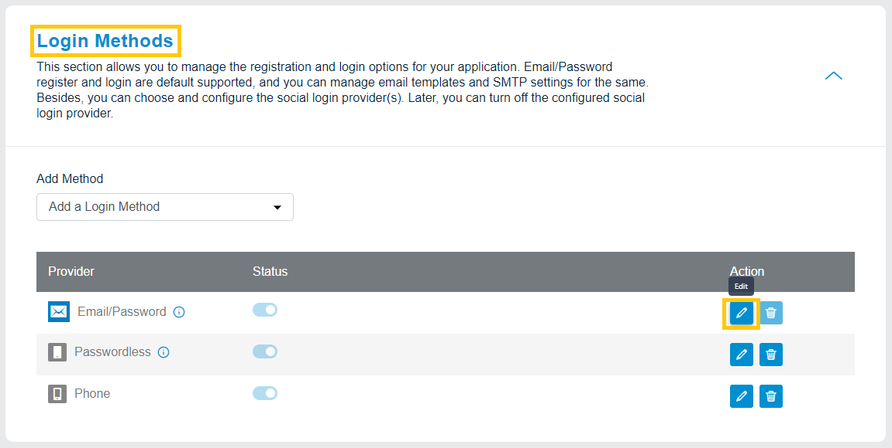
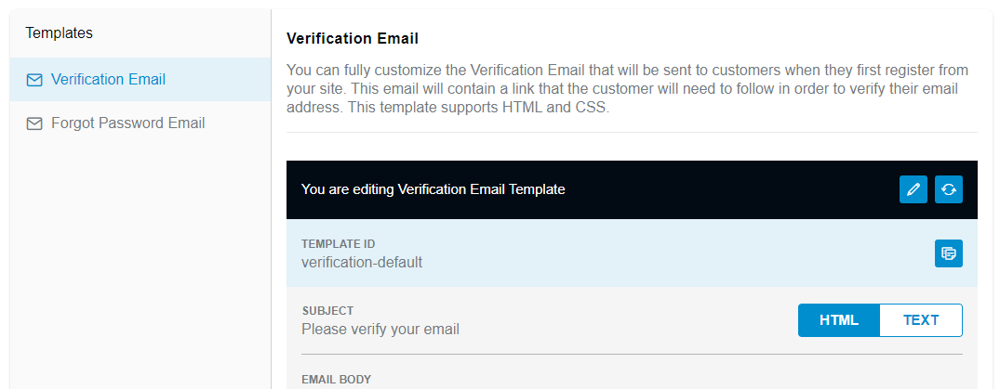

import Pro from "../../src/components/pro.js"

You can view the list of default Verification and Forgot Password email templates or manage the content of these email templates.

> Note: If you have a Developer Plan , you can also create an email template.


Follow these steps for customizing the email templates available in your account.

## Update Email Templates

Login to your <a href="https://dashboard.loginradius.com/dashboard" target="_blank">LoginRadius Dashboard</a>  account, navigate to the **Login Methods** section and click the **Edit** icon given next to the Email/Password provider, as highlighted in the screen below.:

<div style="text-align:center">
  
</div>
<br/>

The following are the default email templates provided by **LoginRadius Identity Platform**:

#### **Verification Email**

Verification Email is sent to your customers when they first register from your site. This email will contain a link which needs to be followed in order to verify their email address.

#### **Forgot Password Email**
 
Forgot Password Email is sent out to customers who request to reset their passwords. This email will contain a link which needs to be followed in order to reset their password.

<!--- 
#### <Pro> **Welcome Email** </Pro>

Welcome Email is sent to customers when they successfully registers and verify themselves using verfication email.

When you select an email template from the left side menu, the template details wil appear on the screen, and you can perform the following actions:

 - **Edit**: Use this option to edit the existing email template.
 - **Reset**: Use this option to reset the default templates in the original state.
-->

The following displays the actions available for the default email templates:

<div style="text-align:center">
  
</div>

And when editing a template you can update the following:

 - **SUBJECT**: The subject line of the template.

 - **HTML BODY**: The HTML body of the template can be added here. The content added here will appear in the email client which supports HTML content in the email. The [placeholder](#placeholder-tags) and [sections](#section-tags) tags can be used in the HTML Body.
 

 - **TEXT BODY**: A plain text version of the template can be added here. This template will appear in the email client which supports only plain text emails. You will be able to send a test email only if the required email configuration has been done as explained in the SMTP Configuration.

To save the changes you have made, click the **Save** button

## Placeholder Tags

  You  can use the following predefined placeholders in your email messages:

  - **#Name#**: Displays the customer's name as defined in the registration form.
  - **#GUID#**: Appended to the query parameter `vtoken` in order to identify the customer after clicking on the link.
  - **#Url#**: Displays the URL passed in JavaScript options. For email verification, it is `commonOptions.verificationUrl`.

  - **#Providers#**: Displays the social provider name through which your customer logged in.
  - **#Email#**: Displays the email address of your registered customer’s profile.
  - **#FirstName#**: Displays the first name of your registered customer’s profile.
  - **#LastName#**: Last name of your registered customer’s profile.
  - **#IpAddress#**: IP address of the registered customer.
  - **#UserAgent#**: User agent string of the registered customer

 ## Section Tags

 For forgot password and forgot provider emails, either the password reset link, social ID provider list, or both can be appended to the email. In the case of only the password reset link or only social ID provider list, you will be required to remove the other section. For making these section removable we have two section tags:

 - **#FPass**: Password reset link should be inside of this section tag. This should be removed for sites that only offer Social Registration and Login.

 - **#FProv**: The #Providers# tag should be inside of this section tag. This should be removed for sites that only offer traditional email registration.

 - **#FUName <#email content for customer name#>**: The #UserName# tag should be inside of this section tag. This should be removed for sites that do not offer username in registration.

 The following are examples for the Email Verification and Forgot Password emails.

### 1. Email Verification

```
Hello #Name#,

To verify your email, please click on the following link and if your browser does not open it, please copy and paste it in your browser’s address bar.

?vtype=emailverification&vtoken=#GUID#

Regards
```
<!-- 
 **Note**: If you pass commonOptions.verificationUrl option through customer Registration Getting Started than you should use #Url# tag instead of static URL ()
-->
  ### 2. Reset Password

```
Hello #Name#, Please reset your password by clicking on the link. To Reset your password, please click on the following link and if your browser does not open it, please copy and paste it in your browser’s address bar.

**#FPass** ?vtype=reset&vtoken=#GUID#

FPass#

**#FProv** You are logging in through the following social provider: #Providers# FProv#

**#FUName** Your customername is #customerName# FUName#

Regards
```