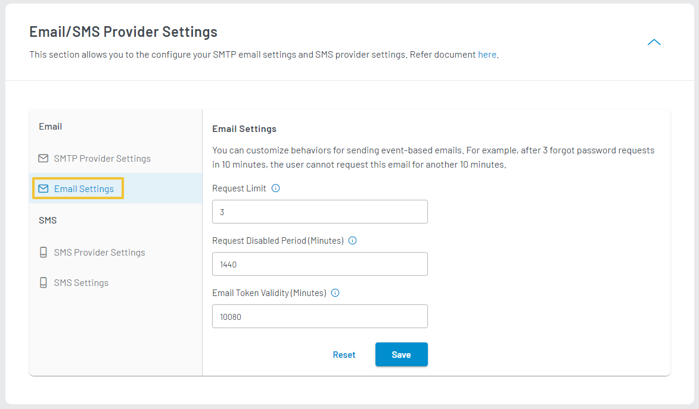
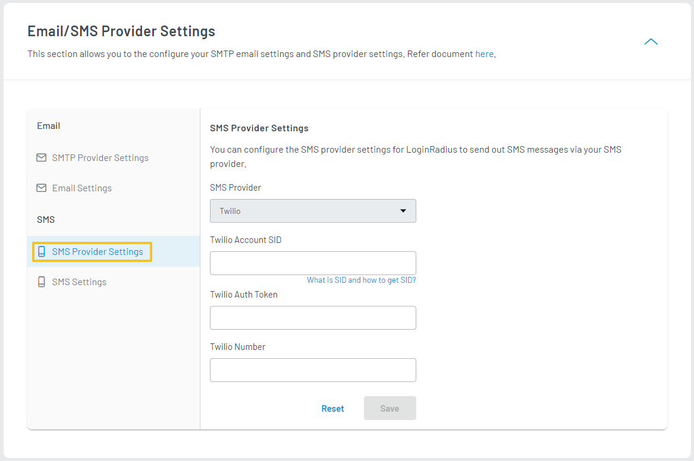

import Pro from "../../src/components/pro.js"

You can manage the Email and SMS providers and settings for your LoginRadius App.

## Email Configuration

LoginRadius Identity Platform allows you to configure your SMTP provider settings and generic email settings in the Communication Setting section.

### SMTP Provider Settings

Setting up the SMTP server in LoginRadius allows the system to send out all email correspondences directly through your SMTP provider. It enables you to get deliverability stats and analytics and also optimize your email messaging. To send emails through your SMTP, you should follow the below steps:

1. Login to your [LoginRadius Dashboard](https://dashboard.loginradius.com/dashboard) account, from the left navigation panel, click the **Configuration** and then navigate to the **Communication Settings** section.  Click the down arrow or anywhere within the section. The **SMTP Provider Settings** screen will appear:

  

 

2. Enter or select the following SMTP details:
- **SMTP Providers:** Select a pre-configured provider or other for a custom provider.
- **From Email Address:** Enter the email of the sender.
- **SMTP User Name:** Enter the SMTP username.
- **SMTP Password:** Enter the password for the SMTP username.
- **From Name:** Enter the name of the sender.
- **SMTP Host:** If you have selected the SMTP provider from the default list (rather than Others), enter the SMTP host details.
- **SMTP Port:** If you have selected the SMTP provider from the default list (rather than Others), enter the SMTP port details.
- **Enable SSL:** Select this option to make email communication more secure.

3. Click the **Verify** button, the following pop-up will appear:

  

 

Enter the email id in the **To Email** textbox and click the **Send** button. If the email is sent successfully, a success message will be displayed on the screen.

4. Save the configured SMTP settings by clicking the **Save** button. 

> Note: The following are the default SMTP providers list:

- Amazon SES (US East)
- Amazon SES (US West)
- Amazon SES (EU)
- Gmail
- Mandrill
- Rackspace-mailgun
- SendGrid
- Yahoo

### Email Settings
You can use Email Settings to customize some of the behaviors for sending emails. To customize these settings, you should follow the below steps: 

1. Login to your [LoginRadius Dashboard](https://dashboard.loginradius.com/dashboard) account, from the left navigation panel, click **Configuration** and then navigate to the **Communication Settings** sections, and click the down arrow or anywhere in the section tile. Then select the **Email Settings** option from the left navigation pane, the following screen will appear:

  

 

2. Configure the following email settings as per your requirements: 

**Request Limit**: The Request Limit is the number of times a user can request a given email during the request period (in minutes) before this feature is temporarily disabled. For example, a user can only request this email 5 times (Request Limit) within 120 minutes (Request Period) before the feature is disabled.

**Request Disable period (Minutes)**: The amount of time (in minutes) that the given email request feature remains disabled for the user once they have reached their Request Limit.

**Email Token Validity Limit (Minutes)**: The amount of time (in minutes) for which the link included in the given email remains valid.

## <Pro>SMS Configuration</Pro>

LoginRadius Identity Platform allows you to configure your SMS provider setting and generic SMS setting in the communication setting section.

### SMS Provider Settings

Setting up an SMS provider allows you to send and receive text messages to and from an SMS capable device over the network. To send SMS through your SMS Provider, you should follow the below steps:

1. Login to your [LoginRadius Dashboard](https://dashboard.loginradius.com/dashboard) account, from the left navigation panel, click the **Configuration** and then navigate to the **Communication Settings** section. Click the down arrow or anywhere within the section and then select the **SMS Provider Settings** as highlighted in the below screen:

  

 

2. Provide the following default supported Twilio SMS provider details:

- **SMS Provider**:  Select Twilio SMS Provider
- **Twilio Account SID**: Enter the Twilio Account SID. Check [Twilio help center](https://support.twilio.com/hc/en-us/articles/223136607-What-is-an-Application-SID-) for Account SID.
- **Twilio Auth Token**: Enter the Twilio Auth Token.
- **Twilio Number**: Enter the Twilio registered number.

3. Save the settings by clicking the **Save** button. 

### SMS Settings

You can use SMS Settings to customize some of the behaviors for sending SMS. To customize these settings, you should follow the below steps: 

1. Login to your [LoginRadius Dashboard](https://dashboard.loginradius.com/dashboard) account, from the left navigation panel, select the **Configuration** and then navigate to the **Communication Settings** sections.Click the down arrow or anywhere within this section and then select the **SMS Settings** option as highlighted in the below screenL 

  

 

2. Configure the following SMS settings as per your requirements:

- **OTP Length:** The length of the one-time passcode you want to set for the SMS.

- **OTP Type:** The type of OTP you want to send to the customer. There are many options available, for example, Numeric, AlphaNumeric.

- **Request Limit:** The number of times a customer can request an OTP during the request period (in seconds) before this feature is temporarily disabled. For example, a customer can request an OTP 5 times (Request Limit) within 120 seconds (Request Period) before the feature is disabled.

- **Request Disabled Period (Minutes):** The duration for which the OTP request will be disabled once the request limit is reached.

- **OTP Validity Limit (Seconds):** The amount of time (in seconds) for which an OTP remains valid.

3. Save the settings by clicking the **Save** button. 

