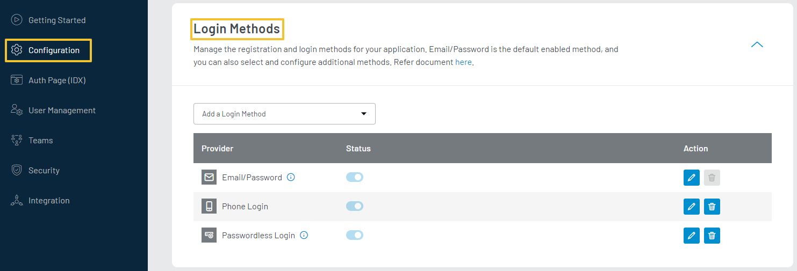
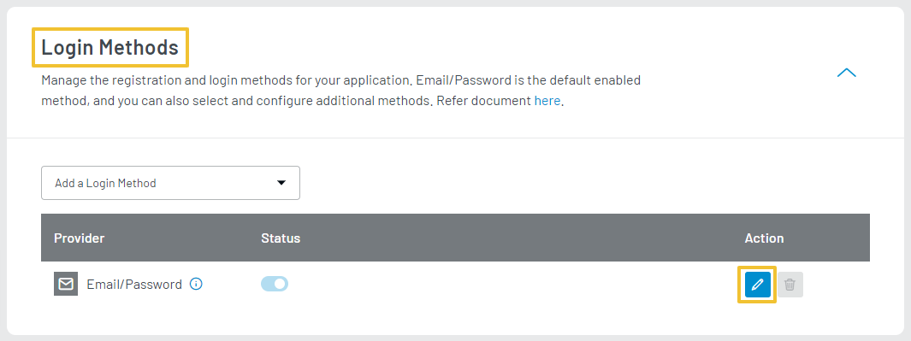
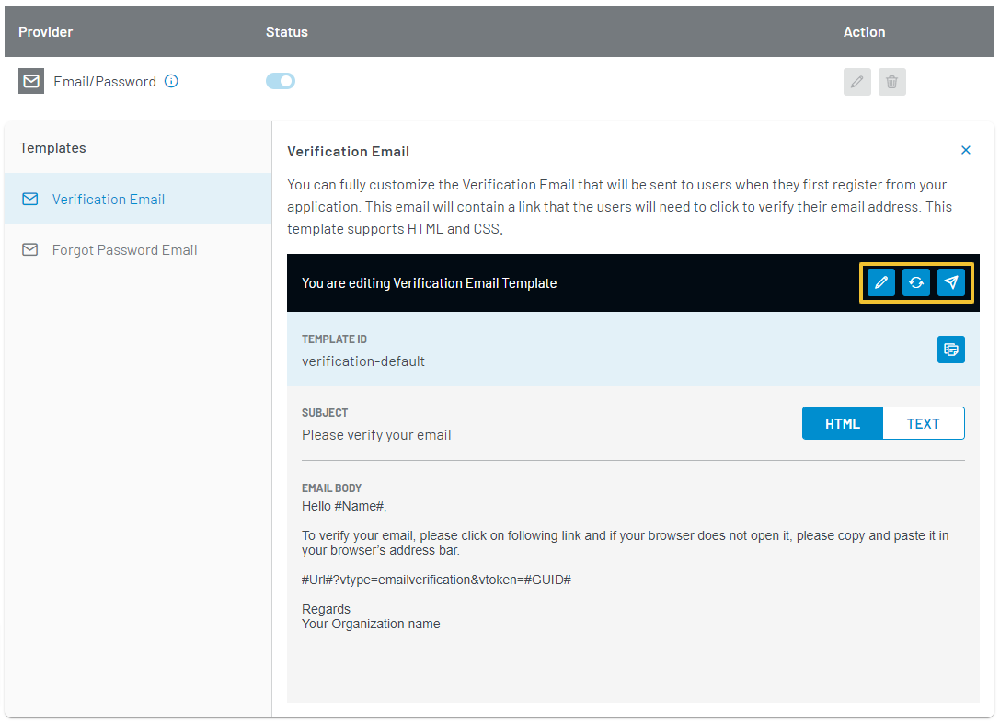

Watch the video for the step by step tutorial or refer to the section below for the text-based guide.

<iframe width="480" height="250" src="https://www.youtube.com/embed/kHbXGqUNv-E" frameborder="0" allow="accelerometer; autoplay; clipboard-write; encrypted-media; gyroscope; picture-in-picture" allowfullscreen></iframe>

LoginRadius Identity Platform provides Email/Password as a default registration and login option. You can also view and customize the content of the available email templates for this login method. 

To access the Email/Password login method, login to your [LoginRadius Dashboard](https://dashboard.loginradius.com/dashboard) account, from the left navigation panel, click **Configuration** and then navigate to the **Add a Login Method** section. 

Click the down arrow or anywhere within the section and the **Add a Login Method** screen will appear:

  

 

In the above screen, you can see that Email/Password is default enabled for your app. 

You can also find other Login Methods by clicking the Add Method drop-down. Enabling a login method lets you further customize the respective Email/SMS templates too. 

Follow these steps to view and customize the email templates for the Email/Password login method available in your account.

## Update Email Templates

To view or update the Email Template, click the **Edit** icon given next to the Email/Password provider, as highlighted in the screen below:

  

 

The following are the type of default email templates provided by **LoginRadius Identity Platform** as highlighted in following screen:

  

 

### Verification Email

Verification Email is sent to your customers when they first register on your application. This email contains a link that needs to be clicked to verify their email address.

### Forgot Password Email
 
Forgot Password Email is sent out to customers who request to reset their passwords. This email contains a link that needs to be clicked to reset their password.

The following displays the actions available for the default email templates, you can either update the existing content or can reset template to default template:

  

 

Editing a template allows you to update the following:

 - **SUBJECT**: The subject line of the template.

 - **HTML BODY**: The HTML body of the template can be added here. The content added here appears in the email client that supports HTML content in the email. The [placeholder](#placeholder-tags) and [sections](#section-tags) tags can be used in the HTML Body.
 

 - **TEXT BODY**: A plain text version of the template can be added here. This template appears in the email client that supports only plain text emails. You can send a test email only if the required email configuration has been done as explained in the [SMTP Configuration](/howto/manage-communication-settings/).

To save the changes you have made, click the **Save** button.

## Placeholder Tags

  You  can use the following predefined placeholders in your email messages:

  - **#Name#**: Displays the customer's name as defined in the registration form.
  - **#GUID#**: Appended to the query parameter `vtoken` to identify the customer once the link is clicked.
  - **#Url#**: Displays the URL passed in JavaScript options. For email verification, it is `commonOptions.verificationUrl`.

  - **#Providers#**: Displays the social provider name through which your customer logged in.
  - **#Email#**: Displays the email address of the registered customer.
  - **#FirstName#**: Displays the first name of the registered customer.
  - **#LastName#**: Last name of the registered customer.
  - **#IpAddress#**: IP address of the registered customer.
  - **#UserAgent#**: Browser information of the registered customer.

## Section Tags

Following are the section tags for forgot password and forgot provider:

 - **#FPass**: Password reset link should be inside of this section tag. You should remove it from the default Forgot Password email template for sites that only offer Social Registration and Login.

 - **#FProv**: The #Providers# tag should be inside of this section tag. You should remove it from the default Forgot Password email template for sites that only offer traditional email registration and login.

As per the required use case, you can use one of the above tags or both the tags in your forget password/forgot provider email.