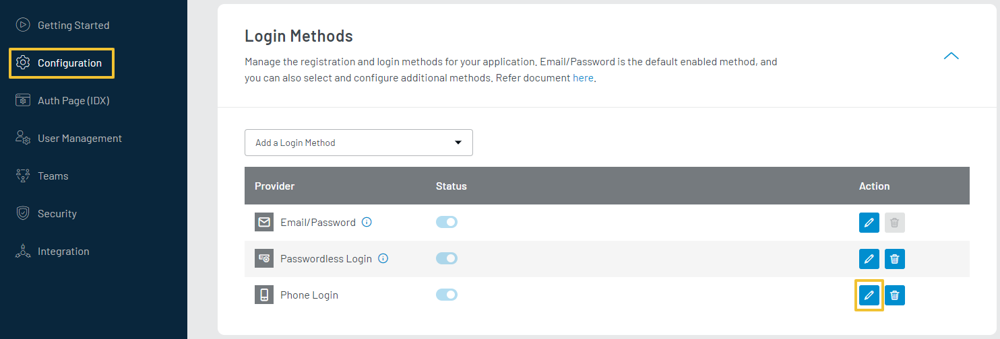
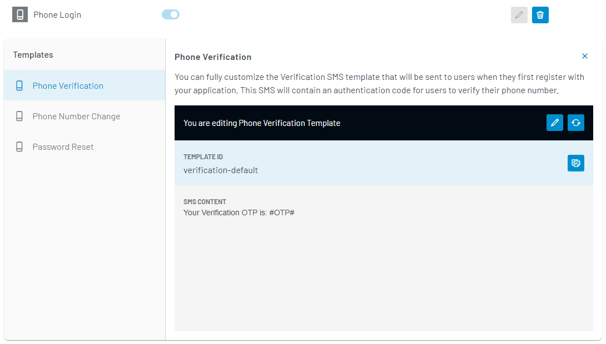

You can enable the **Phone Login** feature for your customers to register and log in using their phone number.

After the registration, the customer must verify the phone number one time via a one-time password (OTP) to log in. The **Phone Login** feature is default enabled if you have a Developer Premium plan.

The customer must set the account password (and fill in the required fields) during the registration. While login, the customer will need to enter the phone number/email id and password:

<div style="text-align:center">
   
</div>
<br/>

> Note: If you want to enable **Login with OTP** for customers i.e. the customer enters phone number and requests for an OTP to log into the account, use the **Passwordless Login** feature. For more details, refer to the [Mange Passwordless Login](/howto/manage-passwordless-login/).


For sending verification, number change, and password reset OTPs to customers, you must manage [SMS Configurations](/howto/manage-communication-settings/) (Provider and Settings), optionally you can also manage the content of these SMS Templates.

## SMS Templates

You can manage the content of SMS templates used for the Phone Login feature. 

Login to your [LoginRadius Dashboard](https://dashboard.loginradius.com/dashboard) account,from the left navigation panel, click the **Configuration** and then navigate to the **Login Methods** section. Click the **Edit** icon given next to the Phone login method, as highlighted in the screen below:

<div style="text-align:center">
   
</div>
<br/>

The following are the default SMS templates provided by **LoginRadius Identity Platform** as highlighted in the screen below:

<div style="text-align:center">
   
</div>
<br/>

### Phone Verification
The Phone Verification SMS is sent to your customers when they first register from your site. This SMS will contain an OTP that the customers will need to verify their phone number.

### Phone Number Change
Phone Number Change SMS is sent to your customers when they change their registered phone number. This SMS will contain an OTP that the customers will need to verify their new phone number.

To use the phone number change functionality, you need to make a small customization in your IDX page using [Advanced Editor](/howto/advanced-editor/) functionality. 

import {
  ExpansionPanel,
  ExpansionPanelList,
  ExpansionPanelListItem
} from 'gatsby-theme-apollo-docs';

import AdvanceEditor from "../howto/advanced-editor"

## Advance Editor

<ExpansionPanel title="Click here to view details">
<AdvanceEditor />
</ExpansionPanel>

Add the below container to HTML under Profile Pages to display the phone number change container on your profile html page. You can place the container where you display the div on your profile page.

```
<div id="updatephone-container"></div>
```

Add below script to Before Script under Profile Pages

```
var updatephone_options = {};
updatephone_options.container = "updatephone-container";
updatephone_options.onSuccess = function(response) {
// On Success
console.log(response);
};
updatephone_options.onError = function(response) {
// On Error
console.log(response);
};

LRObject.util.ready(function() {

LRObject.init("updatePhone",updatephone_options);


});

```

After the above changes, you can find the Phone Number Change on the profile page.

<div style="text-align:center">
   
</div>
<br/>


### Password Reset
Password Reset SMS is sent out to customers who request to reset their passwords. This SMS will contain an OTP that the customers will need to reset their password.


You can use the following predefined placeholders to customize your SMS messages.

### Placeholder Tags
- **#Name#**: This gets replaced with the user's name as defined in the registration form.
- **#OTP#**: OTP received in SMS for phone number verification.
- **#FirstName#**: First name from the registered user's profile.
- **#LastName#**: Last name from the registered user's profile.
- **#UserName#**: If you enabled username login on your site, you may want to show the name when a user forgets his password.
- **#OTPExpiry#**: Expiration time of an OTP in seconds. It will replace the value of the 'OTPExpire' field of particular SMS type settings. If there is no set value, then the default value will be '30' seconds.
- **#Email#**: Email address from the registered user's profile.