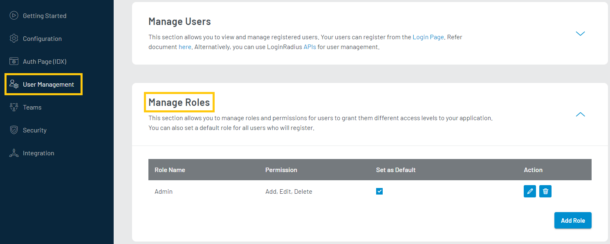
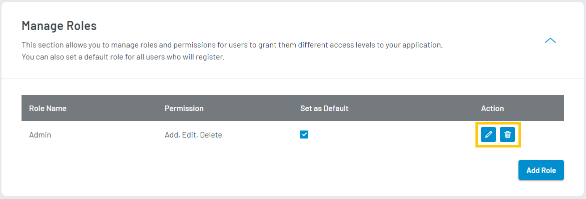
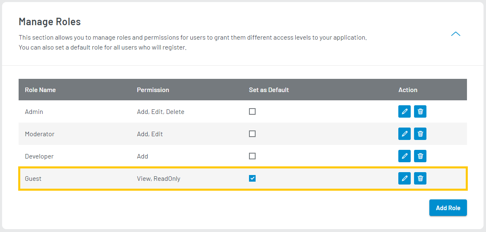

The Manage Roles section allows you to grant different levels of roles and permissions to your users and restrict their access to portions of your site.
 
**Role**: The role is the title given to the set of Permissions you will grant the user, e.g., Developer, Moderator, Admin. A role can have multiple permissions.
**Permissions**: Permissions are to define what type of access you want to grant to each role, e.g., Add, Edit, Delete.

Example: You have Moderators on a web forum, and you want them to be able to "Edit" posts but not "Delete" them. In this case, you would create a "Moderator" role for your moderators and give this role the "Edit" Permission.

To access Manage Roles, login to your [LoginRadius Dashboard](https://dashboard.loginradius.com/dashboard) account, from the left navigation panel, click the **User Management** and then navigate to the **Manage Roles** section. 

Click the down arrow, and the **Manage Roles** screen will appear:

  

 

To add a new role, click the **ADD ROLE** button, the following pop-up will appear:

  

 

Enter the following details:
- **Role Name**: Enter the desired role name.
- **Permissions**: Enter the desired permission name. You can add multiple comma ( , ) separated permissions but need to give it at least 1 permission.

Click the **ADD** button to save the Role.

> **Note**: You need to define the scope and access of your application’s portions with the created roles and permissions. 

To **Edit** or **Delete** a role, click the edit/delete icon available in the respective role’s row.

  

 

You will get a list of all the Roles you have created in the Manage Roles Section. You can also add a Default Role that all of your users should have upon registration.
To have a default role, simply click the checkbox next to the desired role in the **Set as Default** column as displayed in the below screen:

  

 

The default role allows you to select a role applicable to users when they register on your application. Guest Role is a default role in the above screen, so users registering on your application will have the Guest role and linked permission by default. 
