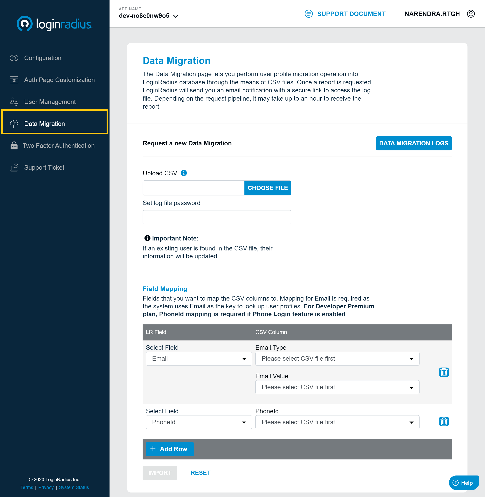
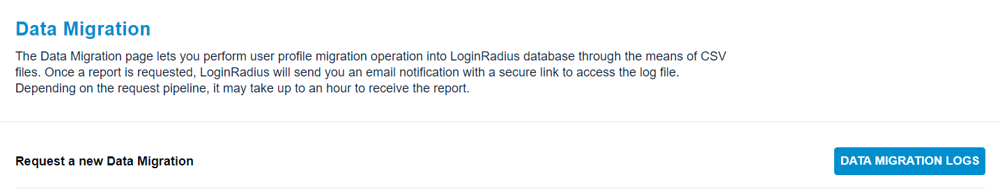
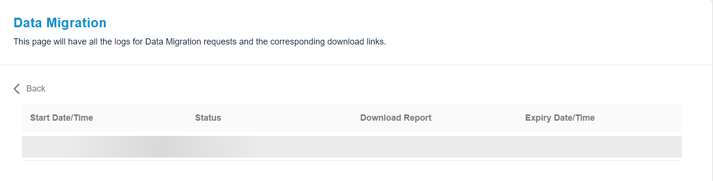

The data migration allows you to mass import customer profile data from another application/service/database into the LoginRadius database through the means of CSV files.

### Data Migration Guide

The following are the required steps that to perform a new data import :-

1. Login to your Admin Console account and select Data Migration option from the left navigation pane. The following screen will appear:

  

 

2. Set the password for the log file under the **Set log file password** field.

3. Upload a CSV file containing the customer profile information by clicking the **Choose File** option

4. Select the customer profile fields from the **LR Fields** list and then the respective CSV file field **Type** and **Value** (if applicable) from the **CSV Column** list for profile field mapping. It is required to map Email and other required fields of the registration form (excluding password). 

The following displays the data mapping section:

  

Select the Fields that you want to map the CSV columns to. Mappings for Email along with Mandatory fields in Data Schema is required.

#### Mapping Process:

- Selecting an LR Field from the Select Field dropdown displays Value dropdown (if applicable). Otherwise, there remains only Type dropdown.
- The CSV Column dropdown populates with number options beginning from 0, 1, 2… up to the number of columns in the CSV file. 
- Selecting a CSV Column number will let the CSV data in that column to be mapped to the corresponding LR Field.

The following displays the numbers in the Type dropdown:

> Note : For example, the content of my CSV file is: 
      **Address 1       |   Address 2 | PostalCode**  
      **357 First Ave   |   Suite 102 | 95034**  
      **456 Second Ave  |   Room 902  | 95035**  
      To map the address information to the **Addresses LR Field**, I would select:   
      **Addresses** from the Select Field dropdown of LR Field (in left). Then from the CSV Column (in right), select one of the number to map the respective data:  
      “0” for the “Addresses.Address1” dropdown.  
      “1” for the “Addresses.Address2” dropdown.  
      “2” for the “Addresses.PostalCode” dropdown.   
      **Since the column index begins with 0, the very first column in the CSV file is considered column “0” instead of column “1”.This follows for all subsequent column indices.**

##### Prerequisites for Field Mapping field:

  1. Email is always a required mapping. Also, a mapping corresponding to the Lookup Type is required. For example, if Lookup Type = Username, then there must be a mapping for Username.

  2. For Email and Phone Number which contain two subfields that are Type and Value, both subfields need to be mapped.

  3. For Address, the Address Type, and at least one other subfield (one of Address 1, Address 2,...), needs to be mapped.

  4. In Platform Configuration > Standard Login > Data Schema, if a data field is enabled and set as "Mandatory", there needs to be mapping for that field. This is required so that the new profile can be created in the database.

5. Click the Import button to request this operation and migrate customer profiles into the LoginRadius database.

> **Note**: Upon request submission, the LoginRadius team will take care of the remaining migration process. After completing the migration, the LoginRadius will send you an email notification with a secure link to access the log file.

### Data Migration Logs

Data Migration Logs show the request history of Data Migration and the download links for logs if available.You can navigate to Data MIgration Logs section  via clicking  the Data Migration Logs button highlighted in the below screen: 

  

Data migration Logs contain the following information:

|   |   |
|---|---|
| Start Time  |  Time at which the data operation started. |
| Status:  |   If the request data operation is done or In Progress. |
| Download link  | File can be downloaded from this button.  |
| Expiry time | Time at which the download link expires.  |

You can download the file by clicking on the **Download** button available under the download report column:

  

> **Note**: It may take up to an hour to receive the report/download link. It depends on the pipeline requests.