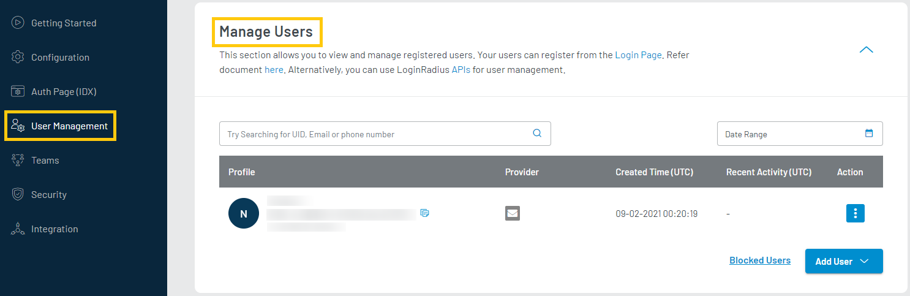
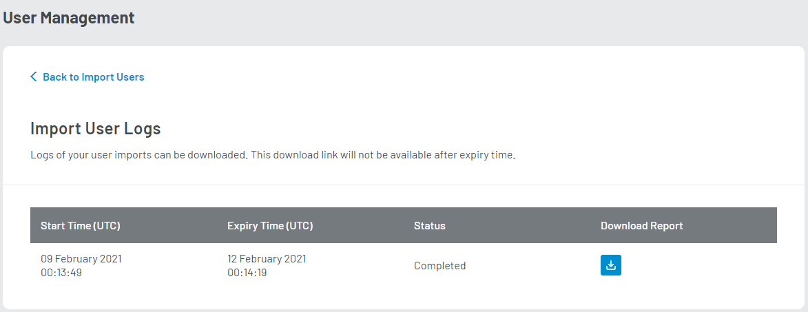

The data migration allows you to mass import customer profile data from another application/ service/ database into the LoginRadius database through the means of CSV files. 

The following are the required steps to perform a new data import:

1. Login to your [LoginRadius Dashboard](https://dashboard.loginradius.com/dashboard) account, select the User Management option from the left navigation panel and navigate to the **Manage Users** section. Click the down arrow or anywhere within the section and the below screen appear:
	

   

 
	
2. Scroll down, click the Add User button and then select Import Users in the list. The following screen will appear:

   

 

3. Download the CSV Template for reference.

4. Upload a CSV file containing the customer profile information by clicking the upload button available under the Upload CSV option.

5. Set the password for the log file under the Set Import log file password field.

6. Click the Import button to migrate customer profiles into the LoginRadius database.

> **Note:** Upon request submission, the LoginRadius team will take care of the remaining migration process. After completing the migration, the LoginRadius will send you an email notification with a secure link to access the log file.

## Monitor Import Logs
Data Migration Logs show the request history of data migration and the download links for logs if available. You can navigate to Import Logs section by clicking the Monitor Import Logs highlighted in the below screen:

   

 

Data migration Logs contain the following information:

|   |   |
|---|---|
|**Start TIme**|Time at which the data operation started.|
|**Expiry Time**|Time at which the download link expires.|
|**Status**| If the request data operation is done or In Progress.|
|**Download link**| File can be downloaded from this button.|

You can download the report by clicking on the Download button available under the download report column:

   

 

> **Note:** It may take up to an hour to receive the report/download link. It depends on the pipeline requests.

