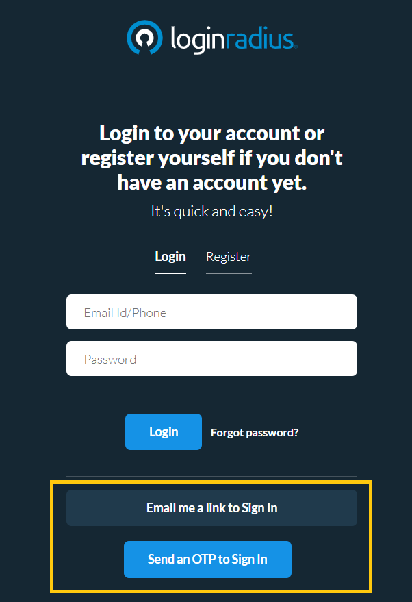
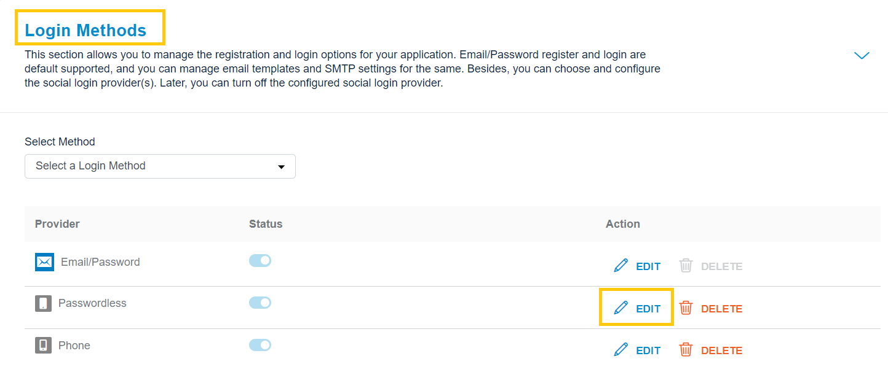
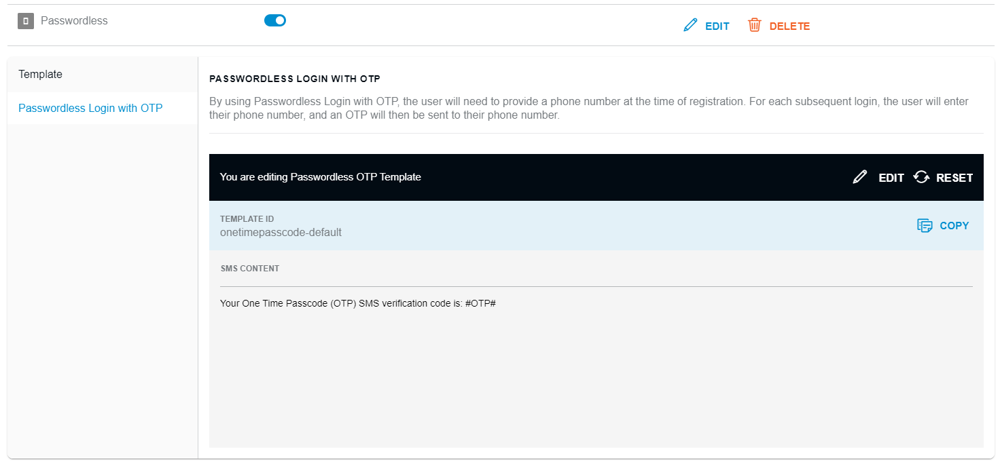

You can enable the **Passwordless Login** feature for your registered customers to login without providing a password. An OTP/link is sent to the registered phone number/email address, and once the OTP/link is verified, the customer will be logged into the account.

> Note: In the case of Passwordless Login, the customer needs to register by providing a password. Later, the customer can log in using the password or OTP.

LoginRadius Identity Platform allows you to implement the Passwordless Login feature in the following ways:

- **With OTP via SMS**: A verification OTP is sent to the registered customer’s phone number, and the OTP verification will log the customer into the account.

The following screen displays the passwordless login buttons (with OTP):

   

For sending login OTP or Email Link, you must manage Communication Configurations (Providers and Settings), optionally you can also manage the content of these SMS and Email Templates.

## SMS Template

You can manage the content of the SMS template used for the sending login OTP. 

Login to your LoginRadius Dashboard account, navigate to the Login Methods section, and click the Edit icon next to the Passwordless login method, as highlighted in the screen below:

   

The following is the default passwordless login template provided by LoginRadius Identity Platform:

## Passwordless Login with OTP

   

## Placeholder Tags
- #Name#: This gets replaced with the user's name as defined in the registration form.
- #OTP#: OTP received in SMS for phone number verification.
- #FirstName#: First name from the registered user's profile.
- #LastName#: Last name from the registered user's profile.
- #UserName#: If you enabled username login on your site, you may want to show the name when a user forgets his password.
- #OTPExpiry#: Expiration time of an OTP in seconds. It will replace the value of the 'OTPExpire' field of particular SMS type settings. If there is no set value, then the default value will be '30' seconds.
- #Email#: Email address from the registered user's profile.

