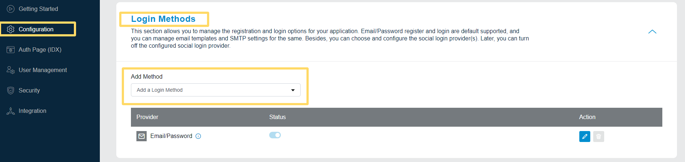
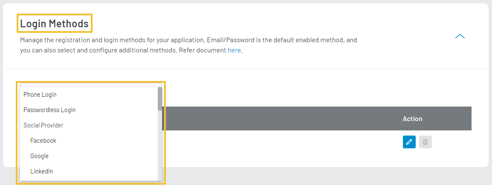

import Pro from "../../src/components/pro.js"

LoginRadius Provides a variety of Login Methods that allow you to manage Login and Registration options for your application.
- Email/Password Login
- Phone Login
- Passwordless Login
- Social Login

To Access the Login Methods, login to your [LoginRadius Dashboard](https://dashboard.loginradius.com/dashboard) account, from the left navigation panel, click the **Configuration** and then navigate to the **Login Methods** section. 

Click the down arrow or anywhere within the section and the **Login Methods** screen will appear:

  

 

## Add Method
To Add a Login Method, click on the Add a Login Method dropdown and select the desired Login Method including the social login providers as displayed in the below screen:

  

 

## Email/Password Login
Email/Password login Method allows your customers to register and login using Email and Password. This is the default method provided for traditional login and registration, checkout our [Email/Password Login](/howto/email-password-login/) document for more information.
## Integrate Social Login
**Social Login** method allows you to implement a quick and convenient approach to customer registration and login, checkout our [Integrate Social Login](/howto/social-login/) document for more information.

## <Pro>Phone Login </Pro>
**Phone Login** method allows your customers to register and log in using their phone number, checkout our [Mange Phone Login](/howto/manage-phone-login/) document for more information.

## <Pro> Passwordless Login </Pro>
**Passwordless Login** method allows your registered customers to login without providing a password. A link or OTP is sent to the registered email address or phone number respectively, and once the link or OTP is verified, the customer will be logged into the account, checkout our [Manage Passwordless Login](/howto/manage-passwordless-login/) document for more information.

