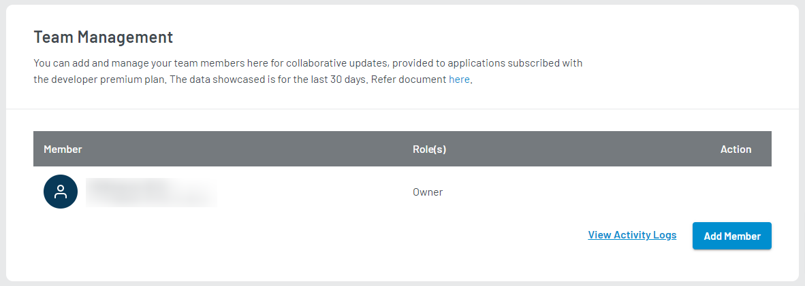
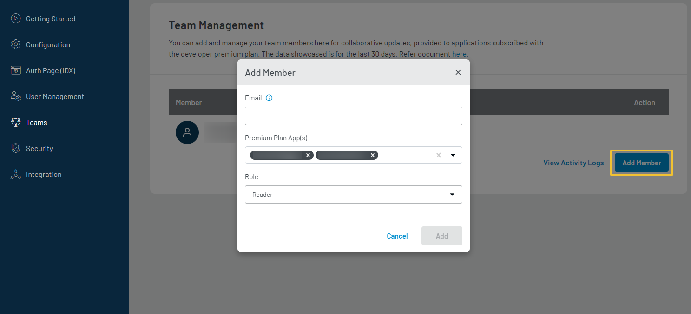
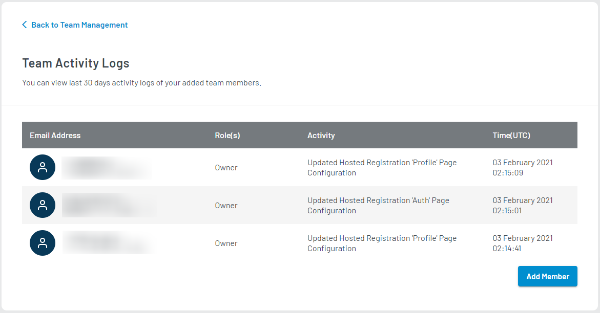

This section helps view and manage your authorized Team Members who can manage your LoginRadius site.

To access Team Management, login to your [LoginRadius Dashboard](https://dashboard.loginradius.com/dashboard) account, click the **Account Avatar** from the top right corner, and then select **Teams** from the dropdown menu. The **Team Management** screen will appear:

  

 

Team Management screen has the following options:

- Manage Team Member
- Add Team Member
- Audit Logs

## Manage Team Member
This section shows the complete list of team members that have access to your LoginRadius site. List of management tasks that can be performed on your team members includes: 

- Edit their roles
- Send them a password reset email
- Delete their account

Roles assigned to a team member can be changed under the Team Management section by editing a team member. Click on the vertical ellipsis (three dots) to select the available action for a team member.

## Add Team Member

From this section, you can add a new team member to your LoginRadius Site by providing the member's details and assigning the desired Role.

Click the **ADD MEMBER** button to add a new team member to your LoginRadius Site and the following pop-up will appear:

  

 

You need to provide following details:

**Email Address(es):** Enter the team member’s email address.

**App(s):** Select the App for which you are adding team members. If you have multiple LoginRadius App(s), you can find the list in dropdown.

**Role(s):** Select the team member’s Role.

Available Role(s) are:
- **Admin:** Allow Add/Update permissions
- **Reader:** Allow Read only permissions

## Activity Logs

Activity Logs contain records of all recent account activities. You can view the records of your LoginRadius site.

Click the **VIEW ACTIVITY LOGS** button to view the all recent activity details in your account and the following screen appear:

  

 

The details include:

- **Email Address:** displays the Email Address of the user who did the particular change.

- **Activity:** which displays the short description of the activity.

- **TimeStamp:** which displays the time at which the activity happened.
