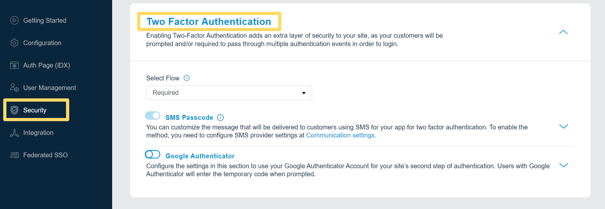
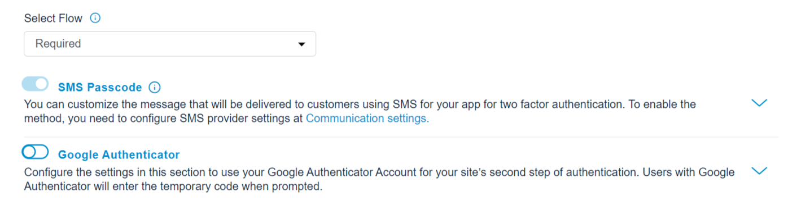
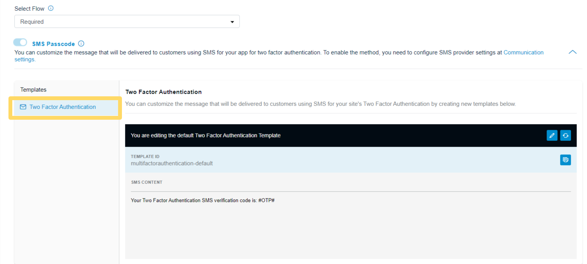
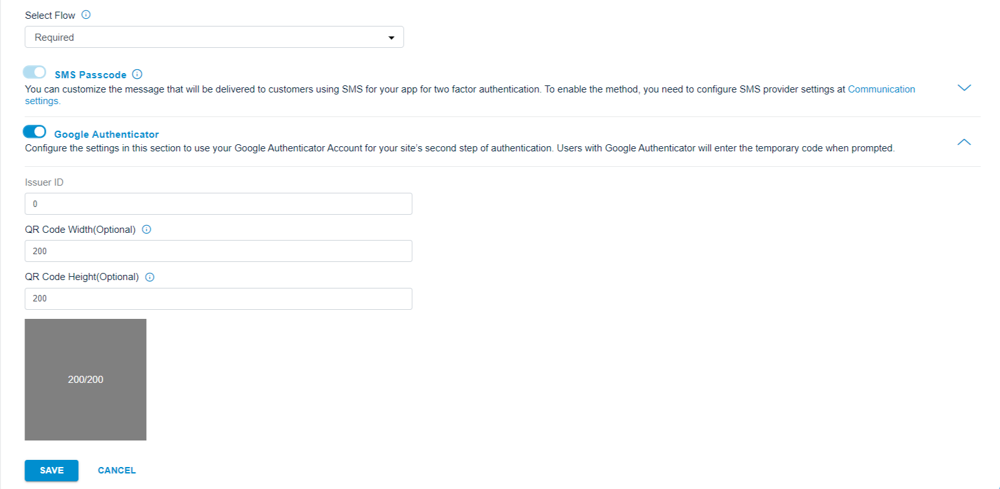
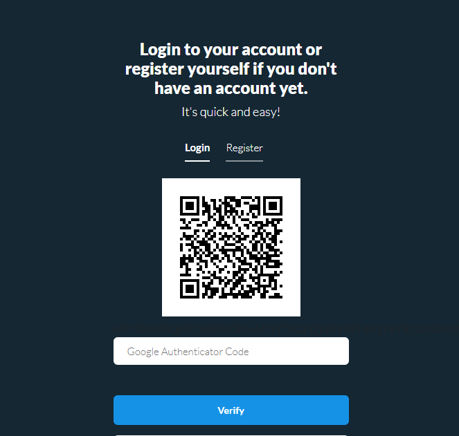

Two-Factor Authentication adds an extra layer of security for the users' accounts. With this feature enabled, once the user enters their login credentials or proceeds with social login, they are sent an authentication code to complete the login. 

Two-Factor Authentication feature is available on an add-on basis, and you can either make it optional or required for the users as per your business requirement.

> Note: This feature will not work along with [Passwordless Login](/howto/manage-passwordless-login) so to use Two Factor Authentication, you need to disable Passwordless feature on your app.

To add the Two Factor Authentication on you app, you should follow the below step:

Login to your [LoginRadius Dashboard](https://dashboard.loginradius.com/dashboard) account, from the left navigation panel, click the **Security** and then navigate to the **Two Factor Authentication** section.  Click the down arrow or anywhere within the section. The **Two Factor Authentication** screen will appear:

  

 

In the following ways, the user can receive the code:

- SMS Passcode
- Google Authenticator

From the following screen, you can choose the desired Two-Factor Authentication methods and whether it is going to be optional or required for the users:

  

 

**Optional**: End users will have the ability to enable or disable Two Factor Authentication on login.

**Required**: End users will be required to authenticate themself using enabled 2FA option in addition to the initial authentication for login.

## SMS Passcode

Two-Factor Authentication with SMS Passcode will be the default option for the users, and in this section, you are allowed to customize the Two Factor Authentication template.

To access the respective SMS template, click the down arrow available next to the SMS Passcode option or anywhere within the section.The following screen will appear:

  

 

### Two Factor Authentication SMS Template

Two Factor Authentication SMS template is sent to your users when they authenticate through their credentials. This SMS will contain an OTP that the users will need to enter to complete the log in.

## Google Authenticator

To enable two-factor authentication with Google Authenticator, you need to configure a few settings under the Google Authenticator section.

- Select the Google Authenticator checkbox.
- Click the edit button available next to the Google Authenticator option.The following section will appear on the screen:

    

        
    

     
    
- Enter the Issuer ID, it can be your product/company name.
- Enter valid values for QR Code Width and Qr Code Height (ideal values are 200 for both).
- Save the settings.

After saving the configuration, open your authentication page and it will display the following google authenticator options (where end user can either scan the QR code or via the google authenticator app or enter the code generated via the app): 

  

 