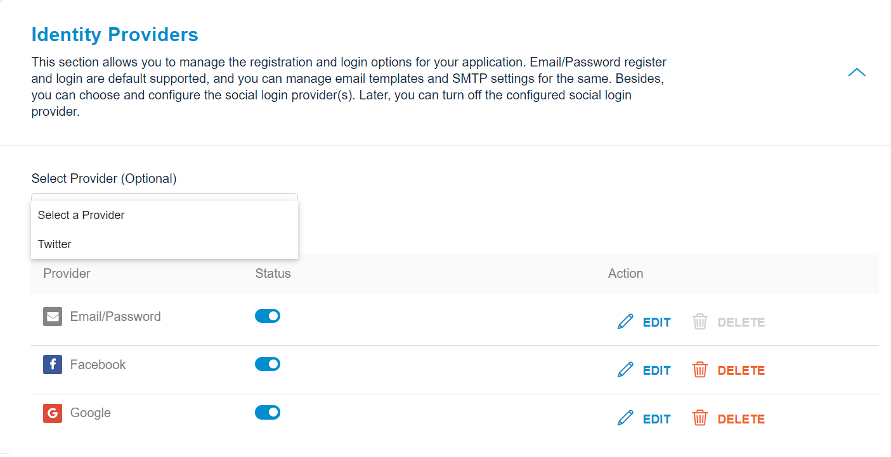
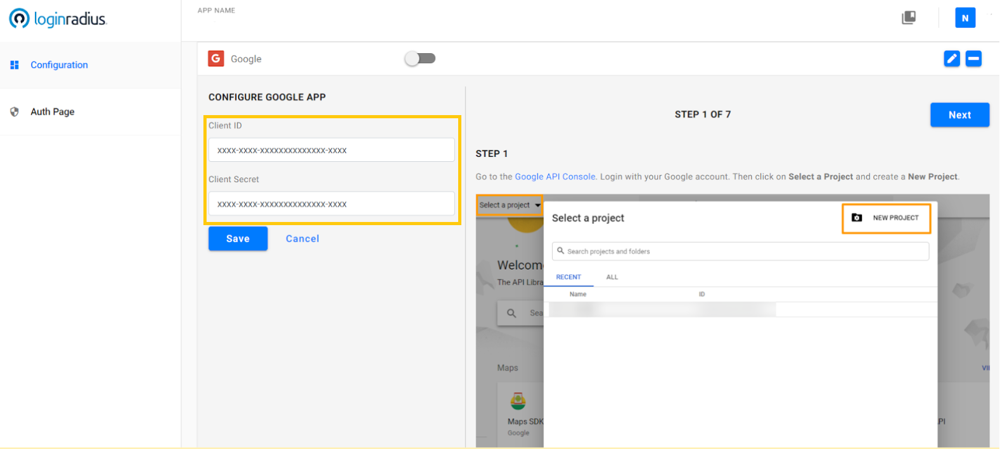
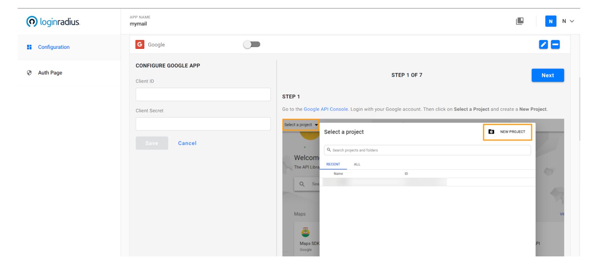
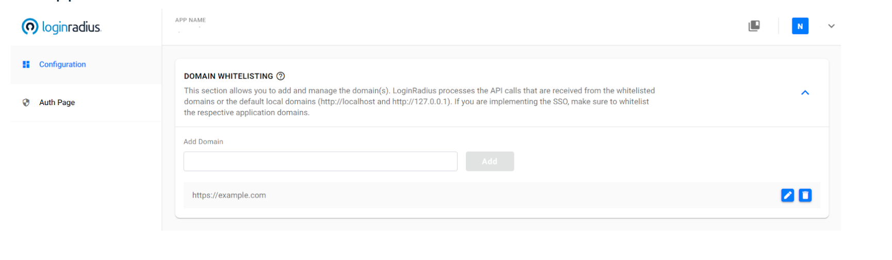
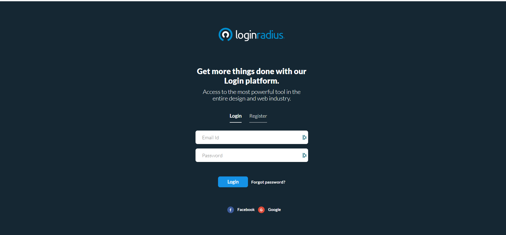

You can implement Social Login for a quick and convenient approach of customer registration and login.

The sections below explain how you can configure the desired Social Login providers in the LoginRadius Dashboard.

## Select Provider

Log in to your [LoginRadius Dashboard](https://dashboard.loginradius.com/dashboard) account and navigate to the **Identity Provider** section. Then click the **Select a Provider** drop-down.

The following screen will appear:

  

## Obtain Credentials

Select the desired Social ID Provider and follow the step by step guide displayed on the LoginRadius Dashboard screen for configuration.

> Note: The steps for configuring each social provider may be different.

For example, the following screen displays the configuration steps of Google:

  

Upon completing the configuration steps of the selected Social ID Provider, you will get the credentials.

## Add Credentials

Enter the obtained credentials in the Configure App section highlighted in the following screen:

  

## Domain Whitelisting

The Social Provider configuration is now complete. However, to use the Social Login feature, you need to whitelist your application domain, as explained in the section below.

In LoginRadius Dashboard, navigate to Domain Whitelisting section and the following screen will appear:

  

 You can see the social icons implemented on your Auth Page (IDX) as below:

  

## Supported Social Providers

The table below lists the social providers that LoginRadius supports for the Free and Developer Plan. 

<table border="1">
 <tr> 
   <th><strong> Plan </strong></th> 
   <th><strong> Facebook </strong></th> 
   <th><strong> Google </strong></th>   
   <th><strong> Twitter </strong></th> 
   <th><strong> LinkedIn </strong></th> 
   <th><strong> GitHub </strong></th>   
  </tr>
 <tr> 
   <td> <strong>Free</strong> </td> 
   <td> Yes </td> 
   <td> Yes </td>   
   <td> Yes </td> 
   <td> No </td> 
   <td> No </td>   
  </tr>
 <tr> 
   <td> <strong>Developer <strong> </td> 
   <td> Yes </td> 
   <td> Yes </td>   
   <td> Yes </td> 
   <td> Yes </td> 
   <td> Yes </td>   
  </tr>
</table>
