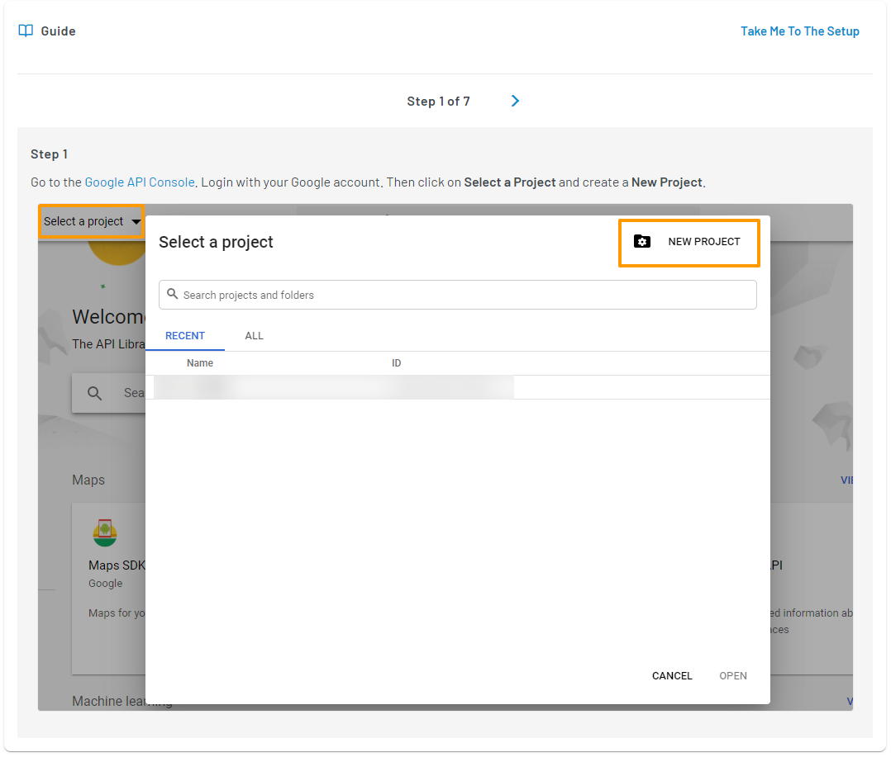

import {
  ExpansionPanel,
  ExpansionPanelList,
  ExpansionPanelListItem
} from 'gatsby-theme-apollo-docs';
 
import Setup from "../howto/dashboard-setup"

You can implement Social Login for a quick and convenient approach to customer registration and login. This section explains how to add and configure the desired Social Login providers on your application using LoginRadius Dashboard.

To access the Social Login methods, login to your [LoginRadius Dashboard](https://dashboard.loginradius.com/dashboard) account, from the left navigation panel, click the **Configuration** and then navigate to the **Login Methods** section. 

Click the down arrow or anywhere within the section and the **Login Methods** screen will appear:

  

 

## Select Provider

To select and enable a social provider, click the **Add a Login Method** drop-down and select your desired social provider from the available providers’ list as displayed in the following screen.

  

 

> **Note**: The list of supported social providers varies based on your plan. Checkout supported social providers for your plan at the bottom of the document.

## Configuration

After selecting the desired Social ID Provider, follow the step by step guide displayed on the LoginRadius Dashboard screen for configuration. The steps for configuring each social provider will be different and displayed after selecting the respective social provider.

For example, the following screen displays the configuration steps of Google:

  

 

Upon completing the configuration steps of the selected Social ID Provider, you will get the credentials. Enter the obtained credentials in the Configure App section and click the **Save** button.

  

 

Upon completing the configuration, you can see the social icons implemented on your Auth Page (IDX) `<your-app-name>.hub.loginradius.com/auth.aspx` as highlighted in the below screen:

  

 

## Domain Whitelisting

The Social Login provider configuration is now complete. However, to use the Social Login feature, you need to whitelist your application domain, Checkout **Domain Whitelisting** under Setup Your Dashboard Page.

### Setup Your Dashboard
 
<ExpansionPanel title="Click here to view details">
  <Setup />
</ExpansionPanel>

## Supported Social Providers

The table below lists the social providers that LoginRadius supports for the Free, Developer, and Developer PremiumPlan. 

|**Plan**|**Facebook**|**Google**|**Twitter**|**LinkedIn**|**GitHub**|
|----|--------|------|-------|--------|------|
|**Free**|Yes|Yes|No|No|No|
|**Developer**|Yes|Yes|Yes|Yes|Yes|
|**Developer Premium**| Supported  20+ Social ID Providers|

