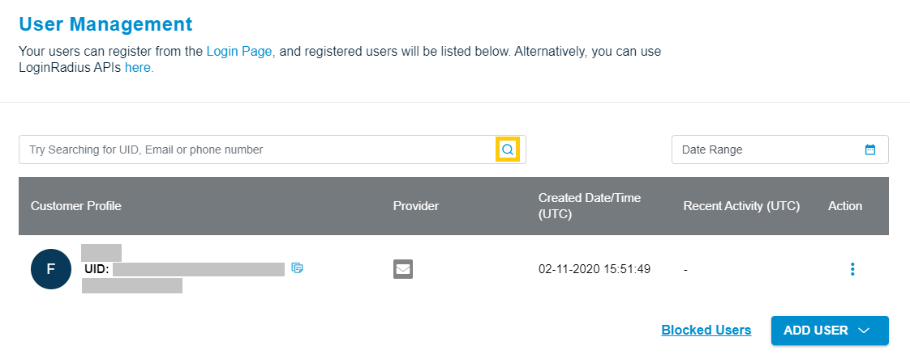

### Overview
Under this section, you can manage your users using the functionality we have provided to assist you in handling your user base without needing to create your own management tool. 

The User Management section contains all the registered users on your application.Here you are able to find the unique details of Each User including:
- UID
- Email
- Name
- Created Date
Last Signed In Date

This section also allows you to search an user with their Email or UID.

### Search users

**Step 1**: Log in to your Admin Console account and click to User Management tab from the left sidebar

**Step 2**: Enter the email or UID of the user and click the search button, as highlighted in the following screen:

  

