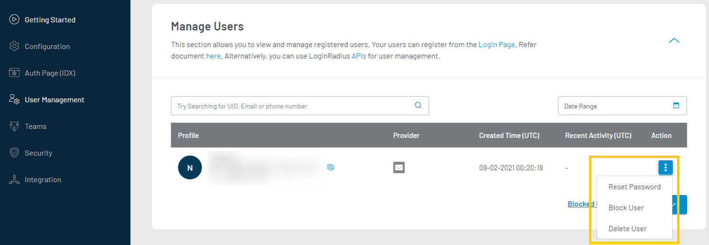

import Pro from "../../src/components/pro.js"

The Manage Users section contains all the registered customers on your application. This feature also allows you to manage your customers without needing to create your management tool. You can perform actions like - add, search, send a reset password link, and block or delete customers.

To access the Manage Users section, login to your [LoginRadius Dashboard](https://dashboard.loginradius.com/dashboard) account, from the left navigation panel, click **User Management** and then navigate to the **Manage User** section. The below screen will appear:

  

 

In the customer list, you can find the following unique details of each customer:

- Profile: Contains Name, UID, Email, etc.
- Provider: Mean by which the account has been created, like - Email, Facebook.
- Created Time (UTC): Date and time of customer account creation.
- Recent Activity (UTC): Date and time of recent customer activity on your application.
- Action: Let you take Reset Password, Block, Delete actions on the customer account. 

## <Pro>Action</Pro>
To access the available actions, click the vertical ellipsis button (three dots) next to each customer profile as displayed in the below screen:

  

 

### Reset Password
It allows you to trigger a reset password link to the customer. Clicking **Reset Password** will show the popup to send the reset password mail as displayed in the below screen.

  

 

Click the **Send Email** button from the above pop-up to send a password reset email to the respective customer.

### Block User
It allows you to block a customer, a blocked customer cannot login to your application. To block a customer click the **Block User** action and a pop-up will appear. Click the **BLOCK** button given in popup as displayed in the below screen:

  

 

### Delete User
It allows you to delete a customer permanently, a deleted customer cannot be recovered again. To delete a customer permanently, click the **Delete User** action, a pop-up will appear. Click the **DELETE** button from popup as highlighted in the below screen:

  

 

You can perform more actions like search customer, view blocked customer, and import customer on this screen for the customers’ accounts. 
## <Pro>Blocked Users</Pro>
You can check the list of the blocked user by clicking the **Blocked User** link available on the bottom right of the screen:

 
The following displays the blocked customers list screen:

  

 

- You can unblock a customer by clicking the respective vertical ellipsis (three dots) and then selecting the Unblock User option from the appeared list.

- You can also delete a blocked customer by clicking the Delete User option from the appeared list.

- You can navigate to the active customers’ list by clicking the **Back to Active Users** link highlighted on the above screen.

## Search users
This section also allows you to search customers with their Email/Phone Number or UID and Date Range.

To search a customer using UID, Email or phone number, enter the respective value in textbox and click the **Search** icon, as highlighted in the following screen:

  

 

You can also search for the customers based on the selected date range; this date range applies to the customers’ registration date.

## Add Users
This section allows you to add a new customer by providing the mandatory information; thus, the customer won't have to go through the entire registration process. 

To add a new customer, click the **ADD USER** button available on the bottom right of the page. From the appeared list, click **Create User** and the Create User pop-up will appear:

  

 

Enter the details in the respective fields and click the **Create** button. 

## Import Users
LoginRadius allows you to mass import customer profile data from another application/ service/ database into the LoginRadius database through CSV files. Read the [Migrate User Data](/howto/migrate-user-data/) for more information.

