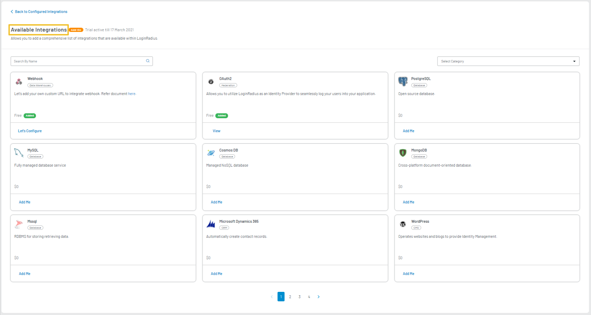
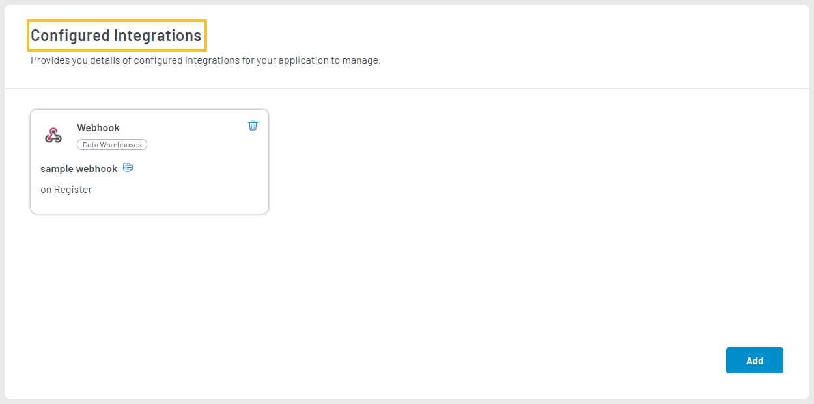

Webhooks allow you to build or set up integrations that subscribe to certain events on LoginRadius. When one of these events is triggered, LoginRadius automatically sends a POST payload over HTTPS to the Webhook's configured URL in real-time. You can use Webhooks to update an external tracker or update a backup mirror.

**Note**: Upon submitting the request to the configured Webhook URL, LoginRadius does not track payload deliverability.

To add or access **Webhook** configurations, login to your [LoginRadius Dashboard](https://dashboard.loginradius.com/dashboard) account, from the left navigation panel, click the **Integration** and the **Configured Integrations** screen will appear:

<div style="text-align:center">
  
</div>
<br/>


Click the **Add** button, and you will find the list of all available integrations as displayed in the below screen:

<div style="text-align:center">
  
</div>
<br/>

Click the **ADD** button available in the **Webhook** integration block, and the **Webhook** screen will appear:

<div style="text-align:center">
  
</div>
<br/>

Enter or select the following Webhook details:

- **Name**: Enter the name of the Webhook
- **Event**: Choose the type of event from the dropdown.

|**Plan** | **Allowed Events** |
|-----|--------|
|**Developer**|Login, Register, UpdateProfile, ResetPassword, ChangePassword, emailVerification, LinkAccount, UnlinkAccount, InvalidateEmailVerification|
|**Developer Premium**|Login, Register, UpdateProfile, ResetPassword, ChangePassword, emailVerification, BlockAccount, DeleteAccount, AssignRoles, UnassignRoles, LinkAccount, UnlinkAccount, VerifyPhoneNumber, UpdateCustomobject, DeleteCustomObject, CreateCustomObject, InvalidateEmailVerification, RemoveRoleContext|

- **Subscribe URL**: Enter the URL where payload data will be sent when the webhook event is triggered.

Click the **Save** button after providing the required details.

You will find the successfully configured integrations in the **Configured Integrations** section as displayed in the below screen:

<div style="text-align:center">
  
</div>
<br/>


> **Note**: You can change the list of subscribed events through the API at any time. By default, Webhooks are only subscribed to the push event.

## Webhook Handling
Once you configure the webhook with an event, LoginRadius triggers that webhook every time for that event. For example, a webhook subscribed URL configured for a Login event will receive a POST request on your server with the below sample payload:


Trigger Method: POST

Format:

```
{
   "HookName":"login",
   "Time":"2018-07-31T09:03:18Z",
   "HookId":"50*****5-***1-4**7-9**e-fc8*****64eb",
   "Data":{
      "Identities":[
         "<Array of Identities>"
      ],
      "Password":"83c***f5559****7e7c***9708*****fd9ebbe6******62f648b0*****e0202:XD***Sxj",
      "LastPasswordChangeDate":"2018-03-05T22:13:36.48263Z",
      "PasswordExpirationDate":"2019-07-31T09:03:12.298Z",
      "LastPasswordChangeToken":"1542daac-4df0-4270-b5b5-5d7922492d7e",
      "EmailVerified":false,
      "IsActive":true,
      "IsDeleted":false,
      "Uid":"8061*****d1241******3297*****4b9",
     },
}
```

- **HookName**: Webhook event which is triggered.
- **Time**: The timestamp when the hook is triggered.
- **HookId**: A uniquely generated number associated with the triggered hook.
- **Data**: The object that contains information about the event associated with the webhook.

## Webhook Security
LoginRadius follows the best practices to ensure your endpoint security and provides several ways to verify that triggered events are securely coming from LoginRadius:

- All the Webhooks configured URL must use HTTPS as it is more secure. To use HTTPS, you must have a valid SSL/TLS certificate.


- A signature field is passed in every Webhook payload header to the subscribed URL. The signature field value contains API secret and payload body in the hashed form. The signature data field can be used to verify that the source of data for each incoming POST request is LoginRadius.


The following is a sample script in .NET that can be used to generate a signature field from the LoginRadius API secret and Webhook payload Body. You can compare this generated signature with the signature field value in the Webhook payload header to validate the Webhook source of data.

Replace `<LoginRadius API secret>` with API secret for your LoginRadius site in the below code.
Replace `<Webhook payload body>` with Webhook payload Body in string format
The code will write the derived signature in the console.

```
using System;
using System.Text;
using System.Security.Cryptography;

public class Program
{
    private const string key = "<LoginRadius API secret>";
    private const string message = "<Webhook payload body>";
    private static readonly Encoding encoding = Encoding.UTF8; 

    static void Main(string[] args)
    {
        var keyByte = encoding.GetBytes(key);
        using (var hmacsha256 = new HMACSHA256(keyByte))
        {
            hmacsha256.ComputeHash(encoding.GetBytes(message));

            Console.WriteLine("Result: {0}", ByteToString(hmacsha256.Hash));
        }
    }
    static string ByteToString(byte[] buff)
    {
        string sbinary = "";
        for (int i = 0; i < buff.Length; i++)
            sbinary += buff[i].ToString("X2"); /* hex format */
        return sbinary;
    }    
}
```

## Webhook Sample Header

All webhook POST request headers will contain the following fields: host, accept, accept-encoding, content-type, request-context, request-id, signature, user-agent, content-length, connection.

Here is the sample for the Webhook payload header:

<div style="text-align:center">
  
</div>
<br/>

## Webhook Sample Payload Body

All webhook request payload contains the configured webhook name, time at which the webhook triggered, webhook id, and information about the event associated with the webhook. The following is a sample payload body:

```
{
    "HookName": "<Web Hook Name>",
    "Time": "2019-06-11T20:27:56Z",
    "HookId": "079***b7-7491-4**9-91fa-eb*********a4",
    "Data": {
        "Password": "\rL��̃�R�J\u001b�*X����<l",
        "LastPasswordChangeDate": "2019-05-09T04:16:35.073Z",
        "PasswordExpirationDate": null,
        "LastPasswordChangeToken": null,
        "EmailVerified": true,
        "IsActive": true,
        "IsDeleted": false,
        "Uid": "7*******948e******c438******cc50a8",
        "CustomFields": {
            "OrganizationID": "132165"
        },
        "IsEmailSubscribed": false,
        "UserName": null,
        "NoOfLogins": 38,
        "PhoneId": "+11234567890",
        "PhoneIdVerified": false,
        "ExternalUserLoginId": null,
        "RegistrationProvider": "Email",
        "IsLoginLocked": false,
        "LoginLockedType": 0,
        "LastLoginLocation": "Washington, United States",
        "RegistrationSource": "API",
        "IsCustomUid": false,
        "UnverifiedEmail": null,
        "IsSecurePassword": true,
        "PrivacyPolicy": {
            "Version": "v1",
            "AcceptSource": "",
            "AcceptDateTime": "2019-05-09T04:24:17.846Z"
        },
        "ExternalIds": null,
        "IsRequiredFieldsFilledOnce": true,
        "ID": "25be****7257****8b5e*****29eea63",
        "Provider": "Email",
        "Prefix": null,
        "FirstName": "bhola",
        "MiddleName": null,
        "LastName": "pappu",
        "Suffix": null,
        "FullName": "bhola pappu",
        "NickName": null,
        "ProfileName": null,
        "BirthDate": null,
        "Gender": null,
        "Website": null,
        "Email": [
            {
                "Type": "Primary",
                "Value": "example1313@example.com"
            }
        ],
        "Country": null,
        "ThumbnailImageUrl": null,
        "ImageUrl": null,
        "Favicon": null,
        "ProfileUrl": null,
        "HomeTown": null,
        "State": null,
        "City": null,
        "Industry": null,
        "About": "leader",
        "TimeZone": null,
        "LocalLanguage": null,
        "CoverPhoto": null,
        "TagLine": null,
        "Language": null,
        "Verified": null,
        "UpdatedTime": null,
        "Positions": null,
        "Educations": null,
        "PhoneNumbers": null,
        "IMAccounts": null,
        "Addresses": [
            {
                "Type": "personal",
                "Address1": null,
                "Address2": null,
                "City": "Washington",
                "State": null,
                "PostalCode": "T6L 6H9",
                "Region": null,
                "Country": "United States"
            }
        ],
        "MainAddress": null,
        "Created": null,
        "CreatedDate": "2019-04-29T21:41:38.122Z",
        "ModifiedDate": "2019-06-11T20:27:56.965Z",
        "ProfileModifiedDate": "2019-05-23T06:46:48.246Z",
        "LocalCity": "Washington",
        "ProfileCity": null,
        "LocalCountry": "United States",
        "ProfileCountry": null,
        "FirstLogin": false,
        "IsProtected": false,
        "RelationshipStatus": null,
        "Quota": null,
        "Quote": null,
        "InterestedIn": null,
        "Interests": null,
        "Religion": null,
        "Political": null,
        "Sports": null,
        "InspirationalPeople": null,
        "HttpsImageUrl": null,
        "FollowersCount": 0,
        "FriendsCount": 0,
        "IsGeoEnabled": null,
        "TotalStatusesCount": 0,
        "Associations": null,
        "NumRecommenders": 0,
        "Honors": null,
        "Awards": null,
        "Skills": null,
        "CurrentStatus": null,
        "Certifications": null,
        "Courses": null,
        "Volunteer": null,
        "RecommendationsReceived": null,
        "Languages": null,
        "Projects": null,
        "Games": null,
        "Family": null,
        "TeleVisionShow": null,
        "MutualFriends": null,
        "Movies": null,
        "Books": null,
        "AgeRange": null,
        "PublicRepository": null,
        "Hireable": false,
        "RepositoryUrl": null,
        "Age": null,
        "Patents": null,
        "FavoriteThings": null,
        "ProfessionalHeadline": null,
        "ProviderAccessCredential": null,
        "RelatedProfileViews": null,
        "KloutScore": null,
        "LRUserID": null,
        "PlacesLived": null,
        "Publications": null,
        "JobBookmarks": null,
        "Suggestions": null,
        "Badges": null,
        "MemberUrlResources": null,
        "TotalPrivateRepository": 0,
        "Currency": null,
        "StarredUrl": null,
        "GistsUrl": null,
        "PublicGists": 0,
        "PrivateGists": 0,
        "Subscription": null,
        "Company": null,
        "GravatarImageUrl": null,
        "ProfileImageUrls": null,
        "WebProfiles": null,
        "PinsCount": 0,
        "BoardsCount": 0,
        "LikesCount": 0,
        "SignupDate": "2019-04-29T21:41:38.122Z",
        "LastLoginDate": "2019-06-11T20:27:56.9658619Z",
        "PreviousUids": null,
        "Identities": null
    }
}
```
