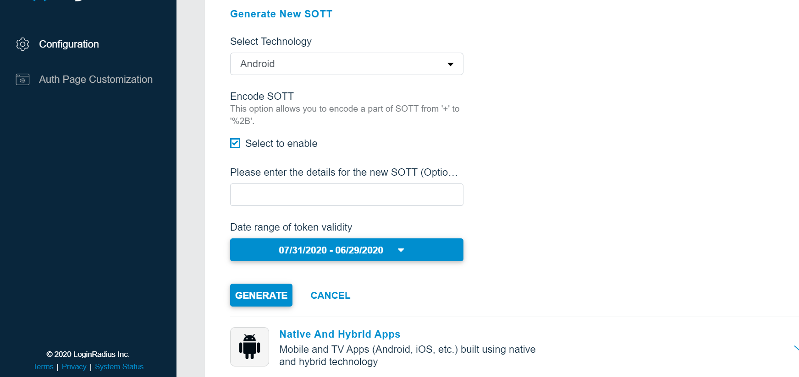

This guide covers the various authentication types and features supported by the LoginRadius Identity Platform’s developer plan.

> **Disclaimer** <br/><br/> This library is meant to help you with a quick implementation of the LoginRadius platform and also to serve as a reference point for the LoginRadius API. Keep in mind that it is an open source library, which means you are free to download and customize the library functions based on your specific application needs.


## Installation

* To download the SDK, please go to the LoginRadius **Github** repository.
* For Gradle based installation, add the following dependency in your app's build.gradle:

```java
implementation 'com.loginradius.android:androidsdk:4.7.0'
```
## Prerequisites
* Android SDK Version >= 15
* Build Tools Version = 28.0.0 (changeable in build.gradle)
* Android Studio >= 3.5.2

To get your app supported by LoginRadius Android SDK, you need to slightly configure your LoginRadius user account.
1. Generate SOTT You need to pass the SOTT value at the time of registration in Android SDK V2 and you can generate this by [dashboard](https://dashboard.loginradius.com/dashboard).

Open dashboard, Click on *Configure Your Application* and open *Mobile SOTT* . now set the time according to the requirement and generate SOTT.

<div style="text-align:center">
  
</div>


## Initialize SDK
Before using the SDK, you must initialize the SDK with the help of following code:
```
LoginRadiusSDK.Initialize init = new LoginRadiusSDK.Initialize();
init.setApiKey("<your-api-key>");
init.setSiteName("<your-site-name>");

```
### Manifest Settings
After creating a new Android project, follow the installation section of this document. Ensure the LoginRadius Android SDK is linked to your new project as a library. Next, add the following permissions to the AndroidManifest.xml:

```xml
<uses-permission android:name="android.permission.INTERNET" />
<uses-permission android:name="android.permission.ACCESS_NETWORK_STATE" />
<uses-permission android:name="android.permission.ACCESS_WIFI_STATE" />
<uses-permission android:name="android.permission.GET_ACCOUNTS" />
<uses-permission android:name="android.permission.MANAGE_ACCOUNTS" />
<uses-permission android:name="android.permission.USE_CREDENTIALS" />
```


## Integrate Social Login

You can set social login by two ways:

1. **Web Social Login**: Web Social Login is done by using Android WebView. It can be performed using any listener for buttons or other respective events.    You can set any configured social provider in web social login. It can be implemented with the help of following code:

  ```java
  LoginRadiusSDK.WebLogin webLogin = new LoginRadiusSDK.WebLogin();
  webLogin.setProvider(SocialProviderConstant.TWITTER);
  webLogin.startWebLogin(LoginActivity.this,2);
  ```
 * Web Social Login is not supported by Facebook or Google.

 

2. **Native Social Login**: Login is done natively, utilizing the respective provider SDKs. It can be performed using any listener for buttons or other respective events. We support native login for Facebook, Google and Vkontakte at the moment. It can be implemented with the help of following code:

```java
LoginRadiusSDK.NativeLogin nativeLogin = new LoginRadiusSDK.NativeLogin();
nativeLogin.startFacebookNativeLogin(LoginActivity.this,2);
```

**NOTE:** There's nothing special about the Intent object you use when starting an activity for a result, but you do need to pass an additional integer argument to the startActivityForResult() method. The integer argument is a "request code" that identifies your request. When you receive the result Intent, the callback provides the same request code so that your app can properly identify the result and determine how to handle it.

When the user is done with the subsequent activity and returns, the system calls your activity's onActivityResult() method.

```java
@Override
protected void onActivityResult(int requestCode, int resultCode, Intent data){
    super.onActivityResult(requestCode, resultCode, data);
    // check if the request code is same as what is passed  here it is 2
    if(requestCode==2) {
        if (data != null){
			Log.i("Access Token",data.getStringExtra("accesstoken"));
			Log.i("Provider",data.getStringExtra("provider"));
        }
	}
}
```

After getting the access token, you need to call the following code :

```java
public void readAllUserProfile(String access_token) {
 QueryParams params = new QueryParams();
 params.setAccess_token(access_token);
 AuthenticationAPI api = new AuthenticationAPI();
 api.readAllUserProfile(params, new AsyncHandler < LoginRadiusUltimateUserProfile > () {
  @Override
  public void onSuccess(LoginRadiusUltimateUserProfile userProfile) {
   Toast.makeText(context, "First Name: " + userProfile.FirstName + " Last Name:" + userProfile.LastName, Toast.LENGTH_SHORT).show();
  }

  @Override
  public void onFailure(Throwable error, String errorcode) {
   Toast.makeText(context, error.getMessage(), Toast.LENGTH_SHORT).show();
  }
 });
}
```

## Integrate Traditional Login
The following code can be used to implement traditional login:

- Using Email

```Java
private void doLogin() {
  QueryParams params = new QueryParams();
    params.setEmail("xyz@mailinator.com");
    params.setPassword("123456");
    AuthenticationAPI api = new AuthenticationAPI();
    api.login(getApplicationContext(), params, new AsyncHandler<LoginData>() {
      @Override
      public void onSuccess(LoginData logindata) {
        Log.e("FirstName", logindata.getProfile().getFirstName().toString());
      }
      @Override
      public void onFailure(Throwable error, String errorcode) {
        Log.e("error", error.getMessage());
      }
    });
   }
```


## Integrate Registration Service
Registration service supports traditional registration and login methods. Registration Service is done through Authentication API. 


The following code can be used to implement registration:

- Using Email

```java
private void doRegistration() {
  QueryParams params = new QueryParams();
  params.setEmailTemplate("<email-template>");		//put your emailTemplate(optional)
  String sott = "put_your_sott_here"; //Required
  final RegistrationData data = new RegistrationData();
  data.setFirstName("Lee");
  data.setLastName("com");
  data.setPassword("123456");
  Email emailObj = new Email();
  emailObj.setType("Primary");
  emailObj.setValue("xyz@mailinator.com");
  data.setEmail(new ArrayList<Email>(Arrays.asList(emailObj)));

  AuthenticationAPI api = new AuthenticationAPI();
  api.register(params,sott,data,new AsyncHandler<RegisterResponse>() {
      @Override
      public void onSuccess(RegisterResponse registerResponse) {
          Log.e("data",registerResponse.getIsPosted().toString());
      }
      @Override
      public void onFailure(Throwable error, String errorcode) {
          Toast.makeText(MainActivity.this, error.getMessage(), Toast.LENGTH_LONG).show();

      }
  });
}
```


## Integrate Forgot Password
Following code can used for implementation of forgot password feature:

- Using Email

```java
  private void doForgotPasswordByEmail() {
    QueryParams params = new QueryParams();
    params.setEmail("xyz1@mailinator.com");
    params.setEmailTemplate("<email-template>");												//put your emailTemplate(optional)
    AuthenticationAPI api = new AuthenticationAPI();
    api.forgotPasswordByEmail(params, new AsyncHandler<ForgotPasswordResponse>() {
    @Override
    public void onSuccess(ForgotPasswordResponse response) {
      Log.e("response", response.getIsPosted().toString());

    }
    @Override
    public void onFailure(Throwable error, String errorcode) {
      Toast.makeText(MainActivity.this, error.getMessage(), Toast.LENGTH_LONG).show();

    }
    });
  }
```


## Native Social Login

#### Google Native Login

1. You need to add the below code on your button to run native login

  ```java
   LoginRadiusSDK.NativeLogin nativeLogin = new LoginRadiusSDK.NativeLogin();
   nativeLogin.startGoogleNativeLogin(LoginActivity.this,2);
  ```

2. Add the following activity definitions, meta data, and permissions to your Android Manifest inside the application tag:​

   ```xml
   <activity android:name="com.loginradius.androidsdk.helper.GoogleSSO" />
   <meta-data android:name="com.google.android.gms.version"
   android:value="@integer/google_play_services_version"/>
   ```

3. Google Configuration for Google Native Login

   - Firstly, sign your app: https://developer.android.com/studio/publish/app-signing.html
   - Generate the signing certificate fingerprint and register your application

     1. Click on your package and choose New -> Google -> Google Maps Activity
     2. Android Studio redirect you to google_maps_api.xml 
        Find your SHA1 fingerprint into google_maps_api.xml
        
        OR
        
        Generate your SHA1 by key tool.
        ```
        keytool -exportcert -alias androiddebugkey -keystore path-to-debug-or-production-keystore -list -v
        ```

   - Create a new Google API console project on the Google Developer https://console.developers.google.com/apis/credentials
     
     Open the Credentials page.
     Follow these steps if your application needs to submit authorized requests: 
	 1. Click Add credentials > OAuth 2.0 client ID. 
	 2. Select Android. 
	 3. In the Package name field, enter your Android app's package name. 
	 4. Paste the SHA1 fingerprint into the form where requested.

   - Common Error Messages: \* **12501:**
     This is more commonly caused by an incorrect SHA1 being used to set up your project with Google. Make sure that the SHA1 of the build you are testing matches what you used in the Developer's Console.

**Google Native Login : Refresh Token / offline-access:**

With the earlier Add Sign-In procedure, your app authenticates the user on the client side only; in that case, you can access the Google APIs only while the user is actively using your app. If you want your servers to be able to make Google API calls on behalf of users—possibly while they are offline— this can be achieved using refresh token.

_Configurations_:

1. Configure OAuth 2.0 web application for google provider from [Developer's Console](https://dashboard.loginradius.com/dashboard) Under Social Provider.

2. Make sure web and android configuration are configured under Single Project in Google API Console.

3. After configuration just need to pass your google OAuth 2.0 web application client ID in LoginRadius Android SDsK to the requestServerAuthCode.

   ```
   nativeLogin.setGoogleServerClientID("<web_server_client_id>");
   ```

#### Facebook Native Login

1. Please add your Facebook "app_id" in your string.xml, you can get the Facebook application id by https://developers.facebook.com/

   ```xml
   <string name="app_id">your facebook app id</string>
   ```

   You need to add the below code on your button to run native login

   ```java
   LoginRadiusSDK.NativeLogin nativeLogin = new LoginRadiusSDK.NativeLogin();
   nativeLogin.startFacebookNativeLogin(LoginActivity.this,2);
   ```

2. Add the following activity definitions and meta data to your Android Manifest inside the application tag:

   ```xml
   <meta-data
     android:name="com.facebook.sdk.ApplicationId"
     android:value="@string/app_id" />
   ```

3. Facebook Configuration for Facebook Native Login

   Create a new Facebook App on the Facebook Developer site. You will need to create an Android application and get a Facebook Application ID: https://developers.facebook.com/

   - Create a Development Key Hash
     Facebook uses the key hash to authenticate interactions between your app and the Facebook app. If you run apps that use Facebook Login, you need to add your Android development key hash to your Facebook developer profile.
     You need to add this code under activity onCreate method.Put your activity package name in this code. After that run the below code and you'll get KeyHash in logs.
     

   ```java
   try {
     PackageInfo info = getPackageManager().getPackageInfo(
         "put-your-Activity-package-name",
         PackageManager.GET_SIGNATURES);
     for (Signature signature: info.signatures) {
         MessageDigest md = MessageDigest.getInstance("SHA");
         md.update(signature.toByteArray());
         Log.d("KeyHash:", Base64.encodeToString(md.digest(), Base64.DEFAULT));
     }
    } catch (NameNotFoundException e)
     {

     } catch (NoSuchAlgorithmException e) {

     }
   ```

   - Now select My Apps and create a new app using "Add a New App".

   - After the creation of App, Click on setting into left panel, Select Add Platform and choose Android

   - After generating KeyHash successfully, you need to setup below setting and fill the required fields e.g. Package Name & Class Name.
     
     

     


**Setup Proguard Configuration**
If you intend to use ProGuard on the release build of your mobile application, you will need to add the following lines to your project's proguard-project.txt file to preserve information required for the SDK to function properly:

```java
-keepattributes Signature
-keepattributes Exceptions
-keep class com.loginradius.** { *; }
```

Also, you need to add the configuration for support libraries of LoginRadius Android SDK. Following is the required code:

```java
-keepattributes *Annotation*
-keep class okhttp3.** { *; }
-keep interface okhttp3.** { *; }
-dontwarn okhttp3.**
-dontnote okhttp3.**

-dontwarn retrofit2.**
-keep class retrofit2.** { *; }

-dontwarn okio.**
-keep class okio.** { *; }
```

## Session Login/Logout
Session Login and Logout method use for store access_token and userProfile after successful login in Android SharedPreferences for long time.

```java
LoginUtil session = new LoginUtil(getApplicationContext());
```

You can store access_token after successful login.

```java
session.setLogin("<access_token>");
```

You can store access_token and userProfile after successful login.

```java
session.setLogin(logindata.getAccessToken(),logindata.getProfile());
```


After successful login or social login LoginRadius access token and user profile can be accessed like this.

```java
Log.d("token",session.getAccessToken()); //For Getting the LoginRadius Local Store(SharedPreferences) Access Token For Further Uses.
Log.d("profile",session.getProfile().FirstName); //For Getting the LoginRadius Local Store(SharedPreferences) Profile For Further Uses.
```

We added a small boolean function if you want to check whether the user is logged in or not.

```java
Log.d("token_login", String.valueOf(session.isLogin()));
```

*Logout*

```java
session.logout("<access_token>", new LoginUtil.LogoutCallBack() {
    @Override
    public void Response(Boolean isLogout, Boolean isError, ErrorResponse error) {
        if(isLogout && !isError){
            //  logout successfully
        }else if(isLogout && isError){
            // logout successfully from local session but get a Error from LoginRadius API.
            Log.d("error",error.getDescription());
        }
    }
});
```

  

## Advanced Configuration

**Social Login Required Fields Flow**
After the process of social login, the SDK flow is redirected to a predefined form having a list of required and optional fields. They are needed to fill out the missing information about the user. If there is a need to customize the default form, options listed below are helpful.

**For social web login**

```java
LoginRadiusSDK.WebLogin webLogin = new LoginRadiusSDK.WebLogin();
webLogin.setProvider(SocialProviderConstant.FACEBOOK);
//avoid the required fields form
webLogin.setRequired(false);
//set the color for required fields
webLogin.setFieldsColor(Col1or.parseColor("#000000"));
webLogin.startWebLogin(LoginActivity.this,2);
```

**For social native login**

```java
LoginRadiusSDK.NativeLogin nativeLogin = new LoginRadiusSDK.NativeLogin();
//avoid the required fields form
nativeLogin.setRequired(false);
//set the color for required fields
nativeLogin.setFieldsColor(Color.parseColor("#000000"));
nativeLogin.startFacebookNativeLogin(LoginActivity.this,2);
```

**For traditional login**

```java
QueryParams params = new QueryParams();
params.setEmail("<email-address>");
params.setPassword("<password>");
params.setEmailTemplate("<email-template>");    //optional
AuthenticationAPI api = new AuthenticationAPI();

//Used to enable missing/required fields flow in traditional login.
api.setAskRequiredFieldsOnTraditionalLogin(false); //true, by default

api.login(getApplicationContext(), params, new AsyncHandler<LoginData>() {
    @Override
    public void onSuccess(LoginData data) {
        Log.i("Login By Email","First Name: "+data.getProfile().getFirstName());
    }

    @Override
    public void onFailure(Throwable error, String errorcode) {
        Log.i("Login By Email","Error: "+error.getMessage());
    }
});
```

**Social Login Custom Scope**
There are some special permissions related to accessing a user's social account. They are known as scopes. There are some default scopes needed for user data. But, they can be overridden for some special needs. To use only specified custom scopes and ignoring the default ones, you can try out the following code:

```
LoginRadiusSDK.WebLogin webLogin = new LoginRadiusSDK.WebLogin();
webLogin.setProvider(provider.getName().toLowerCase());
webLogin.setCustomScopeEnabled(true);
webLogin.startWebLogin(LoginActivity.this,2);
```

**Configure Custom Verification URL and Reset Password URL**
When the user is being registered with the help of email, it needs to be verified through a link received in the email. A similar link is received when the user tries to recover password through email. By default, the link redirects to the default LoginRadius Identity Experience Framework. Following represents the URL of the default Identity Experience Framework:

```
https://auth.lrcontent.com/mobile/verification/index.html
```

To override the default verification and reset password url, additional parameters can be passed at the time of SDK initialization. Following code can be used for reference:

```Java
LoginRadiusSDK.Initialize init = new LoginRadiusSDK.Initialize();
init.setApiKey("<your-api-key>");
init.setSiteName("<your-site-name>");
init.setSott("<your-sott>");
init.setVerificationUrl("<your-verification-url>");
init.setResetPasswordUrl("<your-reset-password-url>");
```

## LoginRadius API Showcase

This section helps you to explore various API methods of LoginRadius Android SDK. They can be used to fulfill your identity based needs related to traditional login, registration, social login and many more.

For more details check [API Reference Here](https://www.loginradius.com/docs/developer/api/)


## Reference Manual

Please find the reference manual [here](http://docs.lrcontent.com/apidocs/ref/android/index.html)
## Discover More 

import { MenuWrapper } from "../../src/components/menu.js";
import WorkoutMenuItem from "../../src/components/menu-item.js";
import { IconSupport } from "@apollo/space-kit/icons/IconSupport";
import { IconInfo } from "@apollo/space-kit/icons/IconInfo";

<MenuWrapper>

<WorkoutMenuItem
  icon={IconInfo}
  keyWord={"Discover More"}
  otherWords={"on"}
>

* Add/Update [Email Templates](/howto/email-templates/)
* Customize Your [Login Page](/howto/authentication-theme/)
* Work with [SOTT](/howto/work-with-sott/)

</WorkoutMenuItem>

<WorkoutMenuItem
  icon={IconSupport}
  keyWord={"How To"}
  otherWords={"Guides"}
>

* Implement [SMTP Configuration](/howto/email-smtp-config/)
* Implement [Social Login](/howto/social-login/)

</WorkoutMenuItem>

</MenuWrapper>