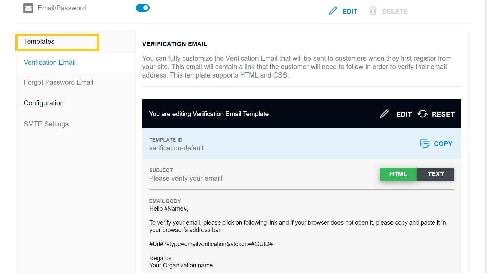
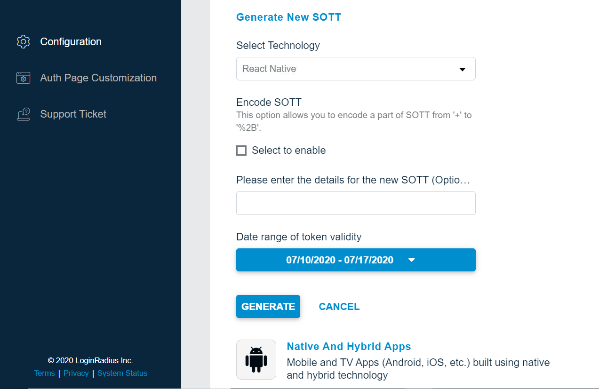
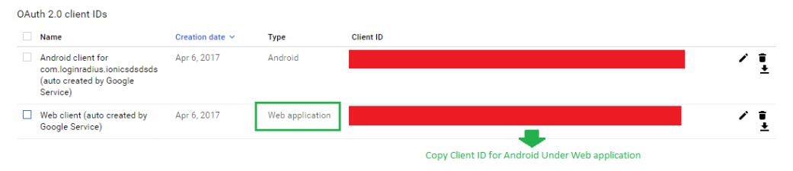

This document provides instructions to integrate the LoginRadius User Registration Service or Social Login in a React Native app.

> **Disclaimer** <br/><br/> This library is meant to help you with a quick implementation of the LoginRadius platform and also to serve as a reference point for the LoginRadius API. Keep in mind that it is an open source library, which means you are free to download and customize the library functions based on your specific application needs.

## Prerequisites

You need to slightly configure your LoginRadius user account with the following changes.
1. Under Identity Providers, add an `apikey` parameter to the default links in the Verification Email and Forgot Password Email Templates.

Verification Email Template: "#Url#?vtype=emailverification&vtoken=#GUID#&apikey="

Forgot Password Email Template: "#Url#?vtype=reset&vtoken=#GUID#&apikey="

<div style="text-align:center">
  
</div>


2. Generate SOTT You need to pass the SOTT value at the time of registration in PhoneGap library and you can generate this by [dashboard](https://dashboard.loginradius.com/dashboard).

Open dashboard, Click on *Configure Your Application* and open *Mobile SOTT* . now set the time according to the requirement and generate SOTT.

<div style="text-align:center">
  
</div>

## Installation

Get a copy of the React Native SDK and demo projects [here](https://github.com/LoginRadius/react-native-sdk) and include in your project.

```
LoginRadiusSDK.js
```

In the app.json file, initialize the LoginRadius User registration Object.

```
"apiKey":"<put-your-apiKey>",
"appName":"<put-your-appName>",
"sott":"<put-sott>",
"verificationUrl":"https://auth.lrcontent.com/mobile/verification/index.html",
"resetPasswordUrl":"https://auth.lrcontent.com/mobile/verification/index.html"
```

The above initialization requires options object with the following parameter:

|Name|Required }Description|
|---|---|---|
|apiKey| yes	|	Set to your LoginRadius API Key which you can get [here](/howto/dashboard-setup/).|
|appName|	yes |	Set to your LoginRadius site name, this is required for User Registration to work with Single Sign On API.|
|sott| yes	|	Secure One-time Token. Get token from Admin Console Note: While generating SOTT from Loginradius Admin Console, enable Encode SOTT.|
|verificationUrl| yes	|	Set dynamic URL for email verification (Default URL: https://auth.lrcontent.com/mobile/verification/index.html)|
|resetPasswordUrl|	yes |	Set dynamic URL for reset password.|

your must be add in your .js file some dependency injection wheare you want use lgoinradius SDK.

```
import LoginRadiusSDK from './LoginRadiusSDK.js';
```

## Native Social Login

Supported Devices
Currently, only Facebook And Google is supported for native login with our SDK for Android and iOS.

### Facebook Native Login
Before you can implement native login, you should have a look at the necessary instructions. This [link](https://developers.facebook.com/docs/react-native/getting-started) will help you regarding the same.

**Installation/Build Errors:**

`Failed to resolve: com.android.support:appcompat-v7:27.0.2 :`


```
repositories {
    mavenLocal()
    jcenter()
    configurations.all {
        resolutionStrategy {
            force 'com.facebook.android:facebook-android-sdk:4.28.0'
        }
    }
    maven {
        url "https://maven.google.com"
    }
    maven {
        // All of React Native (JS, Obj-C sources, Android binaries) is installed from npm
        url "$rootDir/../node_modules/react-native/android"
    }
}

```

If the following dependency exists in app's build.gradle,

```
compile('com.facebook.android:facebook-android-sdk:+')

```

then replace it with the following:

```
dependencies {
compile('com.facebook.android:facebook-android-sdk:4.28.0')  // From node_modules
}
```

**The SDK has not been initialized :**

If you're getting the above error in Android,then add the following code in MainApplication.java

```
public void onCreate() {
    super.onCreate();
    FacebookSdk.sdkInitialize(getApplicationContext());
}
```

#### Sample Code

```
const FBSDK = require('react-native-fbsdk');
const {
  LoginButton,
  LoginManager,
  AccessToken
} = FBSDK;
type Props = {};
export default class App extends Component<Props> {
 render() {
    return (
      <View style={styles.container}>
      <LoginButton
          logInWithReadPermissions = {["public_profile"]}
          onLoginFinished={
            (error, result) => {
              if (error) {
                alert("login has error: " + result.error);
              } else if (result.isCancelled) {
                alert("login is cancelled.");
              } else {
              //Get LoginRadius access token in exchange of Facebook access token
                AccessToken.getCurrentAccessToken().then(
                  (data) => {
                      LoginRadiusSDK.facebookNativeLogin(data.accessToken.toString(), function (handle) {
                      alert(JSON.stringify(handle));
                    });

                  }
                )
              }
            }
          }
          onLogoutFinished={() => alert("logout.")}/>
        <Text style={styles.welcome}>
          Welcome to React Native!
        </Text>
        <Text style={styles.instructions}>
          To get started, edit App.js
        </Text>
        <Text style={styles.instructions}>
          {instructions}
        </Text>
      </View>
    );
  }
 }
```

The above code snippet helps you to get token from Facebook. Then, this token can be used to get the LoginRadius access_token which can be used to authenticate user.


- Facebook Configuration for Facebook Native Login

Create a new Facebook App on the Facebook Developer site. You will need to create an Android application and get a Facebook Application ID: https://developers.facebook.com/

#### Android

- Create a Development Key Hash

Facebook uses the key hash to authenticate interactions between your app and the Facebook app. If you run apps that use Facebook Login, you need to add your Android development key hash to your Facebook developer profile.
You need to add this code under activity onCreate method.Put your activity package name in this code. After that run the below code and you'll get KeyHash in logs.

```
try {
       PackageInfo info = getPackageManager().getPackageInfo(
               "put-your-Activity-package-name",
               PackageManager.GET_SIGNATURES);
       for (Signature signature : info.signatures) {
           MessageDigest md = MessageDigest.getInstance("SHA");
           md.update(signature.toByteArray());
           Log.d("KeyHash:", Base64.encodeToString(md.digest(), Base64.DEFAULT));
           }
   } catch (NameNotFoundException e) {
   } catch (NoSuchAlgorithmException e) {
   }
```

- Now select My Apps and create a new app using "Add a New App".
- After the creation of App, Click on setting into left panel, Select Add Plateform and choose Android
- After generating KeyHash successfully, you need to setup below setting and fill the required fields e.g. Package Name & Class Name.

<div style="text-align:center">
  
</div>

#### iOS

- After the creation of App, Click on setting into left panel, Select Add Plateform and choose iOS.
- Pass your project bundle ID, iPhone store ID and iPad store ID.

<div style="text-align:center">
  
</div>

### Google Native Login

Before you can implement native login, you must install the [react-native-google-signin](https://github.com/react-native-community/google-signin) into your current project for google native login.

**Installation/Build Errors:**

`Failed to install react-native-google-signin`

If you're getting the above error,then you need to specify version of the react-native-google-signin:

```
npm install react-native-google-signin@0.12 --save
react-native link react-native-google-signin
```

- Google Configuration for Google Native Login

#### Android

- To configure Android, generate a configuration file [here](https://firebase.google.com/?platform=android&cntapi=signin). Once Google Sign-In is enabled Google will automatically create necessary credentials in Developer Console. There is no need to add the generated google-services.json file into your react-native project.

- After generating the configuration file, move to [Google Credentials Manager](https://console.developers.google.com/apis/credentials?pli=1) and select your project name (Which you have created) in the header section. Now Select Credentials from the left panel and copy the Client ID available under project's **web application**.

<div style="text-align:center">
  
</div>

- Now pass the webClientId as

```
 async _setupGoogleSignin() {
    try {
      await GoogleSignin.hasPlayServices({ autoResolve: true });
      await GoogleSignin.configure({
        webClientId: '',
        offlineAccess: false
      });

      const user = await GoogleSignin.currentUserAsync();
      console.log(user);
      this.setState({user});
    }
    catch(err) {
      alert(err.message)
      console.log("Play services error", err.code, err.message);
    }
  }
```

#### iOS

- To get your iOS REVERSED_CLIENT_ID, generate a configuration file [here](https://developers.google.com/identity/sign-in/ios/start-integrating). This GoogleService-Info.plist and just drag & drop in your project's "Resources" folder.

- The file contains the REVERSED_CLIENT_ID you'll need during installation and also copy CLIENT_ID from "GoogleService-Info.plist" and pass this on lroptions

Once you've followed the instructions in the above link and implemented Google Login successfully, then we'll fetch the ID token from Google to exchange with LoginRadius access_token.

```
_signIn() {
    GoogleSignin.signIn()
    .then((user) => {
    //Get Google ID token to exchange with LoginRadius access_token.
      LoginRadiusSDK.GoogleJWT(user.idToken, function (handle) {
        alert(JSON.stringify(handle));
    });
     // alert(JSON.stringify(user))
      console.log(user);
      this.setState({user: user});
    })
    .catch((err) => {
      alert(err);
      console.log('WRONG SIGNIN', err);
    })
    .done();
  }
```

### Common Error messages

- **2501** :
This is more commonly caused by an incorrect SHA1 being used to set up your project with Google. Make sure that the SHA1 of the build you are testing matches what you used in the Developer's Console.
- **10** :
Make sure that the client id you're passing in to the plugin (for webClientId) is of type Web Application, not of type Android, iOS, or other.


Make sure that you're Android SDK is completely up to date (see the list posted in my initial response above).

Finally, make sure that the SHA1 you used to set up in the developer's console is the same one that ionic is using when it builds your app. If it's not, log in will not work.

For more details check API Refrence [Here](https://www.loginradius.com/docs/developer/api/)

## API Details

### Authentication API

List of APIs in this Section:<br/>
 
- GET : [Auth Validate Access token](#auth-validate-access-token-get)
- GET : [Auth Read all Profiles by Token](#auth-read-all-profiles-by-token-get)
- GET : [Auth Delete Account](#auth-delete-account-get)
- GET : [Auth Verify Email](#auth-verify-email-get)
- GET : [Auth Social Identity](#auth-social-identity-get)
- POST : [Auth Login by Email](#auth-login-by-email-post)
- POST : [Auth Forgot Password](#auth-forgot-password-post)
- POST : [Auth User Registration by Email](#auth-user-registration-by-email-post)
- PUT : [Auth Change Password](#auth-change-password-put)
- PUT : [Auth Resend Email Verification](#auth-resend-email-verification-put)
- DELETE : [Auth Delete Account with Email Confirmation](#auth-delete-account-with-email-confirmation-delete)


##### Auth Validate Access token (GET)

This api validates access token, if valid then returns a response with its expiry otherwise error.

 ```js
 let access_token = "<your-access_token>"; //Required
LoginRadiusSDK.validateAccessToken(access_token, function (handle) {
  // process returned object
  alert(JSON.stringify(handle));
});
```

##### Auth Read all Profiles by Token (GET)

This API retrieves a copy of the user data based on the access token.

 ```JS
 let access_token = "<your-access-token>"; //Required

LoginRadiusSDK.readAllProfilesByToken(access_token, function (handle) {
  // process returned object
  alert(JSON.stringify(handle));
});
```

##### Auth Delete Account (GET)

This API is used to delete an account by passing it a delete token.

```JS
let deletetoken = "<your-deletetoken>"; //Required
LoginRadiusSDK.deleteAccount(deletetoken, function (handle) {
  // process returned object
  alert(JSON.stringify(handle));
});
```

 
##### Auth Verify Email (GET)

This API is used to verify the email of user. Note: This API will only return the full profile if you have 'Enable auto login after email verification' set in your LoginRadius Dashboard's Email Workflow settings under 'Verification Email'.

```JS
let verificationtoken = "<your-verification-token>"; //Required
let welcomeemailtemplate = "<welcome-email-template>"; //optional
LoginRadiusSDK.verifyEmail(verificationtoken, url, welcomeemailtemplate, function (handle) {
  // process returned object
  alert(JSON.stringify(handle));
});
```

##### Auth Social Identity (GET)

This API is called just after account linking API and it prevents the raas profile of the second account from getting created.

```JS
let access_token = "<your-access-token>"; //Required

LoginRadiusSDK.socialIdentity(access_token, function (handle) {
  // process returned object
  alert(JSON.stringify(handle));
});
```

##### Auth Login by Email (POST)

This API retrieves a copy of the user data based on the Email

 ```JS
 let payload = {
  "email": "",
  "password": ""
}

let emailtemplate = "<email-template>"; //optional
let grecaptcha_response = "<grecaptcha_response>"; //optional

LoginRadiusSDK.loginByEmail(emailtemplate, grecaptcha_response, payload, function (handle) {
  // process returned object
  alert(JSON.stringify(handle));
});
```

##### Auth Forgot Password (POST)

This API is used to send the reset password url to a specified account. Note: If you have the UserName workflow enabled, you may replace the 'email' parameter with 'username'

 ```JS
let email = "<email-address>"; //Required
let emailtemplate = "<emailtemplate-template>"; //optional
LoginRadiusSDK.forgotPasswordByEmail(email,emailtemplate, function (handle) {
  // process returned object
  alert(JSON.stringify(handle));
});
```

##### Auth User Registration by Email (POST)

This API creates a user in the database as well as sends a verification email to the user.

 
 

 ```JS
  let payload = {
  "Prefix": "",
  "FirstName": "Test",
  "MiddleName": null,
  "LastName": "Account",
  "Suffix": null,
  "FullName": "Test Account",
  "NickName": null,
  "ProfileName": null,
  "BirthDate": "10-12-1985",
  "Gender": "M",
  "Website": null,
  "Email": [
    {
      "Type": "Primary",
      "Value": "example@example.com"
    }
  ],
  "Password": "******"
}

let emailtemplate = "<email-template>"; //optional

LoginRadiusSDK.userRegistrationByEmail(emailtemplate, payload, function (handle) {
  // process returned object
  alert(JSON.stringify(handle));
});
```

##### Auth Change Password (PUT)

This API is used to change the accounts password based on the previous password

```JS
let payload = {
  "oldpassword": "<old-password>",
  "newpassword": "<new-password>"
}
let access_token = "<your-access_token>"; //Required
LoginRadiusSDK.changePassword(access_token,payload, function (handle) {
  // process returned object
  alert(JSON.stringify(handle));
});
```

##### Auth Resend Email Verification (PUT)

This API resends the verification email to the user.

 ```JS
let email = "<email-address>"; //Required
let emailtemplate = "<emailtemplate-template>"; //optional
LoginRadiusSDK.resendEmailVerification(email,emailtemplate, function (handle) {
  // process returned object
  alert(JSON.stringify(handle));
});
```

##### Auth Delete Account with Email Confirmation (DELETE)

 This API will send a confirmation email for account deletion to the customer's email when passed the customer's access token

 ```JS
let access_token = "<your-access_token>"; //Required
LoginRadiusSDK.deleteAccountWithEmailConfirmation(access_token, function (handle) {
  // process returned object
  alert(JSON.stringify(handle));
});
```
