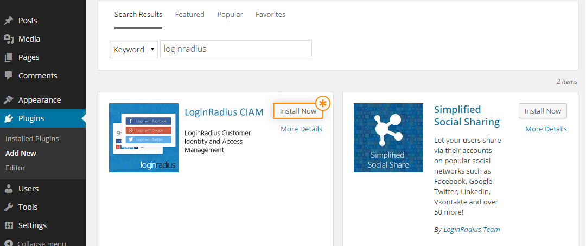
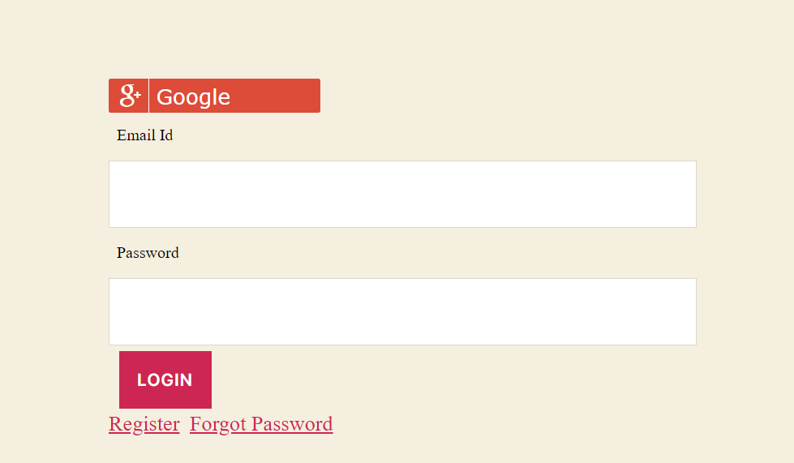
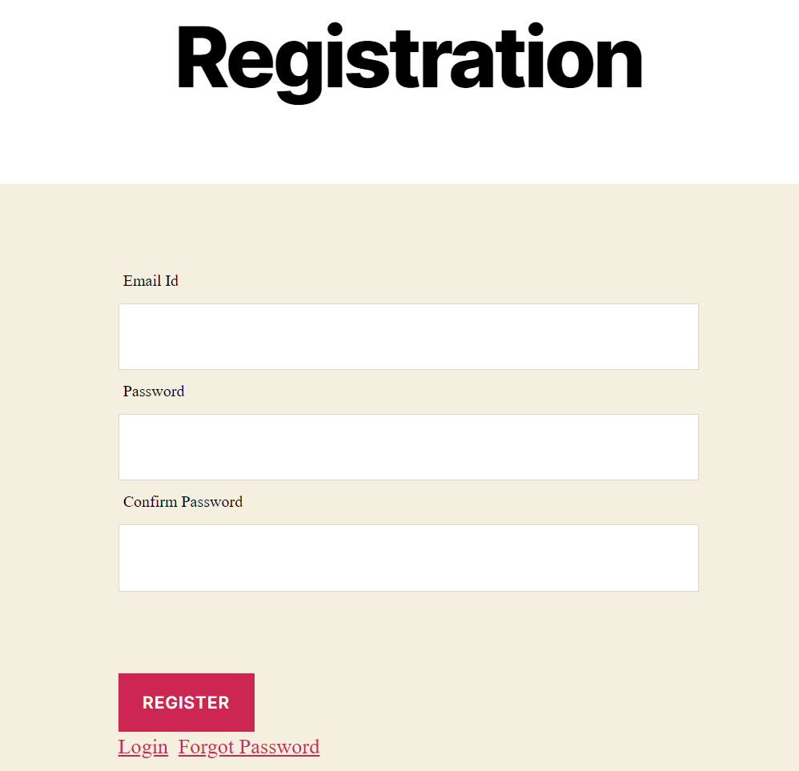
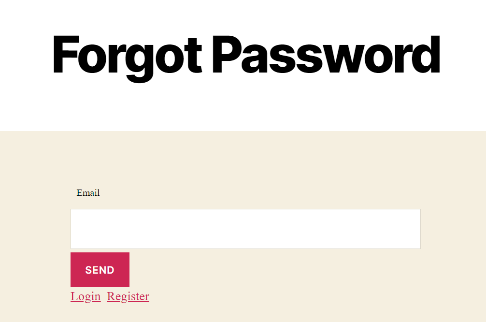
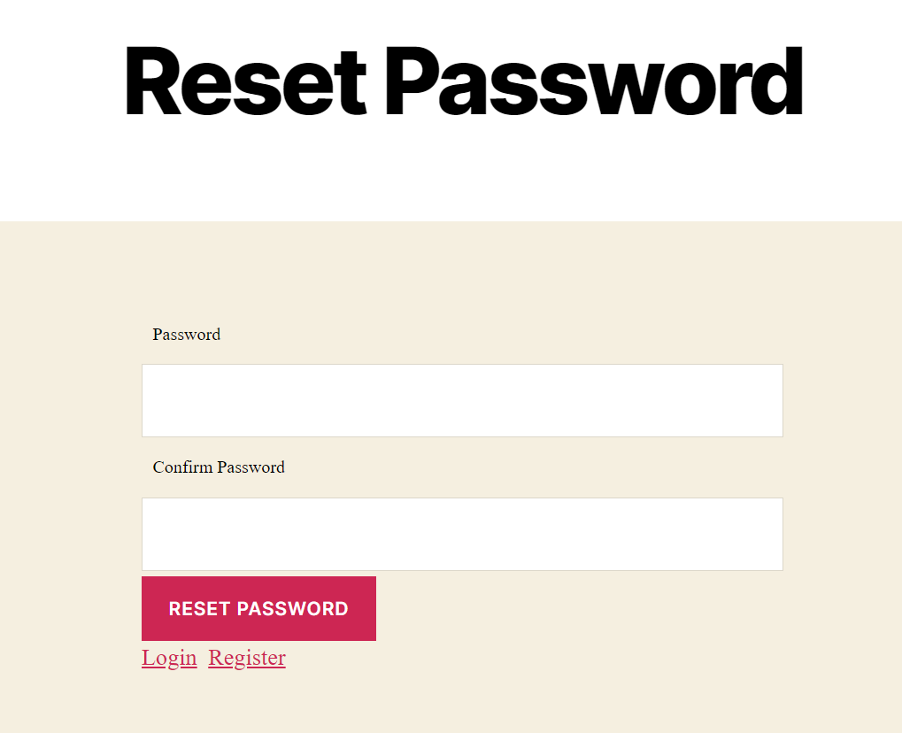

WordPress is an open-source and free content management system that is written in PHP and uses MySQL or MariaDB database. WordPress features have a plugin architecture and different templates, which is commonly referred to as WordPress Themes.

> **Disclaimer**    LoginRadius Customer Identity and Access Management Plugin simplifies and secures your customer registration process, increases customer conversion with Social Login, and offers a full solution with Traditional customer Registration.

> **Note:** Based on your LoginRadius plan you have, you may have access to one or more of the following modules. This document provides an overview of each component listed below. If you require additional components that are not included in your plugin please contact your product specialist at LoginRadius.

## Installation

- Navigate to WordPress Admin Panel->Plugins
- Click "Add New" button
- To install the LoginRadius plugin, type "loginradius" in the search field, or use the "Upload Plugin" button. You can use the plugin that was provided to you by the LoginRadius team or can download the default plugin here.
  

  

## Activation

- To activate the plugin, navigate to WordPress Admin Panel->CIAM
- On the Activation tab, enter your API Key, and API Secret as provided on your LoginRadius Admin Console.
- Click 'Save Settings'.

  

## Authentication

- To enable authentication settings navigate to Wordpress Admin Panel->CIAM->Authentication here, you will find 4 admin settings:
  
  

  

1. User Registration
2. Authentication                                       
3. Advanced settings
4. Short Codes

### Single Sign-On

LoginRadius Single Sign-On (SSO) is a feature for multiple site management. To enable the SSO, navigate to WordPress Admin Panel->CIAM->SSO. In the SSO tab enable the radio button under the 'Enable SSO' tab and then click the Save Settings button.

  

> **Note:** SSO is not available for the free plan customer.

### Debug Mode

- To generate Debug log for debugging purpose, enable **WordPress developer mode** option from **wp-config.php **

> **Note:** When the log is enabled, then it will start writing the log to the 'ciam_debug.log' file which is present at the plugin root.

## Interfaces

Following are the user Interfaces provided by LoginRadius:

### Login Interface

Login interfaces can be used from the login page created from the plugin authentication tab from the admin panel. It can also be used from the page on which the admin has applied the shortcode for login i.e. [ciam_login_form].

To auto-generate the registration page, navigate to WordPress Admin Panel->CIAM->Authentication and check ' Auto Generate User Registration' under the User Registration section.

  

### Registration Interface

The registration interface can be used from the Registration page created from the plugin authentication tab from the admin panel. It can also be used from the page on which admin has applied the shortcode for registration i.e. [ciam_registration_form].

To auto-generate the registration page, navigate to WordPress Admin Panel->CIAM->Authentication and check 'Auto Generate User Registration' under the User Registration section.

  

### Forgot password Interface

Forgot password interfaces can be used from the forgot password page created from the plugin authentication tab from the admin panel. It can also be used from the page on which the admin has applied the shortcode for forgot password i.e. [ciam_forgot_form].

To auto-generate the registration page, navigate to WordPress Admin Panel->CIAM->Authentication and check ' Auto Generate User Registration' under the User Registration section.

The below screenshot is for the Forgot Password page.

  

### Reset password Interface

Reset password interfaces can be used from the Reset password page created from the plugin authentication tab from the admin panel. It can also be used from the page on which the admin has applied the shortcode for Reset password i.e. [ciam_password_form].

To auto-generate the registration page, navigate to WordPress Admin Panel->CIAM->Authentication and check 'Enable Auto Generate User Registration' under the User Registration Integration section.

The customer can reset their password from the link which they receive in their mail after doing the forgot password process.

  

###Default WP Login Form

Default WP Login Form is used for admin purposes. If the admin wants to bypass the LoginRadius authentication services or doesn't require to register a customer at LoginRadius then it can be done using the [ciam_wp_default_login] shortcode. For this Admin needs to create a separate page and apply the given shortcode on it.

**For example:** We have created a new page by the name “Default” and applied [ciam_wp_default_login] shortcode on it, (refer the below screenshot) this will display the default WordPress login form.

  

 

  

### Interface customization

To customize the LoginRadius Interface like Login, Register, forgot password, etc then we have the following options:

- **CSS Customization**
    To make the designing customization like interface layout, popup designing, or interface elements, use the current theme's CSS file for overriding the design.

### Where to look user details in the database?

- You can see the user's email id and username in the "wp_users" table.
- And plugin options setting in the "wp_options" table. 

### How to troubleshoot plugin?

While Troubleshooting, make sure to check out the following points:

- WordPress plugin uses “wp_remote_request” function to run APIs that indirectly call cURL or fsockopen, so please make sure that cURL remains open on the server.
- If you have enabled any caching plugin on your site, then please make sure to clear the cache from it after making any update/customization to the plugin.

### How to Uninstall plugin?

To uninstall the plugin go to the installed plugin section and click on the deactivate button below the "LoginRadius CIAM" or you can select "LoginRadius CIAM" after that choose to deactivate from Bulk Action and click on the Apply button.

> Note: 
>   On uninstallation of the plugin all the options setting will be deleted from the "wp_options" table.

###FAQ
1.  How to update the plugin?
 In case of updating the plugin first deactivate the previous plugin and replace the codebase and activate the new plugin. Alternatively, you can also update it by clicking on the “update” of LoginRadius CIAM at “/wp-admin/plugins.php” of your site.

**Note:** WordPress version tested up to 5.5