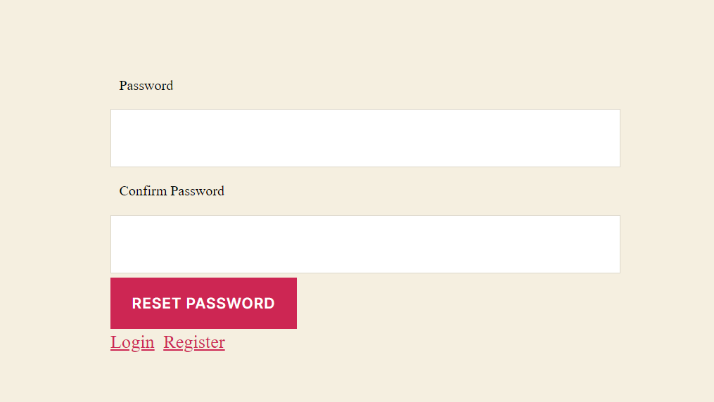

Watch the video for the step by step tutorial or refer to the section below for the text-based guide.

<iframe width="480" height="250" src="https://www.youtube.com/embed/Njxtvu7KBMg" frameborder="0" allow="accelerometer; autoplay; clipboard-write; encrypted-media; gyroscope; picture-in-picture" allowfullscreen></iframe>

WordPress LoginRadius CIAM replaces the WordPress default login form and includes the following features:

- Standard login (email login)
- Social login (Facebook, Google, Twitter)
- User management
- Customizable interfaces for login, registration, and forgot password pages.

Note: Based on your LoginRadius plan, you may have access to one or more of the following modules. If you require additional components that are not included in your plugin, contact our support team at LoginRadius.

## Installation

- Log in to your WordPress account and then navigate to **WordPress Admin Panel->Plugins**
- Click the **"Add New"** button
- To install the LoginRadius plugin, search **loginradius**  keyword. From the search results, click the **Install Now** button given next to the LoginRadius CIAM plugin:
  

  

 

OR click the **Upload Plugin** button, choose the plugin provided to you by the LoginRadius team and then click the **Install Now** button.

  

## Activation

- To activate the plugin, navigate to **WordPress Admin Panel->CIAM**
- On the **Activation** tab, enter your API Key, and API Secret as provided on your LoginRadius Admin Console. For more details, refer to this [document](/howto/dashboard-setup/).
- Click **Save Settings** button.

  

## Authentication

To enable authentication settings, navigate to **WordPress Admin Panel->CIAM->Authentication**, Here you will find the following 4 admin settings:

  1. User Registration
  2. Authentication                                       
  3. Advanced settings
  4. Short Codes

The following image displays the settings mentioned above; configure them as per your requirements to use this plugin’s authentication feature on your WordPress website:

  

 

### Single Sign-On

LoginRadius Single Sign-On (SSO) enables customer to access multiple applications with a single set of login credentials and an active login session. Navigate to **WordPress Admin Panel >CIAM >SSO**, select the radio button under the **Enable SSO** section and then click the **Save Settings** button.

  

 

> **Note:** SSO is not available for the free plan customer.

## Interfaces

Following are the user Interfaces provided by **LoginRadius WordPress CIAM**:

### Login Interface

It can be used from the login page created from the plugin's authentication tab in the WordPress admin panel. It can also be used from the page on which the admin has applied the shortcode for login i.e. **[ciam_login_form]**.

To auto-generate the registration page, navigate to **WordPress Admin Panel >CIAM >Authentication** and check **'Auto Generate User Registration'** under the User Registration tab.

  

### Registration Interface

It can be used from the Registration page created from the plugin's authentication tab in the WordPress Admin Panel. It can also be used from the page on which admin has applied the shortcode for registration i.e. **[ciam_registration_form]**.

To auto-generate the registration page, navigate to WordPress Admin Panel->CIAM->Authentication and check 'Auto Generate User Registration' under the User Registration section.

  

### Forgot password Interface

It can be used from the forgot password page created from the plugin's authentication tab in the WordPress Admin Panel. It can also be used from the page on which the admin has applied the shortcode for forgot password i.e. **[ciam_forgot_form]**.

To auto-generate the registration page, navigate to WordPress **Admin Panel >CIAM >Authentication** and check **'Auto Generate User Registration'** under the User Registration section.

The below screenshot is for the Forgot Password page.

  

### Reset password Interface

It can be used from the Reset password page created from the plugin's authentication tab in the WordPress Admin Panel. It can also be used from the page on which the admin has applied the shortcode for Reset password i.e. **[ciam_password_form]**.

To auto-generate the registration page, navigate to WordPress Admin Panel->CIAM->Authentication and check 'Enable Auto Generate User Registration' under the User Registration Integration section.

The customers can reset their password from the link received in their mail after following the forgot password process.

  

### Default WP Login Form

Default WP Login Form is used for admin purposes. If the admin wants to bypass the LoginRadius authentication services or doesn't require registering a customer at LoginRadius, it can be done using the **[ciam_wp_default_login]** shortcode. For this Admin needs to create a separate page and apply the given shortcode on it.

**For example:** We have created a new page by the name “**Default**” and applied **[ciam_wp_default_login]** shortcode on it. The follwoing displays the default WordPress login form:

  

 

  

### Interface customization

To customize the design (layout, pop-up design, or interface element) of LoginRadius interfaces like Login, Register, Forgot Password, etc  you can use the theme’s CSS file for overriding the design.

### FAQ

#### Where to look user details in the database?

- You can see the user's email id and username in the "wp_users" table.
- And plugin options setting in the "wp_options" table. 

#### How to troubleshoot plugin?

While Troubleshooting, make sure to check out the following points:

- WordPress plugin uses **wp_remote_request** function to run APIs that indirectly call cURL or fsockopen, so ensure that cURL remains open on the server.
- If you have enabled any caching plugin on your site, clear the cache from that plugin after updating/customizing the **Authentication and SSO by LoginRadius** plugin.

#### How to Uninstall plugin?

To uninstall the plugin go to the installed plugin section and click on the deactivate button given below the **LoginRadius CIAM**.

> Note: 
>  All the options setting will be deleted from the **wp_options** table on the plugin’s uninstallation.

#### How to update the plugin?

In case of updating the plugin first deactivate the previous plugin, replace the codebase and activate the new plugin. Alternatively, you can also update it by clicking the **update** of LoginRadius CIAM at “/wp-admin/plugins.php” of your site.

#### How can we generate the debug mode in wordpress?

To generate Debug log for debugging purpose, enable the WordPress developer mode option from wp-config.php

Note: When the log is enabled, it will start writing the log to the 'ciam_debug.log' file present at the plugin root.

> **Note:** WordPress version tested up to 5.5