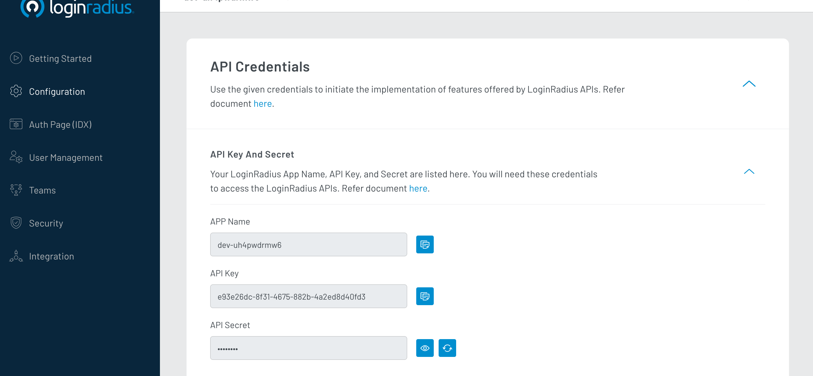
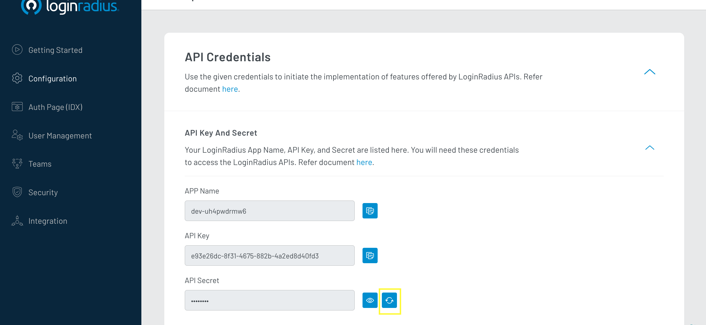
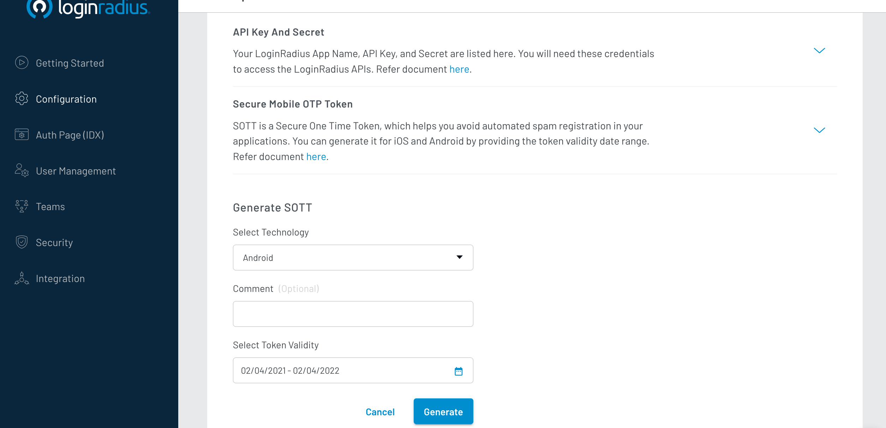
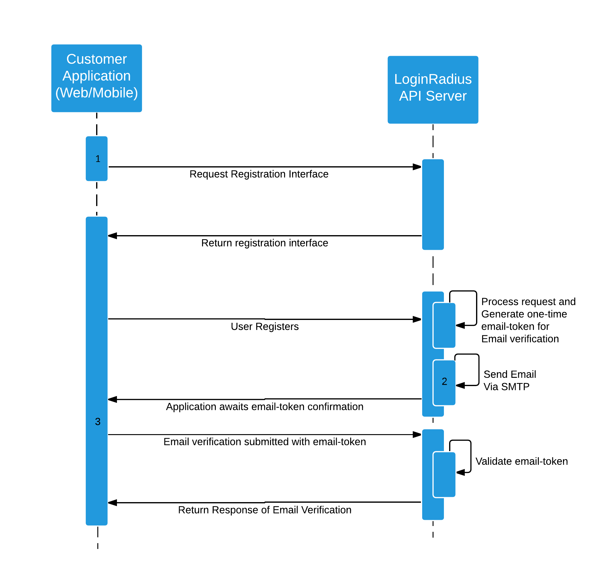
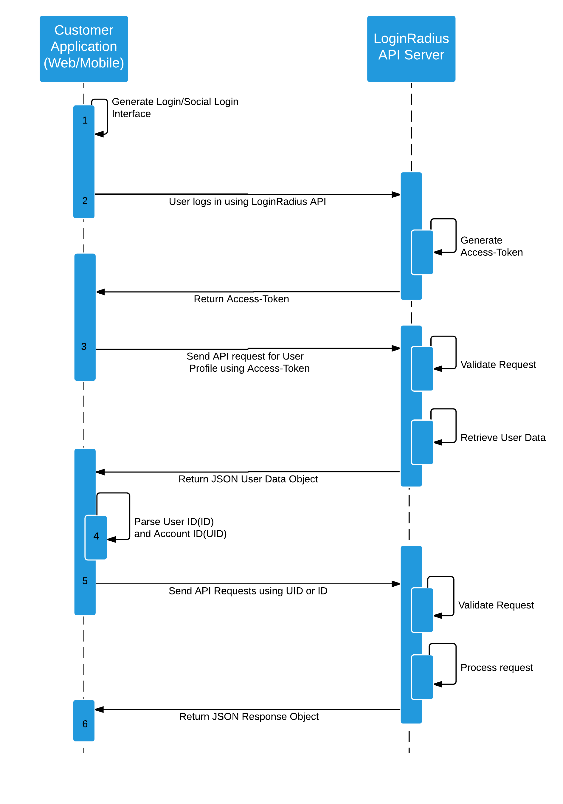
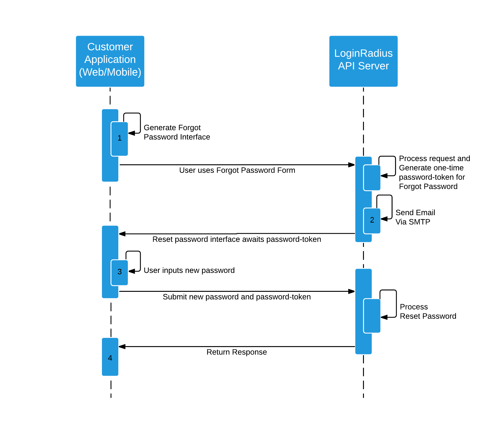
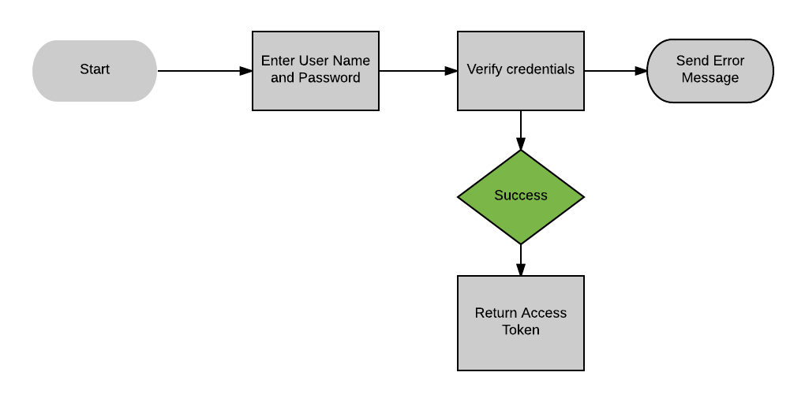
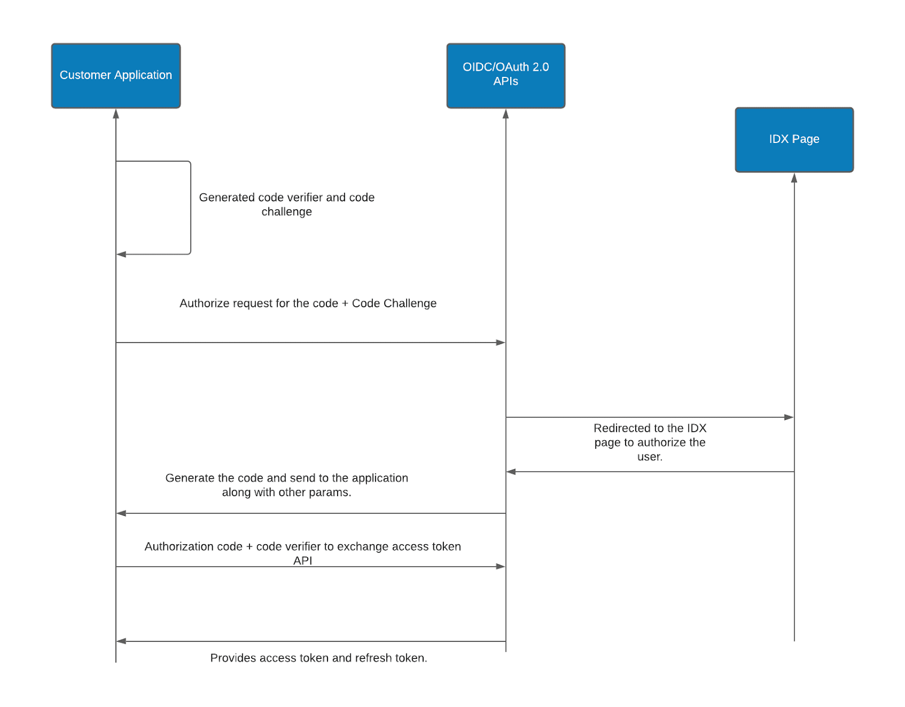

# OAuth Code

## Account API Keys

### Getting your API Key and Secret

The API key and secret are used to interact with LoginRadius' APIs. To get your API key and secret, navigate to Platform Security > API Credentials:

You should see the following:



### Resetting your API Secret

To reset your API secret, click on "Reset Secret" to delete the current secret and generate a new one:



### Secure Mobile OTP Token

SOTT is a Secure One Time Token, which helps you avoid automated spam registration in your applications. You can generate it for iOS and Android by providing the token validity date range




## User Registration Overview

This is a quick overview of the LoginRadius User Registration System.

The LoginRadius User Registration System relies on two identifiers:

**Account User ID (ID)** - The LoginRadius user identifier for a particular social platform(like "Facebook", "Twitter") attached to that account.

**Account ID (UID)** - The identifier for each account, it may have multiple IDs(identifier for each social platform) attached with it.

You can see an outline of the data structure [here](/docs/api/v2/data-points-and-response-code/data-points).

### Registration




1.  [Initialize the LoginRadius User Registration](/docs/api/v2/user-registration/user-registration-getting-started#initializationofloginradiusobject3) system and [display the Registration Interface](/docs/api/v2/user-registration/user-registration-getting-started#registration5) on the page.
2.  You can manage the [Email templates](/docs/api/v2/admin-console/platform-configuration/standard-login/email-templates/) and the [SMTP details](/docs/infrastructure-and-security/smtp-overview) from your LoginRadius [Dashboard](https://secure.loginradius.com/platform-configuration/identity-workflow/communication-configuration).
3.  The email will contain a URL with a one-time email-token which should point to a page with the Email Verification function initialized. When the user navigates to the page with the Email Verification function and the correct parameters then the user's Email will be verified and they can now login.

### Login and Social Login




1.  Initialize the [Social Login](/docs/api/v2/user-registration/user-registration-getting-started#sociallogin8) or [Login](/docs/api/v2/user-registration/user-registration-getting-started#login7) form to allow the user to authenticate.
2.  User Initiates the Login process
3.  After a successful authentication, you will receive an access token that you can use to get the [user's profile](/docs/api/v2/social-login/user-profile) data.
4.  The User Profile Object is returned in JSON format and will contain the user's ID and UID which are used in the User Registration REST APIs.
5.  You can pass the ID or UID with the required parameters into the REST APIs detailed on the [LoginRadius API docs](/docs/api/v2/data-points-and-response-code/data-points) in order to handle admin functionality or setup additional features.
6.  All of the REST APIs return responses in JSON format.

### Forgot Password




1.  To handle Forgot Password functionality initialize the [Forgot Password Interface](/docs/api/v2/user-registration/user-registration-getting-started#forgotpassword12).
2.  You can [manage the Email templates and the SMTP details](/docs/api/v2/admin-console/platform-configuration/standard-login/email-templates/#email-template-management) from your LoginRadius [Admin Console](https://secure.loginradius.com/platform-configuration/identity-workflow/communication-configuration).
3.  The email will contain a URL with a one-time password-token which should point to a page with the [Reset Password interface](/docs/api/v2/deployment/js-libraries/getting-started/#resetpassword13) initialized. When the user navigates to the page with the Reset Password interface and the correct parameters in the URL then the user will be prompted to input a new password.
4.  This will return a JSON response with either a success or error response. If successful the user will now be able to login with the new password.

### UserName Login

UserName is a secure login option for the Traditional Login flows, which is similar to email login. This can be created at the time of registration. LoginRadius User Registration via UserName provides an easy way to allow your user's to login to your website or app without needing to remember or manage an email.

#### UserName Login Flow




#### Restrictions on UserName

A UserName should be unique and is treated as an identity in the LoginRadius cloudstorage, therefore, no two UserNames can be alike. By default the UserName is always saved in lowercase characters, for example: If the UserName is "Jon147" during registration it will save as "jon147" in LoginRadius. This is a customizable option and can be configured when initializing your interfaces to support different character sets.  

**NOTE:** Please contact the LoginRadius Customer Success team if you would like to enable case-sensitive UserNames via our API.

##### Allow Duplicate Emails with the UserName Login flow

Given that the UserName is the unique identifier in the UserName Login Flow, you can enable so that the same email can be registered more than once under a different UserName. Please see below for more details as to what impact this would have on your workflow:

**Specifications and Requirements**:

*   Email can be duplicated across accounts however it is required.
*   Login via email will not work in this flow, as it only requires the UserName to login.
*   Get all emails to the given email address like Verification email, Welcome email, Forgot password email.
*   When sending a Forgot Password request instead of requiring the user's email, it will require the unique UserName and the Forgot Password email will be sent to the available email address.
*   This flow only works with **Disabled email verification**.
*   The Add Email API will not work with this flow due to **Disabled email verification**.
*   Automatic Account linking is disabled with this flow however manual account linking is possible.
*   Compatible with LoginRadius V2 APIs only.
*   Easily Delete an Account tied to a UserName.
*   Auto Login is supported by providing the UserName.
*   Magic link is supported by providing the UserName.

**NOTE**: You need to contact [LoginRadius support](/docs/getting-started/general-questions/support-faq#how-do-i-contact-loginradius-support-) to enable this feature on your LoginRadius site.

### Demo

You can get a simplified demo of the system from our Git repo here: [](https://github.com/LoginRadius/demo)[https://github.com/LoginRadius/demo](https://github.com/LoginRadius/demo)


## Request Tokens
This API allows you to requests a new device code, user code from the Device code Endpoint

HTTP request

POST
https://cloud-api.loginradius.com/sso/oauth/{OAuthName}/access_token


### Template Params

| Name    | Type    | Default   | Description   |
|---      |---      |---      |---          |
| Oauthappname   |  String     |  none         | The name for the OAuth App you have configured in the LoginRadius Dashboard. [REQUIRED]           |


### Post Params
client_id :Your application's Client ID. [REQUIRED]
device_code :Enter the device code [REQUIRED]
Grant-Type :Value should be used as urn:ietf:params:oauth:grant-type:device_code [REQUIRED]

| Name    | Type    | Default   | Description   |
|---      |---      |---      |---          |
| client_id  |  String     |  none         | Your application's Client ID. [REQUIRED] |
| device_code  |  String     |  none         | device_code :Enter the device code [REQUIRED] |
| Grant-Type |  String     |  none         | Value should be used as urn:ietf:params:oauth:grant-type:device_code [REQUIRED] |

### Response

This is what a sample reponse looks like:
```
{
  "access_token": "b8cb84c9-dff7-401a-94c1-7cd44ebf80a0",
  "token_type": "access_token",
  "refresh_token": "a795bbb0-5868-4079-a45b-606ad8aeee80",
  "expires_in": 31103985
}
```
### Error Codes
More Details : [SSO API Error Codes](#)


## Access token by OAuth 2 token

This API allows get a LoginRadius access_token from an OAuth 2.0 Token.

HTTP request

POST
https://cloud-api.loginradius.com/sso/oauth/access_token

### Body Params

| Name    | Type    | Default   | Description   |
|---      |---      |---      |---          |
| client_id   |  String     |  none         | LoginRadius API Key [REQUIRED] |
| client_secret    |  String     |  none         | LoginRadius Secret Key [REQUIRED] |
| redirect_uri   |  String     |  none         | Redirection URI [REQUIRED] |
| response_type  |  String     |  none         | Needs to be 'token' [REQUIRED] |
| code  |  String     |  none         | Code Parameter, given when Login Dialog is performed [REQUIRED] |

### Response

This is what a sample reponse looks like:
```
{
  "access_token": "********-****-****-*****************",
  "token_type": "access_token",
  "expires_in": 394,
  "refresh_token": "********-****-****-*****************"
}
```
### Error Codes
More Details : [SSO API Error Codes](#)


## Access Token by Account Password

This API allows you to obtain a LoginRadius access_token by passing in the customer's account password along with their email/username/phoneid as part of the Resource Owner Password Credential Flow.

HTTP request

POST
https://cloud-api.loginradius.com/sso/oauth/access_token

### Body Params
| Name    | Type    | Default   | Description   |
|---      |---      |---      |---          |
| client_id   |  String     |  none         | LoginRadius API Key [REQUIRED] |
| client_secret    |  String     |  none         | LoginRadius Secret Key [REQUIRED] |
| grant_type   |  String     |  none         | Needs to be 'password' [REQUIRED] |
| username  |  String     |  none         | You must provide the customer's email/username/phoneid depending on how you have configured LoginRadius for authentication [REQUIRED] |
| password |  String     |  none         | The customer's account password. [REQUIRED] |

### Response

This is what a sample reponse looks like:
```
{
  "access_token": "********-****-****-*****************",
  "token_type": "access_token",
  "expires_in": 394,
  "refresh_token": "********-****-****-*****************"
}
```

### Error Codes
More Details : [SSO API Error Codes](#)


## Request Device Code

This API allows you to requests a new device code, user code from the Device code Endpoint


HTTP request

POST
https://cloud-api.loginradius.com/sso/oauth/{OAuthName}/device

### Template Params

| Name    | Type    | Default   | Description   |
|---      |---      |---      |---          |
| Oauthappname   |  String     |  none         | The name for the OAuth App you have configured in the LoginRadius Dashboard. [REQUIRED]           |

### Body Params

| Name    | Type    | Default   | Description   |
|---      |---      |---      |---          |
| client_id |  String     |  none         | Your application's Client ID. [REQUIRED] |
| scope |  String     |  none         | The scope for this is email profile. |


### Response

This is what a sample reponse looks like:
```
{
  "device_code": "af2a4121179546c1b121995414cc4530",
  "user_code": "oP5lLq",
  "verification_uri": "https://mayank.login4website.com/federation/device/activate.php",
  "interval": 10,
  "expires_in": 1800
}
```

### Error Codes
More Details : [SSO API Error Codes](#)

## Proof of Key for Code Exchange

**PKCE** is an extension to the Authorization Code flow to prevent certain attacks and to be able to securely perform the OAuth/OIDC exchange from public clients. It is primarily used by mobile and JavaScript apps, but the technique can be applied to any client as well.

The following image displays the logical flow of the PKCE with Oauth and OIDC authorization process:



The following steps explain the working of the above sequence diagram:

1.  An authorization request is sent from the customer application along with the code challenge.
2.  The OAuth 2.0/OIDC APIs redirects the request to the IDX page in order to authorize the user.
3.  The success response is received to the API after successful authorization at the IDX page and the API further generates the code and sends the response to the application with other parameters.
4.  Authorization code is compared with the code verifier for further exchange of access token via Access Token API.
5.  After successful execution of the process, access token and refresh tokens are retrieved at the application level.

### Generating PKCE code verifier and challenge

First, you need to generate and store a secret **code_verifier** and **code_challenge**. The code verifier is a cryptographically random string using the characters **A-Z, a-z, 0-9**, and the punctuation characters **-._~** (hyphen, period, underscore, and tilde), between 43 and 128 characters long.

Use the below code in your relevant SDK to generate the **code_verifier** and **code_challenge**.

#### For Node.js:

```
var crypto = require("crypto")

function base64URLEncode(str) {
    return str.toString('base64')
        .replace(/\+/g, '-')
        .replace(/\//g, '_')
        .replace(/=/g, '');
}
var verifier = base64URLEncode(crypto.randomBytes(32));
console.log("code_verifier: ", verifier)

if(verifier){
    var challenge = base64URLEncode(sha256(verifier));
    console.log("code_challenge: ",challenge)
}


function sha256(buffer) {
    return crypto.createHash('sha256').update(buffer).digest();
}
```


#### For Golang:

```
package main

import (
    "crypto/sha256"
    "encoding/base64"
    "fmt"
    "math/rand"
    "strings"
    "time"
)

type CodeVerifier struct {
    Value string
}

const (
    length = 32
)

func base64URLEncode(str []byte) string {
    encoded := base64.StdEncoding.EncodeToString(str)
    encoded = strings.Replace(encoded, "+", "-", -1)
    encoded = strings.Replace(encoded, "/", "_", -1)
    encoded = strings.Replace(encoded, "=", "", -1)
    return encoded
}

func verifier() (*CodeVerifier, error) {
    r := rand.New(rand.NewSource(time.Now().UnixNano()))
    b := make([]byte, length, length)
    for i := 0; i < length; i++ {
        b[i] = byte(r.Intn(255))
    }
    return CreateCodeVerifierFromBytes(b)
}

func CreateCodeVerifierFromBytes(b []byte) (*CodeVerifier, error) {
    return &CodeVerifier{
        Value: base64URLEncode(b),
    }, nil
}

func (v *CodeVerifier) CodeChallengeS256() string {
    h := sha256.New()
    h.Write([]byte(v.Value))
    return base64URLEncode(h.Sum(nil))
}

func main() {
    verifier, _ := verifier()
    fmt.Println("code_verifier: ", verifier.Value)
    challenge := verifier.CodeChallengeS256()
    fmt.Println("code_challenge :", challenge)
}
```


> **Note**: Sometimes the packages of the language used, get deprecated so we recommend using the inbuilt packages in that case.

Once you’ve generated the **code_verifier**, it uses that to create the **code challenge**. For devices that can perform a SHA256 hash, the code challenge is a BASE64-URL-encoded string of the SHA256 hash of the code verifier.

**code_challenge** and **code_challenge_method** are optional parameters. If you do not pass these parameters then the flow will work without PKCE.

Note that if you are passing **code_challenge** and the **code_challenge_method** in the authorization request then only the PKCE flow would work and in this case, **code_verifier** would be required to get the token in exchange for the authorization code request.

> **Note:** Currently we are supporting the SHA256 Hash algorithm to generate the code challenge. If we do not pass any method, we use the default method SHA256.

### OAuth 2.0 PKCE Flow

**Authorization URL:** `https://cloud-api.loginradius.com/sso/oauth/redirect?`

**Request Parameters**

```
client_id={LoginRadius API key}
&redirect_uri={Callback URL}
&scope={Scope}
&response_type=code
&state={random long string}
&code_challenge={code challenge}
&code_challenge_method=SHA256
```

For more details over the OAuth documentation, refer [here](/docs/single-sign-on/tutorial/federated-sso/oauth-2-0/oauth-2-0-overview/#authorizationcodegrant6).

**Exchange the Authorization Code**

The pre-generated **code_verifier** needs to be sent along with the token request. The authorization server will check whether the verifier matches the challenge that was used in the authorization request. This ensures that a malicious party that intercepted the authorization code will not be able to use it.

`POST-https://cloud-api.loginradius.com/sso/oauth/access_token`

```
Request body:
{
   client_id:{app-id},
   client_secret:{app-secret},
   redirect_uri:{redirect-uri},
   response_type:token,
   code:{code-parameter}
   code_verifier: {code verifier (generated in the first step)}
}
```

> **Important Note: The `client_secret:{app-secret}` is an optional parameter, you may or may not use this for validation purpose.**

### OIDC V2 PKCE Flow

**Authorization Code Flow**

The authorization code flow returns an authorization code that can then be exchanged for an identity token and/or access token. This requires client authentication using a client_id and a secret to retrieve tokens from the back end and has the benefit of not exposing tokens to the user agent (i.e. a web browser). This flow allows for long-lived access (through the use of refresh tokens). Clients using this flow must be able to maintain a secret. This flow obtains the authorization code from the authorization endpoint and all tokens are returned from the token endpoint.

For more details refer to the OIDC documentation, [here](/docs/single-sign-on/tutorial/federated-sso/openid-connect/openid-connect-overview/#authorizationcodeflow2).

`https://cloud-api.loginradius.com/sso/oidc/v2/<OIDC AppName>/authorize`

**Request Parameters**

```
client_id=
&redirect_uri=
&response_type=
&state={random long string}
&scope=openid email
&nonce={nonce}
&response_mode=form_post
&max-age=123, 
&claims= {"email":null,"email_verified":null},"userinfo"{"email":null,"email_verified":null,"name":null}}
&code_challenge={code challenge}
&code_challenge_method=SHA256
```


**Exchange the Authorization Code**

The same process will be followed as in the case of OAuth’s exchange of authorization code.

`POST https://cloud-api.loginradius.com/sso/oidc/v2/<OIDC AppName>/token`

```
Request body:
{
  "client_id":{Loginradius app api key},
  "client_secret":{Loginradius app api secret},
  "redirect_uri":{callback url passed in the authorization API},
  "response_type":"token",
  "grant_type" : "authorization_code"
  "code": {Authorization code received in the Authorization API}
  "code_verifier": {code verifier (generated in the first step)}
}
```


> **Important Note: The `client_secret":{Loginradius app api secret}` is an optional parameter, you may or may not use this for validation purpose.**


