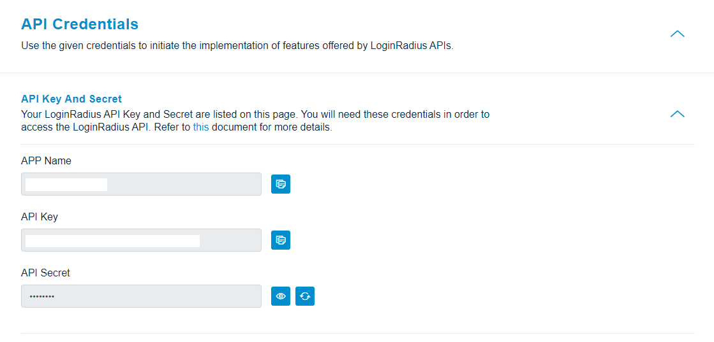

>**Disclaimer:** This library is meant to help you with a quick implementation of the LoginRadius platform and also to serve as a reference point for the LoginRadius API. Keep in mind that it is an open source library, which means you are free to download and customize the library functions based on your specific application needs.

This document contains information and examples regarding the LoginRadius PHP SDK. It provides guidance for working with social authentication, user profile data, and auth implementation with a variety of social networks such as Facebook, Google, Twitter.You can get the SDK from [here](https://github.com/LoginRadius/php-sdk) 


## Installation

The recommended way to install is through [Composer](http://getcomposer.org/).
 
```
# Install Composer
curl -sS https://getcomposer.org/installer | php
```

Next, run the Composer command to install the latest stable version of library:

```
composer require loginradius/php-sdk:10.0.0
```

Include the following files in your Project Directory

```
require_once "src/LoginRadiusSDK/Utility/Functions.php";
require_once "src/LoginRadiusSDK/LoginRadiusException.php";
require_once "src/LoginRadiusSDK/Clients/IHttpClientInterface.php";
require_once "src/LoginRadiusSDK/Clients/DefaultHttpClient.php";

require_once "src/LoginRadiusSDK/CustomerRegistration/Authentication/AuthenticationAPI.php";
require_once "src/LoginRadiusSDK/CustomerRegistration/Authentication/OneTouchLoginAPI.php";
require_once "src/LoginRadiusSDK/CustomerRegistration/Authentication/PasswordLessLoginAPI.php";
require_once "src/LoginRadiusSDK/CustomerRegistration/Authentication/PhoneAuthenticationAPI.php";
require_once "src/LoginRadiusSDK/CustomerRegistration/Authentication/PINAuthenticationAPI.php";
require_once "src/LoginRadiusSDK/CustomerRegistration/Authentication/RiskBasedAuthenticationAPI.php";
require_once "src/LoginRadiusSDK/CustomerRegistration/Authentication/SmartLoginAPI.php";

require_once "src/LoginRadiusSDK/CustomerRegistration/Account/AccountAPI.php";
require_once "src/LoginRadiusSDK/CustomerRegistration/Account/RoleAPI.php";
require_once "src/LoginRadiusSDK/CustomerRegistration/Account/SottAPI.php";

require_once "src/LoginRadiusSDK/CustomerRegistration/Advanced/ConfigurationAPI.php";
require_once "src/LoginRadiusSDK/CustomerRegistration/Advanced/ConsentManagementAPI.php";
require_once "src/LoginRadiusSDK/CustomerRegistration/Advanced/CustomObjectAPI.php";
require_once "src/LoginRadiusSDK/CustomerRegistration/Advanced/CustomRegistrationDataAPI.php";
require_once "src/LoginRadiusSDK/CustomerRegistration/Advanced/MultiFactorAuthenticationAPI.php";
require_once "src/LoginRadiusSDK/CustomerRegistration/Advanced/ReAuthenticationAPI.php";
require_once "src/LoginRadiusSDK/CustomerRegistration/Advanced/WebHookAPI.php";

require_once "src/LoginRadiusSDK/CustomerRegistration/Social/NativeSocialAPI.php";
require_once "src/LoginRadiusSDK/CustomerRegistration/Social/SocialAPI.php";
```
Modify the config.php file in the SDK to include your LoginRadius Credentials

## Configuration

After successful install, you need to define the following LoginRadius Account info in your project anywhere before using the LoginRadius SDK or in the config file of your project:

```PHP
define('APP_NAME', 'LOGINRADIUS_SITE_NAME_HERE'); // Replace LOGINRADIUS_SITE_NAME_HERE with your site name that provide in LoginRadius account.
define('LR_API_KEY', 'LOGINRADIUS_API_KEY_HERE'); // Replace LOGINRADIUS_API_KEY_HERE with your site API key that provide in LoginRadius account.
define('LR_API_SECRET', 'LOGINRADIUS_API_SECRET_HERE'); // Replace LOGINRADIUS_API_SECRET_HERE with your site Secret key that provide in LoginRadius account.

define('API_REQUEST_SIGNING', ''); // Pass boolean true if this option is enabled on you app.
define('API_REGION', ''); // Pass APi Region for your app

define('PROTOCOL', 'PROXY_PROTOCOL'); // Replace PROXY_PROTOCOL with your proxy server protocoal ie http or https.
define('HOST', 'PROXY_HOST'); // Replace PROXY_HOST with your proxy server host.
define('PORT', 'PROXY_PORT'); // Replace PROXY_PORT with your proxy server port.
define('USER', 'PROXY_USER'); // Replace PROXY_USER with your proxy server username.
define('PASSWORD', 'PROXY_PASSWORD'); // Replace PROXY_PASSWORD with your proxy server password.

define('API_DOMAIN', 'DEFINE_CUSTOM_API_DOMAIN');   // Custom API Domain
```

>Replace `LOGINRADIUS_SITE_NAME_HERE`, `LOGINRADIUS_API_KEY_HERE` and  `LOGINRADIUS_API_SECRET_HERE` in the above code with your LoginRadius Site Name, LoginRadius API Key, and Secret which you can get [here](https://dashboard.loginradius.com/dashboard), as shown below:

<div style="text-align:center">
  
</div>


>If you have Custom API Domain then define 'API_DOMAIN' then replaced it with your custom API domain, Otherwise no need to define this option in configuration.

### Implementation

Importing/aliasing with the use operator.
```PHP
use \LoginRadiusSDK\Utility\Functions;
use \LoginRadiusSDK\LoginRadiusException;
use \LoginRadiusSDK\Clients\IHttpClientInterface;
use \LoginRadiusSDK\Clients\DefaultHttpClient;
use \LoginRadiusSDK\CustomerRegistration\Account\AccountAPI;
use \LoginRadiusSDK\CustomerRegistration\Account\RoleAPI;
use \LoginRadiusSDK\CustomerRegistration\Account\SottAPI;
use \LoginRadiusSDK\CustomerRegistration\Advanced\ConfigurationAPI;
use \LoginRadiusSDK\CustomerRegistration\Advanced\ConsentManagementAPI;
use \LoginRadiusSDK\CustomerRegistration\Advanced\CustomObjectAPI;
use \LoginRadiusSDK\CustomerRegistration\Advanced\CustomRegistrationDataAPI;
use \LoginRadiusSDK\CustomerRegistration\Advanced\MultiFactorAuthenticationAPI;
use \LoginRadiusSDK\CustomerRegistration\Advanced\ReAuthenticationAPI;
use \LoginRadiusSDK\CustomerRegistration\Advanced\WebHookAPI;
use \LoginRadiusSDK\CustomerRegistration\Authentication\AuthenticationAPI;
use \LoginRadiusSDK\CustomerRegistration\Authentication\OneTouchLoginAPI;
use \LoginRadiusSDK\CustomerRegistration\Authentication\PasswordLessLoginAPI;
use \LoginRadiusSDK\CustomerRegistration\Authentication\PhoneAuthenticationAPI;
use \LoginRadiusSDK\CustomerRegistration\Authentication\PINAuthenticationAPI;
use \LoginRadiusSDK\CustomerRegistration\Authentication\RiskBasedAuthenticationAPI;
use \LoginRadiusSDK\CustomerRegistration\Authentication\SmartLoginAPI;
use \LoginRadiusSDK\CustomerRegistration\Social\SocialAPI;
use \LoginRadiusSDK\CustomerRegistration\Social\NativeSocialAPI;
```


Create a LoginRadius object :
```PHP
$accountObject = new AccountAPI();
```

### API Examples

#### Partial API response
We have an option to select fields(partial response) which you require as an API response.<br/>
For this, you need to pass an extra parameter(optional) at the end of each API function.

- If any field passed does not exist in response, will be ignored.
- In case of nested, only root object is selectable.
- Values should be separated by the comma.

**Example:**

```

$fields= "email, username";
$email = 'xxxxxr@xxxxx.com';

$result = $accountObject->accountProfileByEmail($email,$fields);

```

**Output Response:**

```
{
    UserName: 'test1213',
    Email: [ { Type: 'Primary', Value: 'test1213@sthus.com' } ]
}
```

For more details check [API Refrence Here](https://www.loginradius.com/docs/developer/api/)


## API Details

### Authentication API

List of APIs in this Section:

- PUT : [Auth Change Password](#auth-change-password-put)
- PUT : [Auth Resend Email Verification](#auth-resend-email-verification-put)
- POST : [Auth Login by Email](#auth-login-by-email-post)
- POST : [Auth Forgot Password](#auth-forgot-password-post)
- POST : [Auth User Registration by Email](#auth-user-registration-by-email-post)
- GET : [Auth Validate Access token](#auth-validate-access-token-get)
- GET : [Auth Read all Profiles by Token](#auth-read-all-profiles-by-token-get)
- GET : [Auth Send Welcome Email](#auth-send-welcome-email-get)
- GET : [Auth Delete Account](#auth-delete-account-get)
- GET : [Auth Verify Email](#auth-verify-email-get)
- GET : [Auth Social Identity](#auth-social-identity-get)
- DELETE : [Auth Delete Account with Email Confirmation](#auth-delete-account-with-email-confirmation-delete)


If you have not already initialized the Authentication object do so now
```
$authenticationAPI = new AuthenticationAPI(); 
```

##### Auth Change Password (PUT)

This API is used to change the accounts password based on the previous password
 

 ```PHP
 $access_token = "access_token"; //Required 
$newPassword = "newPassword"; //Required 
$oldPassword = "oldPassword"; //Required
 
$result = $authenticationAPI->changePassword($access_token,$newPassword,$oldPassword);
 ```

 
##### Auth Resend Email Verification (PUT)
 
This API resends the verification email to the user.
 

 ```PHP
 $email = "email"; //Required 
$emailTemplate = "emailTemplate"; //Optional 
$verificationUrl = "verificationUrl"; //Optional
 
$result = $authenticationAPI->authResendEmailVerification($email,$emailTemplate,$verificationUrl);
 ```

 
##### Auth Login by Email (POST)
 
This API retrieves a copy of the user data based on the Email
 

 ```PHP

 $payload = '{
"email" : "<email>",
"password" : "<password>"
}';  //Required 
$emailTemplate = "emailTemplate"; //Optional 
$fields = null; //Optional 
$loginUrl = "loginUrl"; //Optional 
$verificationUrl = "verificationUrl"; //Optional
 
$result = $authenticationAPI->loginByEmail($payload,$emailTemplate,$fields,$loginUrl,$verificationUrl);
 ```

 
##### Auth Forgot Password (POST)

This API is used to send the reset password url to a specified account. Note: If you have the UserName workflow enabled, you may replace the 'email' parameter with 'username'
 

 ```PHP
 $email = "email"; //Required 
$resetPasswordUrl = "resetPasswordUrl"; //Required 
$emailTemplate = "emailTemplate"; //Optional
 
$result = $authenticationAPI->forgotPassword($email,$resetPasswordUrl,$emailTemplate);
 ```

 
##### Auth User Registration by Email (POST)
 
This API creates a user in the database as well as sends a verification email to the user.
 

 ```PHP

 $payload = '{
"email" : [   { 
 "type" : "<type>"  ,
 "value" : "<value>"   
}  ] ,
"firstName" : "<firstName>",
"lastName" : "<lastName>",
"password" : "<password>"
}';  //Required 
$sott = "sott"; //Required 
$emailTemplate = "emailTemplate"; //Optional 
$fields = null; //Optional 
$options = "options"; //Optional 
$verificationUrl = "verificationUrl"; //Optional 
$welcomeEmailTemplate = "welcomeEmailTemplate"; //Optional
 
$result = $authenticationAPI->userRegistrationByEmail($payload,$sott,$emailTemplate,$fields,$options,$verificationUrl,$welcomeEmailTemplate);
 ```

 
##### Auth Validate Access token (GET)
 
This api validates access token, if valid then returns a response with its expiry otherwise error.
 

 ```PHP
 $access_token = "access_token"; //Required
 
$result = $authenticationAPI->authValidateAccessToken($access_token);
 ```

 
##### Auth Read all Profiles by Token (GET)
 
This API retrieves a copy of the user data based on the access token.
 

 ```PHP
 $access_token = "access_token"; //Required 
$fields = null; //Optional
 
$result = $authenticationAPI->getProfileByAccessToken($access_token,$fields);
 ```

 
##### Auth Send Welcome Email (GET)
 
This API sends a welcome email
 

 ```PHP
 $access_token = "access_token"; //Required 
$welcomeEmailTemplate = "welcomeEmailTemplate"; //Optional
 
$result = $authenticationAPI->sendWelcomeEmail($access_token,$welcomeEmailTemplate);
 ```

 
##### Auth Delete Account (GET)

This API is used to delete an account by passing it a delete token.
 

 ```PHP
 $deletetoken = "deletetoken"; //Required
 
$result = $authenticationAPI->deleteAccountByDeleteToken($deletetoken);
 ```

 
##### Auth Verify Email (GET)

This API is used to verify the email of user. Note: This API will only return the full profile if you have 'Enable auto login after email verification' set in your LoginRadius Dashboard's Email Workflow settings under 'Verification Email'.
 

 ```PHP
 $verificationToken = "verificationToken"; //Required 
$fields = null; //Optional 
$url = "url"; //Optional 
$welcomeEmailTemplate = "welcomeEmailTemplate"; //Optional
 
$result = $authenticationAPI->verifyEmail($verificationToken,$fields,$url,$welcomeEmailTemplate);
 ```

 
##### Auth Social Identity (GET)

This API is called just after account linking API and it prevents the raas profile of the second account from getting created.
 

 ```PHP
 
$access_token = "access_token"; //Required 
$fields = null; //Optional
 
$result = $authenticationAPI->getSocialIdentity($access_token,$fields);
 ```

 
##### Auth Delete Account with Email Confirmation (DELETE)
 
This API will send a confirmation email for account deletion to the customer's email when passed the customer's access token
 

 ```PHP
 $access_token = "access_token"; //Required 
$deleteUrl = "deleteUrl"; //Optional 
$emailTemplate = "emailTemplate"; //Optional
 
$result = $authenticationAPI->deleteAccountWithEmailConfirmation($access_token,$deleteUrl,$emailTemplate);
 ```

 


### Account API

List of APIs in this Section:

- PUT : [Account Update](#account-update-put)
- PUT : [Account Set Password](#account-set-password-put)
- POST : [Account Create](#account-create-post)
- POST : [Forgot Password token](#forgot-password-token-post)
- POST : [Email Verification token](#email-verification-token-post)
- GET : [Get Privacy Policy History By Uid](#get-privacy-policy-history-by-uid-get)
- GET : [Account Profiles by Email](#account-profiles-by-email-get)
- GET : [Account Profiles by UID](#account-profiles-by-uid-get)
- GET : [Account Password](#account-password-get)
- GET : [Account Identities by Email](#account-identities-by-email-get)
- DELETE : [Account Delete](#account-delete-delete)
- DELETE : [Account Remove Email](#account-remove-email-delete)
- DELETE : [Delete User Profiles By Email](#delete-user-profiles-by-email-delete)

If you have not already initialized the Account object do so now
```PHP
$accountAPI = new AccountAPI(); 
```


##### Account Update (PUT)

This API is used to update the information of existing accounts in your Cloud Storage. See our Advanced API Usage section <a href='https://www.loginradius.com/docs/api/v2/customer-identity-api/advanced-api-usage/'>Here</a> for more capabilities.
 

 ```PHP

 $payload = '{
"firstName" : "<firstName>",
"lastName" : "<lastName>"
}';  //Required 
$uid = "uid"; //Required 
$fields = null; //Optional 
$nullSupport = "true"; //Optional
 
$result = $accountAPI->updateAccountByUid($payload,$uid,$fields,$nullSupport);
 ```

 
##### Account Set Password (PUT)

This API is used to set the password of an account in Cloud Storage.
 

 ```PHP
 $password = "password"; //Required 
$uid = "uid"; //Required
 
$result = $accountAPI->setAccountPasswordByUid($password,$uid);
 ```

 
##### Account Create (POST)

This API is used to create an account in Cloud Storage. This API bypass the normal email verification process and manually creates the user. In order to use this API, you need to format a JSON request body with all of the mandatory fields
 

 ```PHP

 $payload = '{
"email" : [   { 
 "type" : "<type>"  ,
 "value" : "<value>"   
}  ] ,
"firstName" : "<firstName>",
"lastName" : "<lastName>",
"password" : "<password>"
}';  //Required 
$fields = null; //Optional
 
$result = $accountAPI->createAccount($payload,$fields);
 ```

 
##### Forgot Password token (POST)
 
This API Returns a Forgot Password Token it can also be used to send a Forgot Password email to the customer. Note: If you have the UserName workflow enabled, you may replace the 'email' parameter with 'username' in the body.
 

 ```PHP
 $email = "email"; //Required 
$emailTemplate = "emailTemplate"; //Optional 
$resetPasswordUrl = "resetPasswordUrl"; //Optional 
$sendEmail = "true"; //Optional
 
$result = $accountAPI->getForgotPasswordToken($email,$emailTemplate,$resetPasswordUrl,$sendEmail);
 ```

 
##### Email Verification token (POST)
 
This API Returns an Email Verification token.
 

 ```PHP
 $email = "email"; //Required
 
$result = $accountAPI->getEmailVerificationToken($email);
 ```

 
##### Get Privacy Policy History By Uid (GET)

This API is used to retrieve all of the accepted Policies by the user, associated with their UID.
 

 ```PHP
 $uid = "uid"; //Required
 
$result = $accountAPI->getPrivacyPolicyHistoryByUid($uid);
 ```

 
##### Account Profiles by Email (GET)

This API is used to retrieve all of the profile data, associated with the specified account by email in Cloud Storage.

 ```PHP
 $email = "email"; //Required 
$fields = null; //Optional
 
$result = $accountAPI->getAccountProfileByEmail($email,$fields);
 ```
##### Account Profiles by UID (GET)

This API is used to retrieve all of the profile data, associated with the account by uid in Cloud Storage.
 

 ```PHP
 $uid = "uid"; //Required 
$fields = null; //Optional
 
$result = $accountAPI->getAccountProfileByUid($uid,$fields);
 ```

 
##### Account Password (GET)
 
This API use to retrive the hashed password of a specified account in Cloud Storage.
 

 ```PHP
 $uid = "uid"; //Required
 
$result = $accountAPI->getAccountPasswordHashByUid($uid);
 ```

 
##### Account Identities by Email (GET)
 
Note: This is intended for specific workflows where an email may be associated to multiple UID
 This API is used to retrieve all of the identities (UID and Profiles), associated with a specified email in Cloud Storage.
 

 ```PHP
 $email = "email"; //Required 
$fields = null; //Optional
 
$result = $accountAPI->getAccountIdentitiesByEmail($email,$fields);
 ```

 
##### Account Delete (DELETE)
 
This API deletes the Users account and allows them to re-register for a new account.
 

 ```PHP
 $uid = "uid"; //Required
 
$result = $accountAPI->deleteAccountByUid($uid);
 ```

 
##### Account Remove Email (DELETE)
 
Use this API to Remove emails from a user Account
 

 ```PHP
 $email = "email"; //Required 
$uid = "uid"; //Required 
$fields = null; //Optional
 
$result = $accountAPI->removeEmail($email,$uid,$fields);
 ```

 
##### Delete User Profiles By Email (DELETE)

This API is used to delete all user profiles associated with an Email.
 

 ```PHP
 $email = "email"; //Required
 
$result = $accountAPI->accountDeleteByEmail($email);
 ```

 


### Social API

List of APIs in this Section:

- GET : [Access Token](#access-token-get)
- GET : [Token Validate](#token-validate-get)
- GET : [Access Token Invalidate](#access-token-invalidate-get)
- GET : [Get Active Session Details](#get-active-session-details-get)
- GET : [Get Active Session By Account Id](#get-active-session-by-account-id-get)
- GET : [Get Active Session By Profile Id](#get-active-session-by-profile-id-get)
- GET : [User Profile](#user-profile-get)

If you have not already initialized the Social object do so now
```PHP
$socialAPI = new SocialAPI(); 
```


##### Access Token (GET)

This API Is used to translate the Request Token returned during authentication into an Access Token that can be used with other API calls.
 

 ```PHP
 $token = "token"; //Required
 
$result = $socialAPI->exchangeAccessToken($token);
 ```

 
##### Token Validate (GET)
 
This API validates access token, if valid then returns a response with its expiry otherwise error.
 

 ```PHP
 $access_token = "access_token"; //Required
 
$result = $socialAPI->validateAccessToken($access_token);
 ```

 
##### Access Token Invalidate (GET)
 
This api invalidates the active access token or expires an access token validity.
 

 ```PHP
 $access_token = "access_token"; //Required
 
$result = $socialAPI->inValidateAccessToken($access_token);
 ```

 
##### Get Active Session Details (GET)

This api is use to get all active session by Access Token.
 

 ```PHP
 $token = "token"; //Required
 
$result = $socialAPI->getActiveSession($token);
 ```

 
##### Get Active Session By Account Id (GET)

This api is used to get all active sessions by AccountID(UID).
 

 ```PHP
 $accountId = "accountId"; //Required
 
$result = $socialAPI->getActiveSessionByAccountID($accountId);
 ```

 
##### Get Active Session By Profile Id (GET)

This api is used to get all active sessions by ProfileId.
 

 ```PHP
 $profileId = "profileId"; //Required
 
$result = $socialAPI->getActiveSessionByProfileID($profileId);
 ```

 
##### User Profile (GET)
 
The User Profile API is used to get social profile data from the user's social account after authentication.

 ```PHP
 $access_Token = "access_Token"; //Required 
$fields = null; //Optional
 
$result = $socialAPI->getSocialUserProfile($access_Token,$fields);
 ```


### NativeSocial API

List of APIs in this Section:

- GET : [Access Token via Facebook Token](#access-token-via-facebook-token-get)
- GET : [Access Token via Twitter Token](#access-token-via-twitter-token-get)
- GET : [Access Token via Google Token](#access-token-via-google-token-get)

If you have not already initialized the NativeSocial object do so now
```
$nativeSocialAPI = new NativeSocialAPI(); 
```


##### Access Token via Facebook Token (GET)
 
The API is used to get LoginRadius access token by sending Facebook's access token. It will be valid for the specific duration of time specified in the response.
 

 ```PHP
 $fb_Access_Token = "fb_Access_Token"; //Required
 
$result = $nativeSocialAPI->getAccessTokenByFacebookAccessToken($fb_Access_Token);
 ```

 
##### Access Token via Twitter Token (GET)
 
The API is used to get LoginRadius access token by sending Twitter's access token. It will be valid for the specific duration of time specified in the response.
 

 ```PHP
 $tw_Access_Token = "tw_Access_Token"; //Required 
$tw_Token_Secret = "tw_Token_Secret"; //Required
 
$result = $nativeSocialAPI->getAccessTokenByTwitterAccessToken($tw_Access_Token,$tw_Token_Secret);
 ```

 
##### Access Token via Google Token (GET)
 
The API is used to get LoginRadius access token by sending Google's access token. It will be valid for the specific duration of time specified in the response.
 

 ```PHP
 $google_Access_Token = "google_Access_Token"; //Required 
$client_id = "client_id"; //Optional 
$refresh_token = "refresh_token"; //Optional
 
$result = $nativeSocialAPI->getAccessTokenByGoogleAccessToken($google_Access_Token,$client_id,$refresh_token);
 ```

 