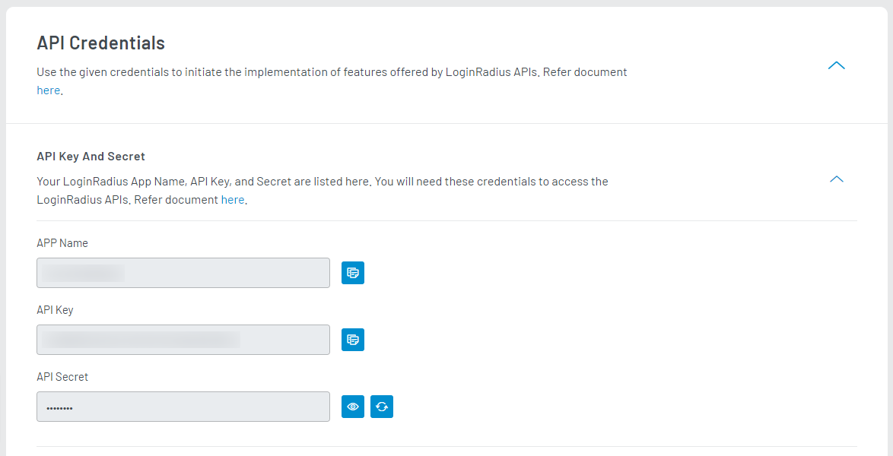

>**Disclaimer:** This library is meant to help you with a quick implementation of the LoginRadius platform and also to serve as a reference point for the LoginRadius API. Keep in mind that it is an open source library, which means you are free to download and customize the library functions based on your specific application needs.

This document contains information and examples regarding the LoginRadius PHP SDK. It provides guidance for working with social authentication, user profile data, and auth implementation with a variety of social networks such as Facebook, Google, Twitter.You can get the SDK from [here](https://github.com/LoginRadius/php-sdk) 


## Installation

The recommended way to install is through [Composer](http://getcomposer.org/).
 
```
# Install Composer
curl -sS https://getcomposer.org/installer | php
```

Next, run the Composer command to install the latest stable version of library:

```
composer require loginradius/php-sdk:10.0.0
```

Include the following files in your Project Directory

```
require_once "src/LoginRadiusSDK/Utility/Functions.php";
require_once "src/LoginRadiusSDK/LoginRadiusException.php";
require_once "src/LoginRadiusSDK/Clients/IHttpClientInterface.php";
require_once "src/LoginRadiusSDK/Clients/DefaultHttpClient.php";

require_once "src/LoginRadiusSDK/CustomerRegistration/Authentication/AuthenticationAPI.php";
require_once "src/LoginRadiusSDK/CustomerRegistration/Authentication/OneTouchLoginAPI.php";
require_once "src/LoginRadiusSDK/CustomerRegistration/Authentication/PasswordLessLoginAPI.php";
require_once "src/LoginRadiusSDK/CustomerRegistration/Authentication/PhoneAuthenticationAPI.php";
require_once "src/LoginRadiusSDK/CustomerRegistration/Authentication/PINAuthenticationAPI.php";
require_once "src/LoginRadiusSDK/CustomerRegistration/Authentication/RiskBasedAuthenticationAPI.php";
require_once "src/LoginRadiusSDK/CustomerRegistration/Authentication/SmartLoginAPI.php";

require_once "src/LoginRadiusSDK/CustomerRegistration/Account/AccountAPI.php";
require_once "src/LoginRadiusSDK/CustomerRegistration/Account/RoleAPI.php";
require_once "src/LoginRadiusSDK/CustomerRegistration/Account/SottAPI.php";

require_once "src/LoginRadiusSDK/CustomerRegistration/Advanced/ConfigurationAPI.php";
require_once "src/LoginRadiusSDK/CustomerRegistration/Advanced/ConsentManagementAPI.php";
require_once "src/LoginRadiusSDK/CustomerRegistration/Advanced/CustomObjectAPI.php";
require_once "src/LoginRadiusSDK/CustomerRegistration/Advanced/CustomRegistrationDataAPI.php";
require_once "src/LoginRadiusSDK/CustomerRegistration/Advanced/MultiFactorAuthenticationAPI.php";
require_once "src/LoginRadiusSDK/CustomerRegistration/Advanced/ReAuthenticationAPI.php";
require_once "src/LoginRadiusSDK/CustomerRegistration/Advanced/WebHookAPI.php";

require_once "src/LoginRadiusSDK/CustomerRegistration/Social/NativeSocialAPI.php";
require_once "src/LoginRadiusSDK/CustomerRegistration/Social/SocialAPI.php";
```
Modify the config.php file in the SDK to include your LoginRadius Credentials


import {
  ExpansionPanel,
  ExpansionPanelList,
  ExpansionPanelListItem
} from 'gatsby-theme-apollo-docs';

import Setup from "../howto/dashboard-setup"

## Setup Your Dashboard

Get your API credentials to initialize SDK and whitelist your application domain as explained in this section.

<ExpansionPanel title="Click here to view details">
<Setup />
</ExpansionPanel>

## Configuration

After successful install, you need to define the following LoginRadius Account info in your project anywhere before using the LoginRadius SDK or in the config file of your project:

```PHP
define('APP_NAME', 'LOGINRADIUS_SITE_NAME_HERE'); // Replace LOGINRADIUS_SITE_NAME_HERE with your site name that provide in LoginRadius account.
define('LR_API_KEY', 'LOGINRADIUS_API_KEY_HERE'); // Replace LOGINRADIUS_API_KEY_HERE with your site API key that provide in LoginRadius account.
define('LR_API_SECRET', 'LOGINRADIUS_API_SECRET_HERE'); // Replace LOGINRADIUS_API_SECRET_HERE with your site Secret key that provide in LoginRadius account.

define('API_REQUEST_SIGNING', ''); // Pass boolean true if this option is enabled on you app.
define('API_REGION', ''); // Pass APi Region for your app

define('PROTOCOL', 'PROXY_PROTOCOL'); // Replace PROXY_PROTOCOL with your proxy server protocoal ie http or https.
define('HOST', 'PROXY_HOST'); // Replace PROXY_HOST with your proxy server host.
define('PORT', 'PROXY_PORT'); // Replace PROXY_PORT with your proxy server port.
define('USER', 'PROXY_USER'); // Replace PROXY_USER with your proxy server username.
define('PASSWORD', 'PROXY_PASSWORD'); // Replace PROXY_PASSWORD with your proxy server password.

define('API_DOMAIN', 'DEFINE_CUSTOM_API_DOMAIN');   // Custom API Domain
```

>Replace `LOGINRADIUS_SITE_NAME_HERE`, `LOGINRADIUS_API_KEY_HERE` and  `LOGINRADIUS_API_SECRET_HERE` in the above code with your LoginRadius Site Name, LoginRadius API Key, and Secret which you can get [here](https://dashboard.loginradius.com/configuration), as shown below:

<div style="text-align:center">
  
</div>


>If you have Custom API Domain then define 'API_DOMAIN' then replaced it with your custom API domain, Otherwise no need to define this option in configuration.

### Implementation

Importing/aliasing with the use operator.
```PHP
use \LoginRadiusSDK\Utility\Functions;
use \LoginRadiusSDK\LoginRadiusException;
use \LoginRadiusSDK\Clients\IHttpClientInterface;
use \LoginRadiusSDK\Clients\DefaultHttpClient;
use \LoginRadiusSDK\CustomerRegistration\Account\AccountAPI;
use \LoginRadiusSDK\CustomerRegistration\Account\RoleAPI;
use \LoginRadiusSDK\CustomerRegistration\Account\SottAPI;
use \LoginRadiusSDK\CustomerRegistration\Advanced\ConfigurationAPI;
use \LoginRadiusSDK\CustomerRegistration\Advanced\ConsentManagementAPI;
use \LoginRadiusSDK\CustomerRegistration\Advanced\CustomObjectAPI;
use \LoginRadiusSDK\CustomerRegistration\Advanced\CustomRegistrationDataAPI;
use \LoginRadiusSDK\CustomerRegistration\Advanced\MultiFactorAuthenticationAPI;
use \LoginRadiusSDK\CustomerRegistration\Advanced\ReAuthenticationAPI;
use \LoginRadiusSDK\CustomerRegistration\Advanced\WebHookAPI;
use \LoginRadiusSDK\CustomerRegistration\Authentication\AuthenticationAPI;
use \LoginRadiusSDK\CustomerRegistration\Authentication\OneTouchLoginAPI;
use \LoginRadiusSDK\CustomerRegistration\Authentication\PasswordLessLoginAPI;
use \LoginRadiusSDK\CustomerRegistration\Authentication\PhoneAuthenticationAPI;
use \LoginRadiusSDK\CustomerRegistration\Authentication\PINAuthenticationAPI;
use \LoginRadiusSDK\CustomerRegistration\Authentication\RiskBasedAuthenticationAPI;
use \LoginRadiusSDK\CustomerRegistration\Authentication\SmartLoginAPI;
use \LoginRadiusSDK\CustomerRegistration\Social\SocialAPI;
use \LoginRadiusSDK\CustomerRegistration\Social\NativeSocialAPI;
```


Create a LoginRadius object :
```PHP
$accountObject = new AccountAPI();
```

### API Examples

#### Partial API response
We have an option to select fields(partial response) which you require as an API response.<br/>
For this, you need to pass an extra parameter(optional) at the end of each API function.

- If any field passed does not exist in response, will be ignored.
- In case of nested, only root object is selectable.
- Values should be separated by the comma.

**Example:**

```

$fields= "email, username";
$email = 'xxxxxr@xxxxx.com';

$result = $accountObject->accountProfileByEmail($email,$fields);

```

**Output Response:**

```
{
    UserName: 'test1213',
    Email: [ { Type: 'Primary', Value: 'test1213@sthus.com' } ]
}
```

For more details check [API Refrence Here](https://www.loginradius.com/docs/developer/api/)


## API Details

### Authentication API

List of APIs in this Section:

* [PUT : Auth Update Profile by Token](#auth-update-profile-by-token-put)
* [PUT : Auth Verify Email By OTP](#auth-verify-email-by-otp-put)
* [PUT : Auth Reset Password by Reset Token](#auth-reset-password-by-reset-token-put)
* [PUT : Auth Change Password](#auth-change-password-put)
* [PUT : Auth Resend Email Verification](#auth-resend-email-verification-put)
* [POST : Auth Add Email](#auth-add-email-post)
* [POST : Auth Login by Email](#auth-login-by-email-post)
* [POST : Auth Forgot Password](#auth-forgot-password-post)
* [POST : Auth User Registration by Email](#auth-user-registration-by-email-post)
* [POST : Auth User Registration By Captcha](#auth-user-registration-by-captcha-post)
* [GET : Auth Validate Access token](#auth-validate-access-token-get)
* [GET : Access Token Invalidate](#access-token-invalidate-get)
* [GET : Access Token Info](#access-token-info-get)
* [GET : Auth Read all Profiles by Token](#auth-read-all-profiles-by-token-get)
* [GET : Auth Send Welcome Email](#auth-send-welcome-email-get)
* [GET : Auth Delete Account](#auth-delete-account-get)
* [GET : Auth Check Email Availability](#auth-check-email-availability-get)
* [GET : Auth Verify Email](#auth-verify-email-get)
* [GET : Auth Social Identity](#auth-social-identity-get)
* [GET : Auth Privacy Policy Accept](#auth-privacy-policy-accept-get)
* [DELETE : Auth Delete Account with Email Confirmation](#auth-delete-account-with-email-confirmation-delete)
* [DELETE : Auth Remove Email](#auth-remove-email-delete)

If you have not already initialized the Authentication object do so now
```php
$authenticationAPI = new AuthenticationAPI(); 
```


##### Auth Update Profile by Token (PUT)
This API is used to update the user's profile by passing the access token.
 

 ```php
 
$access_token = "access_token"; //Required
 $payload = '{
"firstName" : "<firstName>",
"lastName" : "<lastName>"
}';  //Required 
$emailTemplate = "emailTemplate"; //Optional 
$fields = null; //Optional 
$nullSupport = "true"; //Optional 
$smsTemplate = "smsTemplate"; //Optional 
$verificationUrl = "verificationUrl"; //Optional
 
$result = $authenticationAPI->updateProfileByAccessToken($access_token,$payload,$emailTemplate,$fields,$nullSupport,$smsTemplate,$verificationUrl);
 ```

 
##### Auth Verify Email By OTP (PUT)
This API is used to verify the email of user when the OTP Email verification flow is enabled, please note that you must contact LoginRadius to have this feature enabled.
 

 ```php

 $payload = '{
"email" : "<email>",
"otp" : "<otp>"
}';  //Required 
$fields = null; //Optional 
$url = "url"; //Optional 
$welcomeEmailTemplate = "welcomeEmailTemplate"; //Optional
 
$result = $authenticationAPI->verifyEmailByOTP($payload,$fields,$url,$welcomeEmailTemplate);
 ```

 
##### Auth Reset Password by Reset Token (PUT)
This API is used to set a new password for the specified account.
 

 ```php

 $payload = '{
"password" : "<password>",
"resetToken" : "<resetToken>"
}';  //Required
 
$result = $authenticationAPI->resetPasswordByResetToken($payload);
 ```

 
##### Auth Change Password (PUT)
This API is used to change the accounts password based on the previous password
 

 ```php
 
$access_token = "access_token"; //Required 
$newPassword = "newPassword"; //Required 
$oldPassword = "oldPassword"; //Required
 
$result = $authenticationAPI->changePassword($access_token,$newPassword,$oldPassword);
 ```

 
##### Auth Resend Email Verification (PUT)
This API resends the verification email to the user.
 

 ```php
 
$email = "email"; //Required 
$emailTemplate = "emailTemplate"; //Optional 
$verificationUrl = "verificationUrl"; //Optional
 
$result = $authenticationAPI->authResendEmailVerification($email,$emailTemplate,$verificationUrl);
 ```

 
##### Auth Add Email (POST)
This API is used to add additional emails to a user's account.
 

 ```php
 
$access_token = "access_token"; //Required 
$email = "email"; //Required 
$type = "type"; //Required 
$emailTemplate = "emailTemplate"; //Optional 
$verificationUrl = "verificationUrl"; //Optional
 
$result = $authenticationAPI->addEmail($access_token,$email,$type,$emailTemplate,$verificationUrl);
 ```

 
##### Auth Login by Email (POST)
This API retrieves a copy of the user data based on the Email
 

 ```php

 $payload = '{
"email" : "<email>",
"password" : "<password>"
}';  //Required 
$emailTemplate = "emailTemplate"; //Optional 
$fields = null; //Optional 
$loginUrl = "loginUrl"; //Optional 
$verificationUrl = "verificationUrl"; //Optional
 
$result = $authenticationAPI->loginByEmail($payload,$emailTemplate,$fields,$loginUrl,$verificationUrl);
 ```

 
##### Auth Forgot Password (POST)
This API is used to send the reset password url to a specified account. Note: If you have the UserName workflow enabled, you may replace the 'email' parameter with 'username'
 

 ```php
 
$email = "email"; //Required 
$resetPasswordUrl = "resetPasswordUrl"; //Required 
$emailTemplate = "emailTemplate"; //Optional
 
$result = $authenticationAPI->forgotPassword($email,$resetPasswordUrl,$emailTemplate);
 ```

 
##### Auth User Registration by Email (POST)
This API creates a user in the database as well as sends a verification email to the user.
 

 ```php

 $payload = '{
"email" : [   { 
 "type" : "<type>"  ,
 "value" : "<value>"   
}  ] ,
"firstName" : "<firstName>",
"lastName" : "<lastName>",
"password" : "<password>"
}';  //Required 
$sott = "sott"; //Required 
$emailTemplate = "emailTemplate"; //Optional 
$fields = null; //Optional 
$options = "options"; //Optional 
$verificationUrl = "verificationUrl"; //Optional 
$welcomeEmailTemplate = "welcomeEmailTemplate"; //Optional
 
$result = $authenticationAPI->userRegistrationByEmail($payload,$sott,$emailTemplate,$fields,$options,$verificationUrl,$welcomeEmailTemplate);
 ```

 
##### Auth User Registration By Captcha (POST)
This API creates a user in the database as well as sends a verification email to the user.
 

 ```php

 $payload = '{
"email" : [   { 
 "type" : "<type>"  ,
 "value" : "<value>"   
}  ] ,
"firstName" : "<firstName>",
"g-recaptcha-response" : "<g-recaptcha-response>",
"lastName" : "<lastName>",
"password" : "<password>"
}';  //Required 
$emailTemplate = "emailTemplate"; //Optional 
$fields = null; //Optional 
$options = "options"; //Optional 
$smsTemplate = "smsTemplate"; //Optional 
$verificationUrl = "verificationUrl"; //Optional 
$welcomeEmailTemplate = "welcomeEmailTemplate"; //Optional
 
$result = $authenticationAPI->userRegistrationByCaptcha($payload,$emailTemplate,$fields,$options,$smsTemplate,$verificationUrl,$welcomeEmailTemplate);
 ```

 
##### Auth Validate Access token (GET)
This api validates access token, if valid then returns a response with its expiry otherwise error.
 

 ```php
 
$access_token = "access_token"; //Required
 
$result = $authenticationAPI->authValidateAccessToken($access_token);
 ```

 
##### Access Token Invalidate (GET)
This api call invalidates the active access token or expires an access token's validity.
 

 ```php
 
$access_token = "access_token"; //Required 
$preventRefresh = "true"; //Optional
 
$result = $authenticationAPI->authInValidateAccessToken($access_token,$preventRefresh);
 ```

 
##### Access Token Info (GET)
This api call provide the active access token Information
 

 ```php
 
$access_token = "access_token"; //Required
 
$result = $authenticationAPI->getAccessTokenInfo($access_token);
 ```

 
##### Auth Read all Profiles by Token (GET)
This API retrieves a copy of the user data based on the access token.
 

 ```php
 
$access_token = "access_token"; //Required 
$fields = null; //Optional
 
$result = $authenticationAPI->getProfileByAccessToken($access_token,$fields);
 ```

 
##### Auth Send Welcome Email (GET)
This API sends a welcome email
 

 ```php
 
$access_token = "access_token"; //Required 
$welcomeEmailTemplate = "welcomeEmailTemplate"; //Optional
 
$result = $authenticationAPI->sendWelcomeEmail($access_token,$welcomeEmailTemplate);
 ```

 
##### Auth Delete Account (GET)
This API is used to delete an account by passing it a delete token.
 

 ```php
 
$deletetoken = "deletetoken"; //Required
 
$result = $authenticationAPI->deleteAccountByDeleteToken($deletetoken);
 ```

 
##### Auth Check Email Availability (GET)
This API is used to check the email exists or not on your site.
 

 ```php
 
$email = "email"; //Required
 
$result = $authenticationAPI->checkEmailAvailability($email);
 ```

 
##### Auth Verify Email (GET)
This API is used to verify the email of user. Note: This API will only return the full profile if you have 'Enable auto login after email verification' set in your LoginRadius Admin Console's Email Workflow settings under 'Verification Email'.
 

 ```php
 
$verificationToken = "verificationToken"; //Required 
$fields = null; //Optional 
$url = "url"; //Optional 
$welcomeEmailTemplate = "welcomeEmailTemplate"; //Optional
 
$result = $authenticationAPI->verifyEmail($verificationToken,$fields,$url,$welcomeEmailTemplate);
 ```

 
##### Auth Social Identity (GET)
This API is called just after account linking API and it prevents the raas profile of the second account from getting created.
 

 ```php
 
$access_token = "access_token"; //Required 
$fields = null; //Optional
 
$result = $authenticationAPI->getSocialIdentity($access_token,$fields);
 ```

 
##### Auth Privacy Policy Accept (GET)
This API is used to update the privacy policy stored in the user's profile by providing the access token of the user accepting the privacy policy
 

 ```php
 
$access_token = "access_token"; //Required 
$fields = null; //Optional
 
$result = $authenticationAPI->acceptPrivacyPolicy($access_token,$fields);
 ```

 
##### Auth Delete Account with Email Confirmation (DELETE)
This API will send a confirmation email for account deletion to the customer's email when passed the customer's access token
 

 ```php
 
$access_token = "access_token"; //Required 
$deleteUrl = "deleteUrl"; //Optional 
$emailTemplate = "emailTemplate"; //Optional
 
$result = $authenticationAPI->deleteAccountWithEmailConfirmation($access_token,$deleteUrl,$emailTemplate);
 ```

 
##### Auth Remove Email (DELETE)
This API is used to remove additional emails from a user's account.
 

 ```php
 
$access_token = "access_token"; //Required 
$email = "email"; //Required
 
$result = $authenticationAPI->removeEmail($access_token,$email);
 ```

 


### Account API

List of APIs in this Section:

* [PUT : Account Update](#account-update-put)
* [PUT : Update Phone ID by UID](#update-phone-id-by-uid-put)
* [PUT : Account Set Password](#account-set-password-put)
* [PUT : Account Invalidate Verification Email](#account-invalidate-verification-email-put)
* [PUT : Reset phone ID verification](#reset-phone-id-verification-put)
* [PUT : Upsert Email](#upsert-email-put)
* [PUT : Update UID](#update-uid-put)
* [POST : Account Create](#account-create-post)
* [POST : Forgot Password token](#forgot-password-token-post)
* [POST : Email Verification token](#email-verification-token-post)
* [GET : Account Profiles by Email](#account-profiles-by-email-get)
* [GET : Account Profile by Phone ID](#account-profile-by-phone-id-get)
* [GET : Account Profiles by UID](#account-profiles-by-uid-get)
* [GET : Account Password](#account-password-get)
* [GET : Access Token based on UID or User impersonation API](#access-token-based-on-uid-or-user-impersonation-api-get)
* [GET : Account Identities by Email](#account-identities-by-email-get)
* [DELETE : Account Delete](#account-delete-delete)
* [DELETE : Account Remove Email](#account-remove-email-delete)
* [DELETE : Delete User Profiles By Email](#delete-user-profiles-by-email-delete)

If you have not already initialized the Account object do so now
```php
$accountAPI = new AccountAPI(); 
```


##### Account Update (PUT)
This API is used to update the information of existing accounts in your Cloud Storage. See our Advanced API Usage section <a href='https://www.loginradius.com/docs/api/v2/customer-identity-api/advanced-api-usage/'>Here</a> for more capabilities.
 

 ```php

 $payload = '{
"firstName" : "<firstName>",
"lastName" : "<lastName>"
}';  //Required 
$uid = "uid"; //Required 
$fields = null; //Optional 
$nullSupport = "true"; //Optional
 
$result = $accountAPI->updateAccountByUid($payload,$uid,$fields,$nullSupport);
 ```

 
##### Update Phone ID by UID (PUT)
This API is used to update the PhoneId by using the Uid's. Admin can update the PhoneId's for both the verified and unverified profiles. It will directly replace the PhoneId and bypass the OTP verification process.
 

 ```php
 
$phone = "phone"; //Required 
$uid = "uid"; //Required 
$fields = null; //Optional
 
$result = $accountAPI->updatePhoneIDByUid($phone,$uid,$fields);
 ```

 
##### Account Set Password (PUT)
This API is used to set the password of an account in Cloud Storage.
 

 ```php
 
$password = "password"; //Required 
$uid = "uid"; //Required
 
$result = $accountAPI->setAccountPasswordByUid($password,$uid);
 ```

 
##### Account Invalidate Verification Email (PUT)
This API is used to invalidate the Email Verification status on an account.
 

 ```php
 
$uid = "uid"; //Required 
$emailTemplate = "emailTemplate"; //Optional 
$verificationUrl = "verificationUrl"; //Optional
 
$result = $accountAPI->invalidateAccountEmailVerification($uid,$emailTemplate,$verificationUrl);
 ```

 
##### Reset phone ID verification (PUT)
This API Allows you to reset the phone no verification of an end user’s account.
 

 ```php
 
$uid = "uid"; //Required 
$smsTemplate = "smsTemplate"; //Optional
 
$result = $accountAPI->resetPhoneIDVerificationByUid($uid,$smsTemplate);
 ```

 
##### Upsert Email (PUT)
This API is used to add/upsert another emails in account profile by different-different email types. If the email type is same then it will simply update the existing email, otherwise it will add a new email in Email array.
 

 ```php

 $payload = '{
"email" : [   { 
 "type" : "<type>"  ,
 "value" : "<value>"   
}  ] 
}';  //Required 
$uid = "uid"; //Required 
$fields = null; //Optional
 
$result = $accountAPI->upsertEmail($payload,$uid,$fields);
 ```

 
##### Update UID (PUT)
This API is used to update a user's Uid. It will update all profiles, custom objects and consent management logs associated with the Uid.
 

 ```php

 $payload = '{
"newUid" : "<newUid>"
}';  //Required 
$uid = "uid"; //Required
 
$result = $accountAPI->accountUpdateUid($payload,$uid);
 ```

 
##### Account Create (POST)
This API is used to create an account in Cloud Storage. This API bypass the normal email verification process and manually creates the user. 

In order to use this API, you need to format a JSON request body with all of the mandatory fields
 

 ```php

 $payload = '{
"email" : [   { 
 "type" : "<type>"  ,
 "value" : "<value>"   
}  ] ,
"firstName" : "<firstName>",
"lastName" : "<lastName>",
"password" : "<password>"
}';  //Required 
$fields = null; //Optional
 
$result = $accountAPI->createAccount($payload,$fields);
 ```

 
##### Forgot Password token (POST)
This API Returns a Forgot Password Token it can also be used to send a Forgot Password email to the customer. Note: If you have the UserName workflow enabled, you may replace the 'email' parameter with 'username' in the body.
 

 ```php
 
$email = "email"; //Required 
$emailTemplate = "emailTemplate"; //Optional 
$resetPasswordUrl = "resetPasswordUrl"; //Optional 
$sendEmail = "true"; //Optional
 
$result = $accountAPI->getForgotPasswordToken($email,$emailTemplate,$resetPasswordUrl,$sendEmail);
 ```

 
##### Email Verification token (POST)
This API Returns an Email Verification token.
 

 ```php
 
$email = "email"; //Required
 
$result = $accountAPI->getEmailVerificationToken($email);
 ```

 
##### Account Profiles by Email (GET)
This API is used to retrieve all of the profile data, associated with the specified account by email in Cloud Storage.
 

 ```php
 
$email = "email"; //Required 
$fields = null; //Optional
 
$result = $accountAPI->getAccountProfileByEmail($email,$fields);
 ```

 
##### Account Profile by Phone ID (GET)
This API is used to retrieve all of the profile data, associated with the account by phone number in Cloud Storage.
 

 ```php
 
$phone = "phone"; //Required 
$fields = null; //Optional
 
$result = $accountAPI->getAccountProfileByPhone($phone,$fields);
 ```

 
##### Account Profiles by UID (GET)
This API is used to retrieve all of the profile data, associated with the account by uid in Cloud Storage.
 

 ```php
 
$uid = "uid"; //Required 
$fields = null; //Optional
 
$result = $accountAPI->getAccountProfileByUid($uid,$fields);
 ```

 
##### Account Password (GET)
This API use to retrive the hashed password of a specified account in Cloud Storage.
 

 ```php
 
$uid = "uid"; //Required
 
$result = $accountAPI->getAccountPasswordHashByUid($uid);
 ```

 
##### Access Token based on UID or User impersonation API (GET)
The API is used to get LoginRadius access token based on UID.
 

 ```php
 
$uid = "uid"; //Required
 
$result = $accountAPI->getAccessTokenByUid($uid);
 ```

 
##### Account Identities by Email (GET)
Note: This is intended for specific workflows where an email may be associated to multiple UIDs. This API is used to retrieve all of the identities (UID and Profiles), associated with a specified email in Cloud Storage.
 

 ```php
 
$email = "email"; //Required 
$fields = null; //Optional
 
$result = $accountAPI->getAccountIdentitiesByEmail($email,$fields);
 ```

 
##### Account Delete (DELETE)
This API deletes the Users account and allows them to re-register for a new account.
 

 ```php
 
$uid = "uid"; //Required
 
$result = $accountAPI->deleteAccountByUid($uid);
 ```

 
##### Account Remove Email (DELETE)
Use this API to Remove emails from a user Account
 

 ```php
 
$email = "email"; //Required 
$uid = "uid"; //Required 
$fields = null; //Optional
 
$result = $accountAPI->removeEmail($email,$uid,$fields);
 ```

 
##### Delete User Profiles By Email (DELETE)
This API is used to delete all user profiles associated with an Email.
 

 ```php
 
$email = "email"; //Required
 
$result = $accountAPI->accountDeleteByEmail($email);
 ```

 


### PhoneAuthentication API

List of APIs in this Section:

* [PUT : Phone Reset Password by OTP](#phone-reset-password-by-otp-put)
* [PUT : Phone Verification OTP](#phone-verification-otp-put)
* [PUT : Phone Verification OTP by Token](#phone-verification-otp-by-token-put)
* [PUT : Phone Number Update](#phone-number-update-put)
* [POST : Phone Login](#phone-login-post)
* [POST : Phone Forgot Password by OTP](#phone-forgot-password-by-otp-post)
* [POST : Phone Resend Verification OTP](#phone-resend-verification-otp-post)
* [POST : Phone Resend Verification OTP By Token](#phone-resend-verification-otp-by-token-post)
* [POST : Phone User Registration by SMS](#phone-user-registration-by-sms-post)
* [GET : Phone Number Availability](#phone-number-availability-get)
* [DELETE : Remove Phone ID by Access Token](#remove-phone-id-by-access-token-delete)

If you have not already initialized the PhoneAuthentication object do so now
```php
$phoneAuthenticationAPI = new PhoneAuthenticationAPI(); 
```


##### Phone Reset Password by OTP (PUT)
This API is used to reset the password
 

 ```php

 $payload = '{
"otp" : "<otp>",
"password" : "<password>",
"phone" : "<phone>"
}';  //Required
 
$result = $phoneAuthenticationAPI->resetPasswordByPhoneOTP($payload);
 ```

 
##### Phone Verification OTP (PUT)
This API is used to validate the verification code sent to verify a user's phone number
 

 ```php
 
$otp = "otp"; //Required 
$phone = "phone"; //Required 
$fields = null; //Optional 
$smsTemplate = "smsTemplate"; //Optional
 
$result = $phoneAuthenticationAPI->phoneVerificationByOTP($otp,$phone,$fields,$smsTemplate);
 ```

 
##### Phone Verification OTP by Token (PUT)
This API is used to consume the verification code sent to verify a user's phone number. Use this call for front-end purposes in cases where the user is already logged in by passing the user's access token.
 

 ```php
 
$access_token = "access_token"; //Required 
$otp = "otp"; //Required 
$smsTemplate = "smsTemplate"; //Optional
 
$result = $phoneAuthenticationAPI->phoneVerificationOTPByAccessToken($access_token,$otp,$smsTemplate);
 ```

 
##### Phone Number Update (PUT)
This API is used to update the login Phone Number of users
 

 ```php
 
$access_token = "access_token"; //Required 
$phone = "phone"; //Required 
$smsTemplate = "smsTemplate"; //Optional
 
$result = $phoneAuthenticationAPI->updatePhoneNumber($access_token,$phone,$smsTemplate);
 ```

 
##### Phone Login (POST)
This API retrieves a copy of the user data based on the Phone
 

 ```php

 $payload = '{
"password" : "<password>",
"phone" : "<phone>"
}';  //Required 
$fields = null; //Optional 
$loginUrl = "loginUrl"; //Optional 
$smsTemplate = "smsTemplate"; //Optional
 
$result = $phoneAuthenticationAPI->loginByPhone($payload,$fields,$loginUrl,$smsTemplate);
 ```

 
##### Phone Forgot Password by OTP (POST)
This API is used to send the OTP to reset the account password.
 

 ```php
 
$phone = "phone"; //Required 
$smsTemplate = "smsTemplate"; //Optional
 
$result = $phoneAuthenticationAPI->forgotPasswordByPhoneOTP($phone,$smsTemplate);
 ```

 
##### Phone Resend Verification OTP (POST)
This API is used to resend a verification OTP to verify a user's Phone Number. The user will receive a verification code that they will need to input
 

 ```php
 
$phone = "phone"; //Required 
$smsTemplate = "smsTemplate"; //Optional
 
$result = $phoneAuthenticationAPI->phoneResendVerificationOTP($phone,$smsTemplate);
 ```

 
##### Phone Resend Verification OTP By Token (POST)
This API is used to resend a verification OTP to verify a user's Phone Number in cases in which an active token already exists
 

 ```php
 
$access_token = "access_token"; //Required 
$phone = "phone"; //Required 
$smsTemplate = "smsTemplate"; //Optional
 
$result = $phoneAuthenticationAPI->phoneResendVerificationOTPByToken($access_token,$phone,$smsTemplate);
 ```

 
##### Phone User Registration by SMS (POST)
This API registers the new users into your Cloud Storage and triggers the phone verification process.
 

 ```php

 $payload = '{
"firstName" : "<firstName>",
"lastName" : "<lastName>",
"password" : "<password>",
"phoneId" : "<phoneId>"
}';  //Required 
$sott = "sott"; //Required 
$fields = null; //Optional 
$options = "options"; //Optional 
$smsTemplate = "smsTemplate"; //Optional 
$verificationUrl = "verificationUrl"; //Optional 
$welcomeEmailTemplate = "welcomeEmailTemplate"; //Optional
 
$result = $phoneAuthenticationAPI->userRegistrationByPhone($payload,$sott,$fields,$options,$smsTemplate,$verificationUrl,$welcomeEmailTemplate);
 ```

 
##### Phone Number Availability (GET)
This API is used to check the Phone Number exists or not on your site.
 

 ```php
 
$phone = "phone"; //Required
 
$result = $phoneAuthenticationAPI->checkPhoneNumberAvailability($phone);
 ```

 
##### Remove Phone ID by Access Token (DELETE)
This API is used to delete the Phone ID on a user's account via the access token
 

 ```php
 
$access_token = "access_token"; //Required
 
$result = $phoneAuthenticationAPI->removePhoneIDByAccessToken($access_token);
 ```

 


### MultiFactorAuthentication API

List of APIs in this Section:

* [PUT : Update MFA by Access Token](#update-mfa-by-access-token-put)
* [PUT : MFA Update Phone Number by Token](#mfa-update-phone-number-by-token-put)
* [PUT : MFA Validate Google Auth Code](#mfa-validate-google-auth-code-put)
* [PUT : MFA Update Phone Number](#mfa-update-phone-number-put)
* [POST : MFA Email Login](#mfa-email-login-post)
* [POST : MFA Phone Login](#mfa-phone-login-post)
* [GET : MFA Validate Access Token](#mfa-validate-access-token-get)
* [GET : MFA Resend Otp](#mfa-resend-otp-get)
* [DELETE : MFA Reset Google Authenticator by Token](#mfa-reset-google-authenticator-by-token-delete)
* [DELETE : MFA Reset SMS Authenticator by Token](#mfa-reset-sms-authenticator-by-token-delete)
* [DELETE : MFA Reset SMS Authenticator By UID](#mfa-reset-sms-authenticator-by-uid-delete)
* [DELETE : MFA Reset Google Authenticator By UID](#mfa-reset-google-authenticator-by-uid-delete)

If you have not already initialized the MultiFactorAuthentication object do so now
```php
$multiFactorAuthenticationAPI = new MultiFactorAuthenticationAPI(); 
```


##### Update MFA by Access Token (PUT)
This API is used to Enable Multi-factor authentication by access token on user login
 

 ```php
 
$access_token = "access_token"; //Required
 $payload = '{
"googleAuthenticatorCode" : "<googleAuthenticatorCode>"
}';  //Required 
$fields = null; //Optional 
$smsTemplate = "smsTemplate"; //Optional
 
$result = $multiFactorAuthenticationAPI->mfaUpdateByAccessToken($access_token,$payload,$fields,$smsTemplate);
 ```

 
##### MFA Update Phone Number by Token (PUT)
This API is used to update the Multi-factor authentication phone number by sending the verification OTP to the provided phone number
 

 ```php
 
$access_token = "access_token"; //Required 
$phoneNo2FA = "phoneNo2FA"; //Required 
$smsTemplate2FA = "smsTemplate2FA"; //Optional
 
$result = $multiFactorAuthenticationAPI->mfaUpdatePhoneNumberByToken($access_token,$phoneNo2FA,$smsTemplate2FA);
 ```

 
##### MFA Validate Google Auth Code (PUT)
This API is used to login via Multi-factor-authentication by passing the google authenticator code.
 

 ```php
 
$googleAuthenticatorCode = "googleAuthenticatorCode"; //Required 
$secondFactorAuthenticationToken = "secondFactorAuthenticationToken"; //Required 
$fields = null; //Optional 
$smsTemplate2FA = "smsTemplate2FA"; //Optional
 
$result = $multiFactorAuthenticationAPI->mfaValidateGoogleAuthCode($googleAuthenticatorCode,$secondFactorAuthenticationToken,$fields,$smsTemplate2FA);
 ```

 
##### MFA Update Phone Number (PUT)
This API is used to update (if configured) the phone number used for Multi-factor authentication by sending the verification OTP to the provided phone number
 

 ```php
 
$phoneNo2FA = "phoneNo2FA"; //Required 
$secondFactorAuthenticationToken = "secondFactorAuthenticationToken"; //Required 
$smsTemplate2FA = "smsTemplate2FA"; //Optional
 
$result = $multiFactorAuthenticationAPI->mfaUpdatePhoneNumber($phoneNo2FA,$secondFactorAuthenticationToken,$smsTemplate2FA);
 ```

 
##### MFA Email Login (POST)
This API can be used to login by emailid on a Multi-factor authentication enabled LoginRadius site.
 

 ```php
 
$email = "email"; //Required 
$password = "password"; //Required 
$emailTemplate = "emailTemplate"; //Optional 
$fields = null; //Optional 
$loginUrl = "loginUrl"; //Optional 
$smsTemplate = "smsTemplate"; //Optional 
$smsTemplate2FA = "smsTemplate2FA"; //Optional 
$verificationUrl = "verificationUrl"; //Optional
 
$result = $multiFactorAuthenticationAPI->mfaLoginByEmail($email,$password,$emailTemplate,$fields,$loginUrl,$smsTemplate,$smsTemplate2FA,$verificationUrl);
 ```

 
##### MFA Phone Login (POST)
This API can be used to login by Phone on a Multi-factor authentication enabled LoginRadius site.
 

 ```php
 
$password = "password"; //Required 
$phone = "phone"; //Required 
$emailTemplate = "emailTemplate"; //Optional 
$fields = null; //Optional 
$loginUrl = "loginUrl"; //Optional 
$smsTemplate = "smsTemplate"; //Optional 
$smsTemplate2FA = "smsTemplate2FA"; //Optional 
$verificationUrl = "verificationUrl"; //Optional
 
$result = $multiFactorAuthenticationAPI->mfaLoginByPhone($password,$phone,$emailTemplate,$fields,$loginUrl,$smsTemplate,$smsTemplate2FA,$verificationUrl);
 ```

 
##### MFA Validate Access Token (GET)
This API is used to configure the Multi-factor authentication after login by using the access token when MFA is set as optional on the LoginRadius site.
 

 ```php
 
$access_token = "access_token"; //Required 
$smsTemplate2FA = "smsTemplate2FA"; //Optional
 
$result = $multiFactorAuthenticationAPI->mfaConfigureByAccessToken($access_token,$smsTemplate2FA);
 ```

 
##### MFA Resend Otp (GET)
This API is used to resending the verification OTP to the provided phone number
 

 ```php
 
$secondFactorAuthenticationToken = "secondFactorAuthenticationToken"; //Required 
$smsTemplate2FA = "smsTemplate2FA"; //Optional
 
$result = $multiFactorAuthenticationAPI->mfaResendOTP($secondFactorAuthenticationToken,$smsTemplate2FA);
 ```

 
##### MFA Reset Google Authenticator by Token (DELETE)
This API Resets the Google Authenticator configurations on a given account via the access token
 

 ```php
 
$access_token = "access_token"; //Required 
$googleauthenticator = "true"; //Required
 
$result = $multiFactorAuthenticationAPI->mfaResetGoogleAuthByToken($access_token,$googleauthenticator);
 ```

 
##### MFA Reset SMS Authenticator by Token (DELETE)
This API resets the SMS Authenticator configurations on a given account via the access token.
 

 ```php
 
$access_token = "access_token"; //Required 
$otpauthenticator = "true"; //Required
 
$result = $multiFactorAuthenticationAPI->mfaResetSMSAuthByToken($access_token,$otpauthenticator);
 ```

 
##### MFA Reset SMS Authenticator By UID (DELETE)
This API resets the SMS Authenticator configurations on a given account via the UID.
 

 ```php
 
$otpauthenticator = "true"; //Required 
$uid = "uid"; //Required
 
$result = $multiFactorAuthenticationAPI->mfaResetSMSAuthenticatorByUid($otpauthenticator,$uid);
 ```

 
##### MFA Reset Google Authenticator By UID (DELETE)
This API resets the Google Authenticator configurations on a given account via the UID.
 

 ```php
 
$googleauthenticator = "true"; //Required 
$uid = "uid"; //Required
 
$result = $multiFactorAuthenticationAPI->mfaResetGoogleAuthenticatorByUid($googleauthenticator,$uid);
 ```

 


### PasswordLessLogin API

List of APIs in this Section:

* [PUT : Passwordless Login Phone Verification](#passwordless-login-phone-verification-put)
* [GET : Passwordless Login by Phone](#passwordless-login-by-phone-get)
* [GET : Passwordless Login By Email](#passwordless-login-by-email-get)
* [GET : Passwordless Login Verification](#passwordless-login-verification-get)

If you have not already initialized the PasswordLessLogin object do so now
```php
$passwordLessLoginAPI = new PasswordLessLoginAPI(); 
```


##### Passwordless Login Phone Verification (PUT)
This API verifies an account by OTP and allows the customer to login.
 

 ```php

 $payload = '{
"otp" : "<otp>",
"phone" : "<phone>"
}';  //Required 
$fields = null; //Optional 
$smsTemplate = "smsTemplate"; //Optional
 
$result = $passwordLessLoginAPI->passwordlessLoginPhoneVerification($payload,$fields,$smsTemplate);
 ```

 
##### Passwordless Login by Phone (GET)
API can be used to send a One-time Passcode (OTP) provided that the account has a verified PhoneID
 

 ```php
 
$phone = "phone"; //Required 
$smsTemplate = "smsTemplate"; //Optional
 
$result = $passwordLessLoginAPI->passwordlessLoginByPhone($phone,$smsTemplate);
 ```

 
##### Passwordless Login By Email (GET)
This API is used to send a Passwordless Login verification link to the provided Email ID
 

 ```php
 
$email = "email"; //Required 
$passwordLessLoginTemplate = "passwordLessLoginTemplate"; //Optional 
$verificationUrl = "verificationUrl"; //Optional
 
$result = $passwordLessLoginAPI->passwordlessLoginByEmail($email,$passwordLessLoginTemplate,$verificationUrl);
 ```

 
##### Passwordless Login Verification (GET)
This API is used to verify the Passwordless Login verification link. Note: If you are using Passwordless Login by Phone you will need to use the Passwordless Login Phone Verification API
 

 ```php
 
$verificationToken = "verificationToken"; //Required 
$fields = null; //Optional 
$welcomeEmailTemplate = "welcomeEmailTemplate"; //Optional
 
$result = $passwordLessLoginAPI->passwordlessLoginVerification($verificationToken,$fields,$welcomeEmailTemplate);
 ```

 


### Role API

List of APIs in this Section:

* [PUT : Assign Roles by UID](#assign-roles-by-uid-put)
* [PUT : Upsert Context](#upsert-context-put)
* [PUT : Add Permissions to Role](#add-permissions-to-role-put)
* [POST : Roles Create](#roles-create-post)
* [GET : Roles by UID](#roles-by-uid-get)
* [GET : Get Context with Roles and Permissions](#get-context-with-roles-and-permissions-get)
* [GET : Role Context profile](#role-context-profile-get)
* [GET : Roles List](#roles-list-get)
* [DELETE : Unassign Roles by UID](#unassign-roles-by-uid-delete)
* [DELETE : Delete Role Context](#delete-role-context-delete)
* [DELETE : Delete Role from Context](#delete-role-from-context-delete)
* [DELETE : Delete Additional Permission from Context](#delete-additional-permission-from-context-delete)
* [DELETE : Account Delete Role](#account-delete-role-delete)
* [DELETE : Remove Permissions](#remove-permissions-delete)

If you have not already initialized the Role object do so now
```php
$roleAPI = new RoleAPI(); 
```


##### Assign Roles by UID (PUT)
This API is used to assign your desired roles to a given user.
 

 ```php

 $payload = '{
"roles" : [  "roles" ] 
}';  //Required 
$uid = "uid"; //Required
 
$result = $roleAPI->assignRolesByUid($payload,$uid);
 ```

 
##### Upsert Context (PUT)
This API creates a Context with a set of Roles
 

 ```php

 $payload = '{
"roleContext" : [   { 
  "additionalPermissions" : ["<additionalPermissions>" ] ,
 "context" : "<context>"  ,
 "expiration" : "<expiration>"  ,
  "roles" : ["<roles>" ]  
}  ] 
}';  //Required 
$uid = "uid"; //Required
 
$result = $roleAPI->updateRoleContextByUid($payload,$uid);
 ```

 
##### Add Permissions to Role (PUT)
This API is used to add permissions to a given role.
 

 ```php

 $payload = '{
"permissions" : [  "permissions" ] 
}';  //Required 
$role = "role"; //Required
 
$result = $roleAPI->addRolePermissions($payload,$role);
 ```

 
##### Roles Create (POST)
This API creates a role with permissions.
 

 ```php

 $payload = '{
"roles" : [   { 
 "name" : "<name>"  ,
"permissions" : {"Permission_name":true}  
}  ] 
}';  //Required
 
$result = $roleAPI->createRoles($payload);
 ```

 
##### Roles by UID (GET)
API is used to retrieve all the assigned roles of a particular User.
 

 ```php
 
$uid = "uid"; //Required
 
$result = $roleAPI->getRolesByUid($uid);
 ```

 
##### Get Context with Roles and Permissions (GET)
This API Gets the contexts that have been configured and the associated roles and permissions.
 

 ```php
 
$uid = "uid"; //Required
 
$result = $roleAPI->getRoleContextByUid($uid);
 ```

 
##### Role Context profile (GET)
The API is used to retrieve role context by the context name.
 

 ```php
 
$contextName = "contextName"; //Required
 
$result = $roleAPI->getRoleContextByContextName($contextName);
 ```

 
##### Roles List (GET)
This API retrieves the complete list of created roles with permissions of your app.
 

 ```php

 
$result = $roleAPI->getRolesList();
 ```

 
##### Unassign Roles by UID (DELETE)
This API is used to unassign roles from a user.
 

 ```php

 $payload = '{
"roles" : [  "roles" ] 
}';  //Required 
$uid = "uid"; //Required
 
$result = $roleAPI->unassignRolesByUid($payload,$uid);
 ```

 
##### Delete Role Context (DELETE)
This API Deletes the specified Role Context
 

 ```php
 
$contextName = "contextName"; //Required 
$uid = "uid"; //Required
 
$result = $roleAPI->deleteRoleContextByUid($contextName,$uid);
 ```

 
##### Delete Role from Context (DELETE)
This API Deletes the specified Role from a Context.
 

 ```php
 
$contextName = "contextName"; //Required
 $payload = '{
"roles" : [  "roles" ] 
}';  //Required 
$uid = "uid"; //Required
 
$result = $roleAPI->deleteRolesFromRoleContextByUid($contextName,$payload,$uid);
 ```

 
##### Delete Additional Permission from Context (DELETE)
This API Deletes Additional Permissions from Context.
 

 ```php
 
$contextName = "contextName"; //Required
 $payload = '{
"additionalPermissions" : [  "additionalPermissions" ] 
}';  //Required 
$uid = "uid"; //Required
 
$result = $roleAPI->deleteAdditionalPermissionFromRoleContextByUid($contextName,$payload,$uid);
 ```

 
##### Account Delete Role (DELETE)
This API is used to delete the role.
 

 ```php
 
$role = "role"; //Required
 
$result = $roleAPI->deleteRole($role);
 ```

 
##### Remove Permissions (DELETE)
API is used to remove permissions from a role.
 

 ```php

 $payload = '{
"permissions" : [  "permissions" ] 
}';  //Required 
$role = "role"; //Required
 
$result = $roleAPI->removeRolePermissions($payload,$role);
 ```

 


### Sott API

List of APIs in this Section:
* [GET : Generate SOTT](#generate-sott-get)

If you have not already initialized the Sott object do so now
```php
$sottAPI = new SottAPI(); 
```


##### Generate SOTT (GET)
This API allows you to generate SOTT with a given expiration time.
 

 ```php
 
$timeDifference = 0; //Optional
 
$result = $sottAPI->generateSott($timeDifference);
 ```

 


### NativeSocial API

List of APIs in this Section:

* [GET : Access Token via Facebook Token](#access-token-via-facebook-token-get)
* [GET : Access Token via Twitter Token](#access-token-via-twitter-token-get)
* [GET : Access Token via Google Token](#access-token-via-google-token-get)
* [GET : Access Token using google JWT token for Native Mobile Login](#access-token-using-google-jwt-token-for-native-mobile-login-get)
* [GET : Access Token via Linkedin Token](#access-token-via-linkedin-token-get)
* [GET : Access Token via Google AuthCode](#access-token-via-google-authcode-get)

If you have not already initialized the NativeSocial object do so now
```php
$nativeSocialAPI = new NativeSocialAPI(); 
```


##### Access Token via Facebook Token (GET)
The API is used to get LoginRadius access token by sending Facebook's access token. It will be valid for the specific duration of time specified in the response.
 

 ```php
 
$fb_Access_Token = "fb_Access_Token"; //Required
 
$result = $nativeSocialAPI->getAccessTokenByFacebookAccessToken($fb_Access_Token);
 ```

 
##### Access Token via Twitter Token (GET)
The API is used to get LoginRadius access token by sending Twitter's access token. It will be valid for the specific duration of time specified in the response.
 

 ```php
 
$tw_Access_Token = "tw_Access_Token"; //Required 
$tw_Token_Secret = "tw_Token_Secret"; //Required
 
$result = $nativeSocialAPI->getAccessTokenByTwitterAccessToken($tw_Access_Token,$tw_Token_Secret);
 ```

 
##### Access Token via Google Token (GET)
The API is used to get LoginRadius access token by sending Google's access token. It will be valid for the specific duration of time specified in the response.
 

 ```php
 
$google_Access_Token = "google_Access_Token"; //Required 
$client_id = "client_id"; //Optional 
$refresh_token = "refresh_token"; //Optional
 
$result = $nativeSocialAPI->getAccessTokenByGoogleAccessToken($google_Access_Token,$client_id,$refresh_token);
 ```

 
##### Access Token using google JWT token for Native Mobile Login (GET)
This API is used to Get LoginRadius Access Token using google jwt id token for google native mobile login/registration.
 

 ```php
 
$id_Token = "id_Token"; //Required
 
$result = $nativeSocialAPI->getAccessTokenByGoogleJWTAccessToken($id_Token);
 ```

 
##### Access Token via Linkedin Token (GET)
The API is used to get LoginRadius access token by sending Linkedin's access token. It will be valid for the specific duration of time specified in the response.
 

 ```php
 
$ln_Access_Token = "ln_Access_Token"; //Required
 
$result = $nativeSocialAPI->getAccessTokenByLinkedinAccessToken($ln_Access_Token);
 ```

 
##### Access Token via Google AuthCode (GET)
The API is used to get LoginRadius access token by sending Google's AuthCode. It will be valid for the specific duration of time specified in the response.
 

 ```php
 
$google_authcode = "google_authcode"; //Required
 
$result = $nativeSocialAPI->getAccessTokenByGoogleAuthCode($google_authcode);
 ```

 


### WebHook API

List of APIs in this Section:

* [POST : Webhook Subscribe](#webhook-subscribe-post)
* [GET : Webhook Subscribed URLs](#webhook-subscribed-urls-get)
* [GET : Webhook Test](#webhook-test-get)
* [DELETE : WebHook Unsubscribe](#webhook-unsubscribe-delete)

If you have not already initialized the WebHook object do so now
```php
$webHookAPI = new WebHookAPI(); 
```


##### Webhook Subscribe (POST)
API can be used to configure a WebHook on your LoginRadius site. Webhooks also work on subscribe and notification model, subscribe your hook and get a notification. Equivalent to RESThook but these provide security on basis of signature and RESThook work on unique URL. Following are the events that are allowed by LoginRadius to trigger a WebHook service call.
 

 ```php

 $payload = '{
"event" : "<event>",
"targetUrl" : "<targetUrl>"
}';  //Required
 
$result = $webHookAPI->webHookSubscribe($payload);
 ```

 
##### Webhook Subscribed URLs (GET)
This API is used to fatch all the subscribed URLs, for particular event
 

 ```php
 
$event = "event"; //Required
 
$result = $webHookAPI->getWebHookSubscribedURLs($event);
 ```

 
##### Webhook Test (GET)
API can be used to test a subscribed WebHook.
 

 ```php

 
$result = $webHookAPI->webhookTest();
 ```

 
##### WebHook Unsubscribe (DELETE)
API can be used to unsubscribe a WebHook configured on your LoginRadius site.
 

 ```php

 $payload = '{
"event" : "<event>",
"targetUrl" : "<targetUrl>"
}';  //Required
 
$result = $webHookAPI->webHookUnsubscribe($payload);
 ```