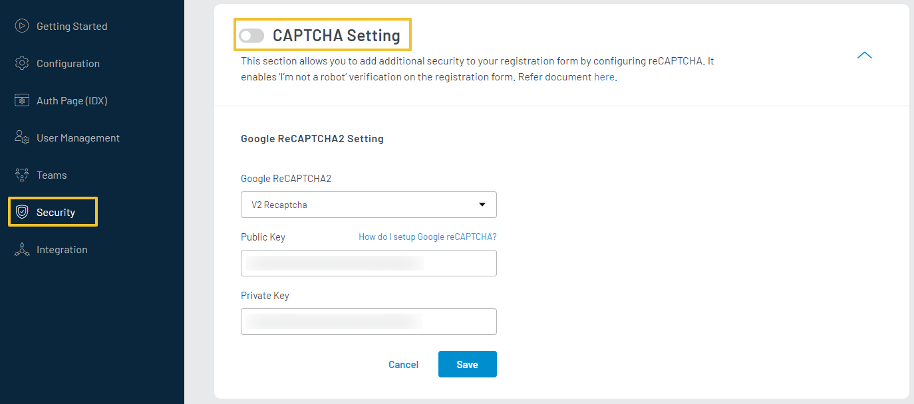

The CAPTCHA Setting allows you to enable Google reCAPTCHA as part of your registration flows for additional security.

LoginRadius Identity Platform supports two different versions of the Google reCAPTCHA:

- **reCAPTCHA v2**: This is the second version of the reCAPTCHA service. Users are presented with descriptions along with a set of images to identify based on the description.
- **Invisible reCAPTCHA**: This version provides a better experience to the end-user by tracking mouse movements to identify if a human is interacting with the website.

To access CAPTCHA Setting, login to your [LoginRadius Dashboard](https://dashboard.loginradius.com/dashboard) account, from the left navigation panel, click the **Security** and then navigate to the **CAPTCHA Setting** section. 

Click the down arrow or anywhere within the section and the **CAPTCHA Setting** screen will appear:

  

 

Enter or select the following CAPTCHA details:

- **reCAPTCHA Type**: Choose the type of reCAPTCHA from the dropdown.
- **Public Key**: Enter the Public key provided by Google reCAPTCHA.
- **Private Key**: Enter the Private Key provided by Google reCAPTCHA.

> Note: Check the configuration section below  to get the Public and Private key and to register for Google reCAPTCHA.

Click the **Save** button after providing the required details. In case of reCAPTCHA v2, the captcha will be available on your Auth Page `<your-app-name>.hub.loginradius.com/auth.aspx` as highlighted in the below screen`. 

  

 

## Configuration
To setup Google reCAPTCHA, you should follow the below steps:

Login to your Google account. Once you are logged in, navigate to [Google reCAPTCHA](https://www.google.com/recaptcha/about/) and select **Admin Console** from the header.

  

 

To register a new site, click the + icon available on the top of the page, the **Register a new site** screen will appear:

  

 

Provide a label for this new reCAPTCHA configuration, select reCAPTCHA type reCAPTCHA v2, and provide domains that will be using the reCAPTCHA. 

This is for domain whitelisting purposes. If this is for your development environment, you can provide ‘localhost.’ Otherwise, provide your website's domain.

Click the **Submit** button and you will get the Public and Private Key.

  

 

Use these Public and Private keys in to configure Google reCAPTCHA for your LoginRadius app.
