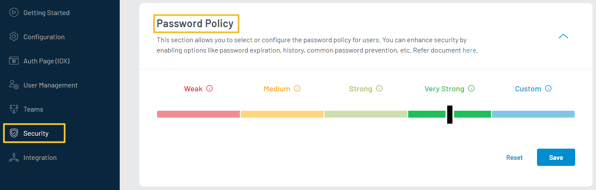
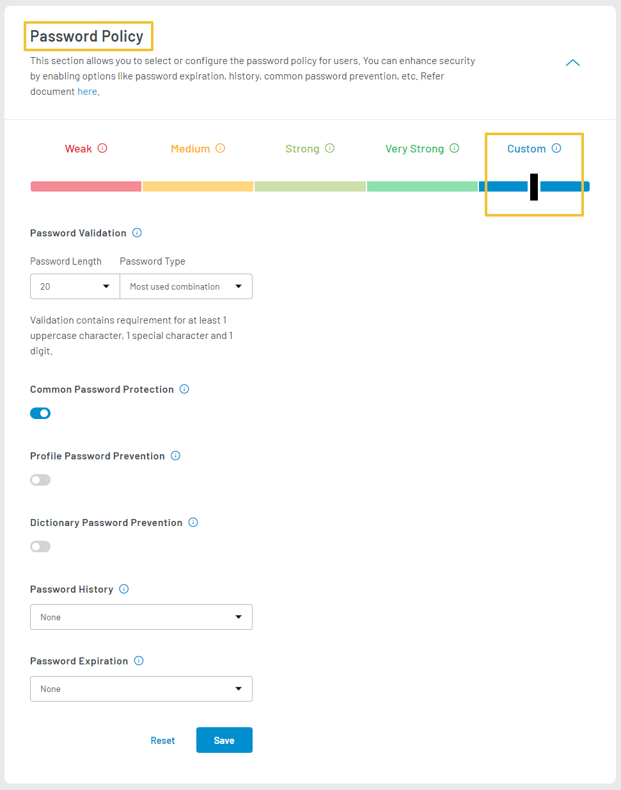

The **Password Policy** feature allows you to enhance security by defining the password rules. This guide will help you in setting up Password Policy by setting up the password strength in the password policy scale.

To set up Password Policy, login to your [LoginRadius Dashboard](https://dashboard.loginradius.com/dashboard) account, from the left navigation panel, click the **Security** and then navigate to the **Password Policy** section. Click the down arrow or anywhere within the section. The **Password Policy** screen will appear:

  

 

LoginRadius allows you to set up password strength from weak to Very Strong along with a set of predefined rules, or you can set your custom rules by setting the scale to Custom.

## Set of Rules
To make it easy to set up a password policy for your users, LoginRadius provides a predefined list of rules set except custom. You can directly use these password policies or create your custom ruleset.

### Weak
Allows your users to set passwords with min length 6 to max length 20 with alphanumeric characters allowed.

### Medium
Allows your users to set passwords with min length 6 to max length 20 with alphanumeric characters allowed. Also, commonly used passwords will not be allowed to set as passwords.

### Strong
Allows your users to set passwords with min length 6 to max length 20 with alphanumeric characters allowed. Commonly used passwords, dictionary words, profile words will not be allowed to set as passwords. Also, the last 3 passwords cannot be used again.

### Very Strong
Allows your users to set passwords with min length 6 to max length 20 with alphanumeric characters allowed. Commonly used passwords, dictionary words, profile words will not be allowed to set as passwords. Further, the last 3 passwords used cannot be set again, and users are required to change passwords each month.

### Custom
To set up a custom password policy ruleset, click anywhere on the Custom scale. The **Custom Password Policy** screen will appear: 

  

 

Enter or select the following configuration details:

- **Password Validation**: The Password Validation allows you to set the length (6 to 32 ) and type of the password (Alphabet or Alphanumeric)

	
- **Common Password Protection**: Common Password Protection enables you to prevent users from setting passwords listed in the common passwords. The common passwords list gets updated regularly.

- **Profile Password Prevention**: Profile Password Prevention enables you to prevent your users from using the profile data for the account password. For example, an Email address cannot be used for an account password.

- **Dictionary Password Prevention**: Dictionary Password Prevention enables you to prevent your users from setting the dictionary passwords.

- **Password History**: You can configure the number of unique passwords a user must set before reusing an old password. This enables you to enhance security by ensuring that old passwords are not reused continually.

- **Password Expiration**: You can set the password expiry configuration to request an updated password from your users periodically. This feature allows you to customize how often you want your users to reset their passwords.
